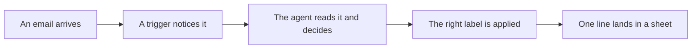

@slide two-col
kicker: The tool
## One canvas, no code

::: cols
:: card bad
### What you might be picturing
- A developer console
- Command lines
- A blank page and a manual
:: card good
### What n8n actually is
- A drag and drop canvas
- Boxes you connect with lines
- Free to run yourself, forever
:::

@narrate
n8n is an automation tool. You have probably used something in its family
without knowing the name: a system that watches for a trigger, like a new
email, then runs a chain of steps in response. n8n's version of that chain
is visual. You will spend this course looking at boxes and arrows, never
at a terminal.

It is open source, which matters for one practical reason. You can run it
on your own machine for nothing, for as long as you like, and nobody can
take it away from you or change the price on a whim.

One honesty note. n8n also sells a hosted version, where their servers
run your workflows so your laptop does not have to stay on. It costs
money and this course does not need it. We run everything on the free,
run it yourself route, and Section 2 names the exact moment the paid
route starts earning its fee, so the choice stays yours.

@slide diagram
kicker: The shape of every build
## One email's journey through a chain

figcap: Each box does one small job and hands the result to the next.

@narrate
Here is what a chain actually looks like in practice, and why none of it
needs code. An email arrives. One box notices. The next box reads it and
decides what kind of email it is. A third files it under the right
label, and a fourth adds one line to a spreadsheet so nothing gets lost.
Each box does one small job and hands its result on, like a relay. When
you can picture that, you understand n8n. Everything else is detail.

@slide bullets
kicker: The other half
## You bring the AI

1. n8n does the plumbing: reading the email, saving the file, sending the message
2. An AI model does the thinking: reading the content and deciding what it means
3. You choose which model, and this course shows the free route first

@narrate
n8n on its own cannot tell an urgent client query from a newsletter. For
that, one box in each workflow calls out to an AI model. Which one is your
choice, and Section 2 walks through picking one. We will start on a free
tier so today costs you nothing.

Think of it like a stapler and a good assistant. n8n is the stapler. The
model is the assistant reading the page before it staples it. You need
both, and they are two different subscriptions to two different things.

What does the thinking actually look like? For inbox triage, the model
reads the sender, the subject and the message itself, then judges it
against rules you wrote in plain English: flag anything from a client,
ignore anything promotional, escalate anything about money or deadlines.
Your rules live in a paragraph, not a program. When the agent gets
something wrong, you fix it by rewriting a sentence, the same way you
would correct a new assistant. That single fact is why this course can
exist for people who do not code.

@slide table
kicker: What you are building toward
## The ten artifacts

| Artifact | What it is | Ships in |
| --- | --- | --- |
| Four agent templates | Working n8n workflows, import and connect | Sections 3 to 6 |
| Job description template | Turns a vague wish into a delegable task | Section 1 |
| Trial task checklist | What to run before you trust an agent | Section 7 |
| Spot check rubric | Catches drift after you do trust it | Section 7 |
| Guardrails worksheet | Sets the blast radius before anything acts | Section 8 |
| Cost and savings tracker | The honest number for your manager | Section 9 |
| Team rollout one pager | Takes this from your desk to your team's | Section 10 |

@narrate
You do not need to memorise this list. Each artifact lands exactly when
you need it, and every one is designed to be forwarded to a colleague
without embarrassment. A template nobody would actually use is not worth
building, so none of these are teasers. They are the real thing, cut down
to one page each.

The reason the artifacts matter more than the videos is simple: the
videos teach you, the artifacts survive you. Six months from now you
will not rewatch Section 7 before trusting a new agent. You will open
the trial checklist, spend ten minutes on it, and catch the same failure
Priya catches in this course. A colleague who never took the course can
still pick up the job description template and use it cold. That is the
test each one had to pass to ship.

@slide callout
kicker: One honest note before we start
::: callout What this course will not do
It will not turn you into a developer, and it will not pretend agents are
risk free. Every build in this course gets checked before it gets trusted,
and Section 9 tells you plainly which tasks should stay with a human. If
that is not the course you wanted, this is a good moment to know it.
:::

@narrate
What the course does assume: you are comfortable using web apps, and you
have one task you do every week that you would rather not. That is the
entire entry bar. Each build section takes thirty to sixty minutes at
your own pace, and the course is front loaded on purpose: you build
first, in Sections 3 to 6, and earn the judgement that keeps those
builds safe in Sections 7 to 10, against mistakes you have actually
seen by then.

Right. That is the map. Next lecture, we stop talking about agents and
build one.
