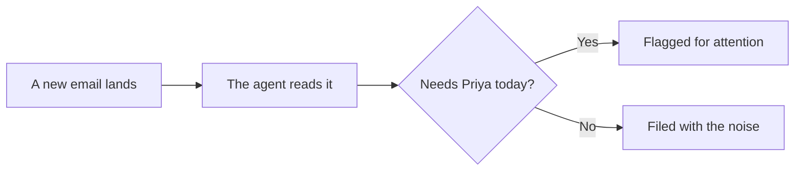

@slide statement
kicker: 09:14, a Tuesday in March
## Ravi's message had been sitting there for six days.

lead: Buried under forty other emails that all looked the same.

@narrate
Priya Malhotra manages renewals for forty one commercial insurance clients.
On a normal week her inbox fills with the same shape of noise every
morning: a webinar invite, a LinkedIn digest, a flash sale on office
chairs. Somewhere in the middle of that Tuesday's forty emails sat a
message from Ravi Chandra at Brightwell Manufacturing, asking a simple
question about their September renewal.

Nobody had answered it. Nobody had even seen it. That is not carelessness.
That is what forty identical looking subject lines do to a human inbox by
Tuesday lunchtime.

And the stakes are not symmetrical. If Priya misses the webinar invite,
nothing happens. If she misses Ravi's question long enough, a commercial
policy drifts towards its renewal date unanswered, and a lapsed policy is
not a late invoice: it is a client sitting uninsured. Six days of silence
had already been absorbed before anyone knew there was silence to count.
Every inbox has one of these. The whole point of the next twenty minutes
is to find yours.

@slide bullets
kicker: What you are about to do
## Three steps, twenty minutes

1. Import a ready made workflow into a free tool called n8n
2. Point it at an inbox
3. Watch it find the one email that matters

@narrate
You are not building anything from scratch yet. Section 3 does that, slowly
and screen by screen. Right now you are doing what most people do with a
new agent for the first time: importing someone else's work and seeing
whether it earns your trust.

Open the course resources and grab the file called C01-preview. It is a
real n8n workflow, saved out as one plain text file that n8n can read
back in, and it is the same file I used to write this lecture.

A word on how to take this lecture. If you already have n8n and a free
AI account connected from skimming ahead, follow along live. If not,
watch it through once first, then come back and do it with the video
paused at each step. Both routes work. The only wrong route is watching
without ever running it, because the moment this course actually starts
is the moment the agent reads your inbox, not Priya's.

@slide two-col
kicker: Landing in n8n
## Two screens before anything happens

::: cols
:: card bad
### What you might expect
- A setup wizard
- Twenty minutes of configuration
- Somewhere to type a command
:: card good
### What actually happens
- One page: "Let's build your first automation"
- One click: "Import from file"
- A canvas with your workflow already drawn
:::

note: TODO-IMG screenshots/section-0/n8n-first-automation-prompt.png (n8n empty state, one "Build a workflow" card)

@narrate
The first thing n8n shows a new account is not a blank terminal, it is one
button. You will use the menu next to it to import the file instead of
starting from scratch, and within a few seconds the canvas fills in with
three boxes already connected: a trigger, an agent, and the model behind
the agent.

@slide diagram
kicker: The whole shape, on one slide
## Something happens. An agent looks. It decides.

figcap: Every agent in this course is a variation on this one shape.

@narrate
That is the whole shape of everything you build in this course.
Something happens, an agent looks at it, the agent decides what to do.
Sound too simple to be worth four sections of build time? The simplicity
is the point. The weekly report agent is this same shape with a
spreadsheet where the inbox is. The follow up chaser is this shape with
a calendar behind it. Master one honest version of this diagram and the
other three agents are rearrangements, which is exactly why the course
can promise them by Friday.

Do not worry about the unfamiliar words on those boxes yet. Every label
you can see gets explained in Section 2, and none of them need touching
today. An imported workflow arrives with its settings already made. The
only two things it cannot arrive with are your accounts, because those
are yours to connect, and that is the next step.

@slide sidenote
kicker: The three boxes
## Trigger. Agent. Model.

::: split
:: main
The first box watches Priya's inbox and fires whenever a new email lands.
The second box is the AI Agent itself, the part that reads and decides.
The third box, hanging underneath the second, is the actual AI model doing
the reading: in this build, Google's Gemini, on its free tier.
:: aside Why three boxes and not one
n8n keeps the watching, the deciding and the thinking as separate pieces
on purpose. You can swap the model out for a different one later without
touching anything else. Section 2 shows you how.
:::

note: TODO-IMG screenshots/section-3/n8n-triage-workflow-overview.png (trigger to agent to Gemini model, "41 items" on the wire)

@narrate
Forty one items is not a typo on my screen, and it will not be the number
on yours. That is how many emails were sitting in the test inbox I built
this workflow against, standing in for Priya's real one. Once you connect
your own account, that number becomes however many emails are actually
sitting in your inbox right now.

The number rides on the line between the boxes, and that line matters
more than it looks. In n8n, data travels along those wires as small
tables you can open and read: here, one row per email, with the sender,
the subject and the text in named columns. When something goes wrong in
any workflow you ever build, the fastest diagnosis is always the same
move: click a wire, look at the table, and see what the next box was
actually given. Learn that reflex in week one and half of Section 7's
debugging becomes instinct.

@slide callout
kicker: The one thing you have to do yourself
::: callout Connect two accounts, not zero
n8n cannot read an inbox it has never met. You will connect your email
account once, and a free AI account once. Both take about two minutes,
and Section 2 walks through the free routes for each in detail. This
lecture assumes you have done that.
:::

@narrate
I am not going to pretend that part is invisible. Connecting an email
account means typing in a real address and a real password, or clicking
through your provider's own login screen. It is the only unglamorous step
in this entire twenty minutes, and it is also the last time this course
will ask you to trust a screen you cannot see reasoning happen behind.

Two reassurances, both checkable. The login screen belongs to your email
provider, not to n8n, and what n8n keeps is a saved permission you can
revoke from your provider's security page at any time. Because n8n runs
on your own machine, that permission never leaves your computer. For
today, a practice inbox or a personal one you are comfortable with is
the right starting point. Section 8 teaches the tighter scoping later.

@slide bullets
kicker: Pressing the button
## Watch it run

1. One click: Execute workflow, bottom of the canvas
2. Each box lights up in turn as the work passes through it
3. Green ticks mean done; open any box to see what it did
4. Open the agent's box last, and read its reasoning

note: TODO-IMG screenshots/section-3/n8n-full-triage-workflow-with-routing.png (executed run, green ticks on every node)

@narrate
This is the part no screenshot does justice, so run it rather than take
my word. The trigger fires, the emails stream in, and the agent box works
through them one at a time. It takes a few seconds, not an hour, and when
it finishes you can open the agent and read what it wrote about each
email in plain English: this one is promotional, this one is internal
chatter, this one is a client asking about a renewal and nobody has
replied for six days.

That last part deserves a beat. The agent does not just sort. It gives
you its reasons, in sentences, and you can check them against the actual
email with one click. Every agent in this course is built to be checkable
like that, because an assistant whose reasoning you can read is one you
can correct, and one you can correct is one you can eventually trust.

@slide callout
kicker: When it does not work first time
::: callout The three snags that cover nearly everyone
Nothing happens at all: the workflow imported but was never activated, so
flip the Active toggle. A red box on the credential step: the account
connection did not finish, so open that box and reconnect. A red box on
the model step mentioning limits: the free tier is pausing you, so wait a
minute and run it again.
:::

@narrate
If your first run fails, you are not behind. You are having the normal
first run. The habit to build, starting today, is to read the red box
instead of fearing it: n8n tells you exactly which step failed, and the
last line of its message says why, in words. Click it, read it, fix that
one thing, run it again. Priya's first run failed on the credential step
because she had connected the practice inbox and then run the workflow
against the wrong account. Ninety seconds later she was watching it work.
Nobody in this course debugs by being clever. They debug by reading.

@slide statement
class: center
kicker: The moment it clicks
## It found Ravi's email. Unprompted, unread, buried under forty others.

lead: That is the first win. Here is the first doubt.

note: TODO-IMG screenshots/section-3/n8n-mock-inbox-41-items.png (pinned 41-row inbox table, Brightwell's query midway down)

@narrate
Run the workflow, and within a few seconds it has read every email in the
inbox and flagged exactly one of them as needing Priya's attention today:
Ravi's. Not because it was marked urgent. Because it read what he actually
wrote and understood what an unanswered renewal question sitting for six
days actually means for Brightwell's policy.

Sit with that for a second, because the next lecture is about the
question that follows it in every new user's head: if it can read that
one, what else can it read?

Because the honest answer is: everything you connected. The payslip
email. The message from your doctor. The thread about a colleague. It
read all of it in the same pass, and it needed to, because triage means
reading everything to find the one thing. Shrinking that trade until it
is clearly worth making is what the rest of this course teaches. Do not
resolve the discomfort tonight. Keep it.

One thing before the next lecture: run this against an inbox you are
comfortable with, and write down the one email it flags that you had
genuinely lost track of. That is your own version of Ravi's message, and
everything from Section 1 onwards lands differently once the missed
email in the story is yours.
