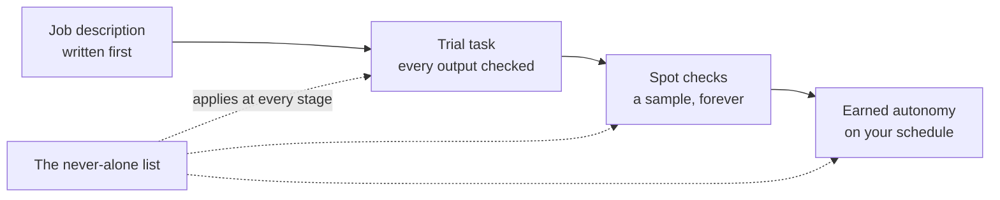

@slide statement
kicker: A question worth sitting with
## Would you hand a new hire your inbox, your calendar and your client files on their first morning?

lead: No. So why would you hand an agent all three before lunch?

@narrate
Priya's answer was no before she had even finished the question. Every
manager's is. You would give a new hire a desk, a login for one system,
and a first task small enough to check. Nobody hands over the keys on
day one, and nobody thinks that is being overly cautious. It is just how
you bring someone on.

Software has trained us to expect the opposite. You install an app, tick
a permissions box without reading it, and it works immediately at full
power. That habit is the one this course exists to break.

Think about the last time you watched someone new arrive anywhere you
have worked. However good their references were, their first week had a
shape: one system login, not twelve. A first task someone could check
without embarrassment on either side. A colleague glancing over the
work, not because anyone expected disaster, but because checking early
is cheaper than apologising later. Nobody wrote a policy for that. It is
simply what trusting a stranger with real work looks like when the work
matters. An agent is a stranger with excellent references. The
references are the demo. The stranger is what shows up on your data.

@slide two-col
kicker: Two verbs, two different risks
## Install versus onboard

::: cols
:: card bad
### Installing an agent
- Full access, granted once, on day one
- Trust is assumed from the start
- Failure shows up as a surprise
:: card good
### Onboarding an agent
- Narrow access, granted in steps
- Trust is earned, one task at a time
- Failure shows up as a small, expected miss
:::

@narrate
Notice that the right hand column is not slower for the sake of caution.
It is slower on day one and faster for the rest of the year, because
every failure it produces is small and survivable instead of the kind
that ends up in an apology email to a client.

Make the difference concrete. Two people set up the same follow up
agent. The installer connects everything it asks for and lets it send.
Three weeks in, it chases a client who had already replied, warmly, to
close the matter, and the client reads the chase as nobody at the firm
talking to each other. The onboarder set the same agent to draft only.
The same wrong chase appears in her drafts folder, she deletes it in
four seconds, and she has learned something specific: this agent cannot
yet tell a closing pleasantry from an open thread. Same software, same
mistake, and only one of them had to say sorry for it. The difference
was never intelligence. It was the order in which trust was granted.

@slide bullets
kicker: What onboarding a person always includes
## Four habits you already have

1. A written job description, so the scope is explicit, not assumed
2. A trial task, checked closely, before anything runs unsupervised
3. Spot checks that continue after trust is granted, not before
4. A clear line for what they are never allowed to do alone

@narrate
Read that list again and notice you did not learn it from a management
book. You already do all four for people without thinking about it. The
entire method in this section is applying the same four habits to
software that can now read, decide and act, instead of quietly assuming
they do not apply because the new hire happens to be a workflow.

The first habit is the one people most want to skip, so here is why it
cannot be skipped for an agent specifically. A human new starter fills
the gaps in their instructions from context: they hear how colleagues
talk to clients, they notice what gets escalated, they ask when unsure.
An agent has none of that ambient learning. It has exactly what you
wrote down, and it will apply what you wrote with perfect, literal
confidence to situations you never imagined when you wrote it. Writing
the job description is not bureaucracy. It is the only channel through
which your judgement reaches the agent at all, which is why it comes
before anything else and why the next two lectures are spent on it.

@slide diagram
kicker: The four habits, in the order they run
## Onboarding, as a pipeline

figcap: The fourth habit is not a stage. It is a line that never moves.

@narrate
One reading note on this pipeline: three of the habits are stages you
move through, but the fourth is a boundary that applies at every stage.
The things an agent may never do alone on day ninety are the same
things it may never do alone on day one. Autonomy grows inside that
line. The line itself does not move, and drawing it before the first
stage is what the next three lectures are for.

@slide callout
kicker: The honest cost
::: callout This takes longer on day one
Writing a job description and running a trial task is slower than
clicking "connect account" and walking away. That is the trade you are
making deliberately. An hour of setup now is what keeps a mistake small
enough to laugh about later instead of one that costs you a client.
:::

@narrate
Is the hour genuinely worth it? Run the honest arithmetic, because this
course promised to. The job description takes about half an hour the
first time. A trial costs you checking time for a few weeks. Against
that: the follow up mistake above cost the installer a client apology
and, more expensively, her own confidence in the whole idea. Most people
who abandon agents do not abandon them because the technology failed.
They abandon them because an early, avoidable mess scared them off
before the savings arrived. The setup hour is not overhead on the
payback. It is what makes the payback survivable long enough to
collect, and Section 9 subtracts every minute of checking time from the
savings before it ever shows you a number.

One thing to do before the next lecture: name the task you would hand a
competent new hire on their first morning. Not the hardest thing on
your list, the checkable thing. That task is your first agent's job,
and the next lecture writes its job description. Then we cover how
trust actually gets earned, in stages, once that description exists.
