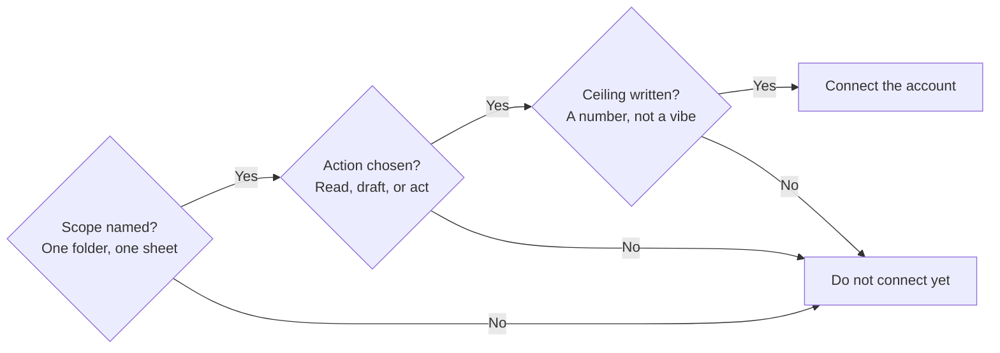

@slide definition
kicker: A term worth borrowing

::: definition Blast radius
How much damage the **worst version** of this can do, not the version you
are planning for.
:::

::: example Where it comes from
Engineers ask this before they ship a change. You should ask it before
you connect an agent to anything.
:::

@narrate
Blast radius is not a term from AI, it comes from systems engineering.
Before anyone ships a change, they ask what breaks and how far the break
spreads if the worst case actually happens. It is a useful habit to
steal, because most people setting up their first agent never ask it at
all. They ask whether it works. They do not ask what happens the day it
does not.

For the agents in this course, the worst version comes in three
flavours, and it is worth naming them in ascending order of pain. It
reads something it should never have seen: uncomfortable, and usually
recoverable. It sends something it should never have sent: public, and
apology shaped. Or it quietly changes a number somewhere nobody looks:
the worst of the three, because the first two announce themselves and
this one waits until the wrong figure has been in front of a client for
a month. Every limit this lecture sets exists to shrink one of those
three, and the silent one is why read only is a real permission level
and not a technicality.

@slide two-col
kicker: Two questions, asked in order
## Scope, then permission

::: cols
:: card bad
### The question people skip to
"What can I ask it to do?"
:: card good
### The question that actually protects you
"What is it physically able to reach, whether I asked it to or not?"
:::

@narrate
Those are different questions. What you ask it to do is the job
description. What it is able to reach is the access you granted when you
connected an account, and access is almost always broader than the job.
An inbox connection that can read one folder can usually read every
folder, unless you deliberately narrow it.

The gap between the two is rarely visible at setup, because permission
screens are written in the provider's language, not yours. "Read your
mail" means every folder, every year, attachments included. "Manage
your calendar" usually includes deleting events, not just reading them.
"Edit spreadsheets" means every sheet the account can open, not the one
you had in mind. The practical habit: read the permission screen as a
list of what you are handing over, not as a formality, and where a
narrower grant exists, take it. Where one does not, the narrowing has
to happen on your side instead: a dedicated folder, a label, a copy of
the sheet that holds only what the agent needs. Priya's Renewals label
is exactly that move, and it costs five minutes.

@slide bullets
kicker: Setting the radius, concretely
## Three limits to set before you connect anything

1. **Scope**: which folder, which sheet, which account, named specifically
2. **Action**: read only, draft only, or send and act, chosen deliberately
3. **Ceiling**: a number or a value it cannot exceed without a human

@narrate
Priya's follow up agent, built in Section 6, is scoped to her Renewals
folder alone and drafts only, never sends. That is not caution for its
own sake. It is the exact reason a contained incident later in this
course stays contained instead of becoming a real one: the access was
narrow before anything went wrong, not narrowed afterward as a fix.

The ceiling deserves a moment, because it is the limit people set last
and lean on most. A ceiling is always a number: never more than this
many messages in a day, never a figure above this amount touched
without a human, never an email outside this list of addresses. Numbers
matter because they fail loudly. "Be sensible about volume" cannot trip
an alarm; "more than twenty drafts in an hour means stop" can, and an
agent stuck in a loop is exactly the failure that turns twenty into two
hundred while you are in a meeting. Pick ceilings you expect never to
hit. Their job is not to manage normal days. Their job is to make an
abnormal day cost you an alert instead of an afternoon.

@slide diagram
kicker: The three limits, as a gate
## No connection before all three are named

figcap: Three questions stand between an idea and an access grant. All of them are cheap.

@narrate
Treat this as a literal gate, not an aspiration. The whole diagram
costs perhaps ten minutes of writing, and every path that skips a
question lands in the same place: do not connect yet. If that feels
strict, notice what it is protecting you from. Nobody regrets the ten
minutes. The regrets in this course all belong to accounts connected
first and thought about afterwards, and Section 8's near miss is
exactly one of those.

@slide callout
kicker: The trap to name now
::: callout Wide access, narrow intention, is still wide access
"I would never ask it to touch that folder" is not a safeguard. An
agent's intentions are whatever the model decides in the moment, not
whatever you assumed when you set it up. If it can reach something, plan
as though one day it will.
:::

@narrate
Why be that untrusting about intentions? Because an agent's input is
also, functionally, its instructions. Everything it reads becomes part
of what it thinks about, including text other people wrote. An email
can, in effect, talk to your agent. Most of the time that is harmless.
Occasionally it is exactly how an agent ends up doing something nobody
in your building asked for. You do not need to master that risk today.
You need the design habit that makes it survivable, which is the same
one this whole lecture teaches: what it can reach is the risk, so
narrow the reach.

That sentence is the whole argument for Section 8, which comes back to
this exact idea with a real near miss. For now, one habit: set scope,
action and ceiling before you connect, not after something goes wrong.

@slide bullets
kicker: Before you move on
## What to do now

1. For the agent you imported in Section 0, name its scope, its action level and its ceiling out loud
2. Write down one folder or account it can reach that it has no job needing

@narrate
If step two turned up something, you have already found your first real
guardrail. Next lecture turns all of this, the scope, the trial, the
ceiling, into one document you write before you build anything else.
