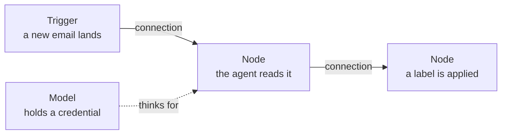

@slide example
kicker: The number that shouldn't be possible

::: example Every n8n workflow, including the complicated ones
Is built from two shapes: a box, and a line between boxes. That is true
of the three-box workflow you have already seen, and it will still be
true of Section 6's twelve-box one.
:::

@narrate
That sentence sounds too simple to be useful, and it is exactly why it
is worth saying. People new to n8n expect the complexity to grow the same
way spreadsheet formulas do, into something only the original author can
read. It does not. A hundred-box workflow is still just boxes and lines,
read left to right.

The reason is structural, not cosmetic. A spreadsheet hides its logic
inside cells: the sheet shows you results and buries the reasoning. The
canvas is the opposite: every step is a visible box doing one action,
in the order drawn, so the workflow is its own documentation. This
matters beyond comfort. When Dev picks up Priya's templates in Section
10, he can read what they do before trusting them, without Priya in
the room. When you inherit a workflow from a colleague who left, you
can too. An automation your successor cannot read is a liability with
a start button, and the canvas is what keeps these from becoming that.

@slide bullets
kicker: The vocabulary you actually need
## Four words, and you can read any canvas

1. **Trigger**: the box with a lightning bolt, what starts the workflow
2. **Node**: any other box, one action each, in the order the lines connect them
3. **Connection**: the line itself, meaning "this box's output feeds that box's input"
4. **Credential**: the login a node needs to reach the outside world

@narrate
Go back to the Section 0 screenshot in your mind: trigger, agent, model.
A trigger box, a node box, and a credential-holding node hanging off it.
Four words, and you already had everything you needed to read it.

The vocabulary earns its keep the day something fails, because the four
words are also the four diagnoses. Nothing ran at all? Trigger: it is
switched off, or the thing it watches never happened. One box red in
the middle? Node: open it, read the last line of the error, fix that
one action. Red on the box that talks to the outside world? Credential:
the saved login expired or lost permission, reconnect it. The line
between boxes never fails on its own, but clicking it shows you the
data that flowed, which is how you catch the subtler case: every box
green, and the answer still wrong, because a box was given something
different from what you assumed. Four words, four first moves. That is
most of the debugging you will ever do.

@slide diagram
kicker: The four words, on one canvas
## Anatomy of every workflow you will ever read

figcap: Trigger, node, connection, credential: every canvas is these four words drawn.

@narrate
Hold this picture and the earlier diagnosis list together and the
canvas stops being a diagram and becomes a dashboard. Left edge:
whether anything starts. Middle: what happens, in order. The box
hanging underneath: where the outside world, and therefore most of the
failures, connects. When Section 3's build adds more boxes, they will
all land in the middle of this picture, and nothing about how you read
it will change.

@slide sidenote
kicker: Choosing what a node does
## The panel you'll see constantly

::: split
:: main
Click the plus wherever you see one, and a search panel opens listing
every node available: triggers, actions, and every AI model n8n
supports, from the big names to smaller providers you may not
recognise.
:: aside Don't try to learn them all
You will use perhaps ten node types across all four agents in this
course. Search for what you need by what it does, not its exact name.
:::

note: TODO-IMG screenshots/section-3/n8n-language-models-list.png (node search panel, "Language Models" list: Gemini, Anthropic, OpenAI and others)

@narrate
Notice the panel does not make you memorise anything. You type roughly
what you want, "email," "sheet," "Gemini," and it narrows the list. That
search habit alone gets you through every build in this course.

Since the whole course runs on about ten node types, here is the map in
one breath. Two triggers: one that watches an inbox, one that runs on a
schedule. A handful of doers: read or write a sheet, fetch or send an
email, post a message. The star pairing you already know: the AI Agent
node with a model node underneath. And one piece of plumbing: a branch
node that sends urgent left and routine right. Everything Priya builds,
all four agents, is those pieces rearranged. When the panel shows you
four hundred options, you are looking at a hardware shop, not a
syllabus. You need one shelf.

@slide callout
kicker: The habit that saves you real money
::: callout Test with pinned data, not real API calls
Every AI call costs a fraction of a cent, and that adds up fast while
you are still getting a workflow's wiring right. n8n lets you "pin" a
sample result to any node, a fake answer that stands in for a real one,
so you can test everything downstream without spending a call. Build the
shape first. Spend real calls only once the shape is right.
:::

@narrate
This is not a workaround, it is standard practice, and it is exactly
how every workflow in this course was tested before a word of narration
was written. Pin a sample, prove the logic, then connect the real thing
once.

The mechanics take one run to learn. Execute the workflow once for
real, so the node has a genuine result. Pin that result, and from then
on every test run downstream reuses it instantly and free, however
many times you rewire what comes after. One warning, and it is the only
sharp edge on this tool: a pin does not expire. A workflow that goes
live with a pinned node keeps serving that frozen sample forever, with
every box green, which is precisely the every box green and still
wrong case from earlier. So adopt the closing ritual now, while it is
cheap: before any workflow's trial starts, walk it once and unpin
everything. Pins are for the workshop, never the road.

@slide bullets
kicker: Before you move on
## What to do now

1. Open the workflow you imported in Section 0 and click through each node once
2. Find the pin icon on any node's output and try pinning a result

@narrate
One extra rep if you want it: n8n's own site hosts a public library of
workflow templates other people built. Open any one of them and read
it with the four words: find the trigger, follow the lines, spot which
nodes hold credentials. Ninety seconds per workflow, and reading other
people's canvases is exactly how the reading skill becomes automatic.

That is the whole toolbox. Section 3 starts the real build: your first
agent, from an empty canvas, screen by screen.
