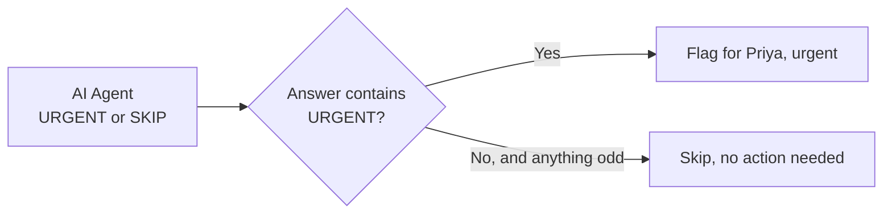

@slide statement
kicker: A number that shouldn't be possible
## The agent can now write "URGENT" or "SKIP." Nothing in the workflow is listening yet.

lead: A decision nobody acts on is not a decision. It is a diary entry.

@narrate
This is an easy step to under-rate, because it looks like the boring
part after the interesting part. It is not boring. It is the exact
place blast radius, from Section 1.3, becomes a real setting instead of
a principle.

Picture the workflow as it stands. An email arrives, the agent reads
it, and a line of text, URGENT with a reason, or SKIP, lands on the
wire and stops. Nothing downstream exists to hear it. Run it a hundred
times and you have a hundred verdicts filed in a log nobody opens,
which is why the slide calls it a diary. What turns a verdict into
triage? Something has to fork on it: urgent goes one way, noise goes
the other, and the two paths end differently. Routing is that fork,
and it is also where you decide, in wiring, what the agent's words are
allowed to cause. That is why this lecture belongs to blast radius and
not to plumbing.

@slide bullets
kicker: The node for the job
## Switch: one input, several exits

1. Add a Switch node after the AI Agent
2. Set a rule: if the agent's answer contains the word "URGENT," send it one way
3. Everything else falls through to a second exit automatically

@narrate
A Switch node is a fork in the road, built entirely from a condition you
write once. Here, the condition is almost embarrassingly simple: does
the answer contain the word URGENT. It does not need to be clever,
because the hard judgement already happened one node ago, inside the
system prompt.

The configuration is three choices in one panel. What to look at: the
agent's answer, dragged in from the left the same way you built the
prompt. How to compare: contains, not equals, and that one word is a
small robustness lesson. Your agent writes URGENT and then a reason,
so an equals check against the bare word would fail every single time
while looking perfectly sensible. Contains matches the answer you
actually get. And what to match: the word URGENT, in capitals, as the
prompt demanded. Everything that does not match falls through to the
other exit on its own, and notice what that quietly handles: the day
the model gets creative and answers MAYBE, or apologises, or writes a
paragraph, the strange answer drops safely into the skip path instead
of crashing anything. The fallback exit is your first guardrail that
costs literally nothing to own.

@slide diagram
kicker: The fork, drawn
## One verdict, two doors

figcap: The fallback branch catches every answer that is not URGENT, including the strange ones.

@narrate
Two details of this picture repay attention. The question in the
diamond is deliberately dumb: one word, contains, done, because the
intelligence already happened a box earlier and duplicating judgement
in two places is how systems disagree with themselves. And the lower
door is wider than it looks. It is not "answers that said SKIP", it is
"everything that failed the urgent test", which is what makes it a
safety net rather than a label. When you build your own forks, keep
that shape: one smart box, one dumb question, and a default path that
catches whatever the smart box does on a strange day.

@slide sidenote
kicker: What sits at each exit
## Two labelled endpoints, on purpose

::: split
:: main
The Urgent exit leads to a node named plainly: "Flag for Priya, urgent."
The Skip exit leads to one named "Skip, no action needed." Both are
placeholders: holding a clear name, doing nothing yet.
:: aside Why placeholders
The job description says read only. A real action here is one you would
add deliberately, later, once trial has earned it. Section 6 shows a
draft-only action done properly.
:::

note: TODO-IMG screenshots/section-3/n8n-full-triage-workflow-with-routing.png (full canvas with routing)

@narrate
Step back and look at the whole shape now. Five boxes, one line of
judgement, one fork. That is the entire agent, and it is also the exact
shape from Section 2.3: trigger, node, connection, credential. Nothing
about this build needed a fifth vocabulary word.

Do the placeholders bother you? Good instinct, wrong conclusion. They
are not scaffolding waiting for the real thing. They are what makes
next week's trial measurable: every run now exits through a door with
a name, so the execution log stops being a list of runs and becomes a
tally you can read. How many emails left through the urgent door this
week, and which ones? That is exactly the question Priya's one week
trial has to answer, and the placeholders are what let her answer it
by reading, not by re-running anything. When a real action does earn
its place here, it will replace a named door, deliberately, with the
job description open. That is how read only grows up safely.

@slide callout
kicker: The habit this reinforces
::: callout Name your nodes like a person would read them
"Switch1" tells a colleague nothing. "Flag for Priya, urgent" tells them
everything, six months from now, without asking you. Every node in
every agent this course builds gets a name a stranger could read cold,
and the stranger it protects most often is you, in February, wondering
what October you was thinking.
:::

@narrate
Do the renames now, while you still remember why each box exists.
Double click, type the sentence, move on: it costs less than a minute
for the whole canvas. Six months from now, this workflow will be
something Dev opens cold in the Section 10 rollout, and whether he can
trust it will depend on whether it reads like a colleague's tidy desk
or a stranger's junk drawer.

The build is functionally complete. What is missing is proof that it
actually works, without you spending a single real AI call to find out.
That is next lecture.
