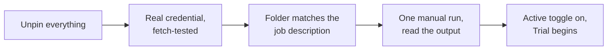

@slide statement
kicker: The last honest step
## Unpin the test data. Connect your own inbox. Watch it read something real.

lead: Everything up to here was proof. This is the agent going to work.

@narrate
Open the Email Trigger node one more time and unpin the test data. Do
the full ritual from Section 2.3 while you are at it: walk every node
once and check for the solid pin icon anywhere, because one forgotten
pin is the difference between an agent and a very convincing
screensaver. Then set up your real IMAP credential, the one from
Section 3.2, pointed at your real inbox or folder. Nothing else in the
workflow changes. That is the entire point of building it this way: the
plumbing was never the risky part.

If real client mail is about to flow through this, one errand comes
first, and you were warned it was coming: the ten minute read of your
model provider's current data terms, from Section 2.2. Do it now, not
after. If the terms do not sit right for client content, the fix is
the paid tier of the same provider or a different one, and either way
it is a two minute swap of the model node. What you should not do is
decide the reading can wait until the agent has been running a month.

@slide bullets
kicker: Before you run it live
## A short checklist

1. Confirm the credential is connected, not just added
2. Confirm the folder is the one from your job description, not the default inbox
3. Run it once, manually, and read what comes back before trusting a second run
4. Leave it on the Trial rung from Section 1.2. Nothing here is ready for Release yet

@narrate
That fourth point matters more than it sounds like it does. You have
proven the wiring. You have not yet proven the judgement on your own
real, messy inbox, with its own real edge cases. Trial exists precisely
for that gap.

Two of the other points hide traps worth naming. Connected, not just
added, means the credential has actually spoken to the server: use the
trigger's fetch test one more time and watch a real email come back,
because a credential that saved without erroring has proven nothing
yet. And when you flip the workflow's Active toggle, understand what
you switched on: from now on it reacts to mail as it arrives, while
n8n is running, which on a self hosted install means while your
machine is on. Expect it to work your day forward from here, not to
sweep the archive, and expect nothing overnight if the laptop sleeps.
That is the honest shape of free self hosting from Section 2.1, met
in the wild for the first time.

@slide diagram
kicker: Going live, in order
## The sequence that keeps the first day boring

figcap: Five steps, one direction, no shortcuts on day one.

@narrate
Why insist on this exact order? Because each step only proves something
if the ones before it already happened. A manual run before unpinning
tests the frozen sample, not your inbox. A folder check after
activation is an audit of something already running. Done in sequence,
each step hands the next one solid ground, and the whole ceremony
takes under five minutes. Skipped steps do not fail loudly here. They
fail three weeks later, in the middle of the trial, as mysteries.

@slide two-col
kicker: Exporting what you built
## Two ways to leave with a copy

::: cols
:: card good
### Export as a file
Workflow menu, Download. A JSON file you can import into any n8n
instance, including a colleague's.
:: card bad
### What does not travel with it
Your credentials. Anyone importing this file connects their own inbox
and their own model key. That is a safety feature, not a gap.
:::

@narrate
This is exactly how C01, the file in your course resources, was made.
Download yours the same way, and you have something genuinely worth
forwarding: not a screenshot of an idea, a workflow someone else can
open and run in minutes.

Be clear about what rides inside that file, because it is more than
wiring. The export carries your node layout, your routing rule, and
your entire system prompt: the judgement paragraph travels with the
template. That is what makes forwarding it generous, a colleague
receives your thinking, not just your plumbing, and it is also worth a
glance before you share one more widely: anything you typed into the
briefing goes where the file goes. Two habits to start with your first
export. Put the date in the filename, because prompts get tuned and
you will want to know which version a colleague has. And keep each
export somewhere deliberate, because in Section 10 these files become
the thing Priya hands her team, and a template you cannot find is a
rollout that does not happen.

@slide callout
kicker: Ship it
::: callout C01 is in your course resources now
The inbox triage agent, exported, importable, and identical in structure
to the one built across this section. Import it, connect your own
accounts, and you have Agent 1 running for real.
:::

@narrate
Before you leave, put the trial on the calendar the way the job
description promised: one week, every flag reviewed each morning.
Priya's version is five minutes with the first coffee: read what the
agent flagged, say each verdict out loud, and keep two tallies on a
sticky note, flags I agreed with, and urgent emails it missed that I
found myself. Those two numbers are the whole trial, and Section 7
turns them into the pass decision. The habit costs a coffee's length
and buys you the only thing that matters here: trust with evidence
behind it.

One agent down, three to go, and every one from here reuses something
you have already done once. Next lecture closes this section. Section 4
starts the next build: turning a meeting into action items nobody has
to chase.
