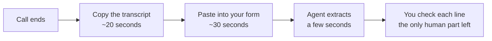

@slide callout
kicker: The honest shortcut this lecture takes
::: callout This agent starts with a form, not a live Zoom or Teams connection
Most meeting tools can auto-save a transcript to a file. Wiring that up
is a real, useful upgrade, and it is also a second credential screen
this course does not need to add. A form gets you the same judgement,
today, for free.
:::

@narrate
Search "Form Trigger" in your node panel and add "n8n Form." Unlike the
IMAP node, this one opens a small menu first: Triggers and Actions. You
want the trigger, "On new n8n Form event."

Why is a manual paste not cheating, in a course about automation?
Because you should spend integration effort where the hours actually
go. Priya's twenty minutes per call went on reading the transcript and
distilling it, not on moving the file, and the agent removes the
twenty minutes either way. Meanwhile every live connection you add is
a credential to guard, a blast radius to think about, and a thing that
breaks when the meeting tool updates. A form has none of those costs.
The judgement, which is the entire value, is identical down both
routes. Automate the thinking first. Automate the transport the day
the transport is what hurts.

Later, if you decide the paste step is one click too many, you can swap
this trigger for a folder watcher on wherever your meeting tool saves
transcripts, and nothing else in this build changes. That upgrade is
worth knowing exists, even if you do not need it on day one.

@slide sidenote
kicker: What you're actually building
## A form only you will ever fill in

::: split
:: main
Give it a title and description, then add three fields: Meeting title,
Attendees, and Transcript, the last one set to a multi-line text box.
n8n generates a real, working web page for this the moment you save it.
:: aside Why this counts as "real"
This is not a mockup. The Test URL n8n shows you is a working form right
now. Paste a transcript into it yourself after a real call, and it
triggers your workflow exactly like a live integration would.
:::

note: TODO-IMG screenshots/section-4/n8n-form-trigger-with-transcript.png (form trigger config: Form Title, Description, three fields, pinned test output showing a real transcript)

@narrate
You now have a working intake for this agent, and you did not touch a
single credential to get it. That is worth noticing: not every agent in
this course needs the setup weight Agent 1 did.

Name the three fields with a little care, because these names are not
labels on a page, they are the columns of the wire table the next
lecture's prompt will point at. Meeting title, Attendees, Transcript:
plain words you will recognise from the left hand panel when you build
the briefing. The attendees field earns its place in a specific way:
the transcript says "Sam will send the figures", and the agent can
only turn that into a real owner if it knows which Sam was in the
room. You are not filling in a form for bureaucracy. You are handing
the agent the context the transcript itself forgets to say out loud.
Set the transcript field to the multi line type, save, and open the
Test URL n8n gives you, just to see your own intake page exist: a
private little web page that did not exist two minutes ago.

@slide two-col
kicker: Two honest routes, not one right answer
## Paste it yourself, or watch a folder

::: cols
:: card good
### A form, this build
One click after every call. Zero setup weight. Works with whatever
meeting tool you already use, because you are copying text, not
integrating with software.
:: card bad
### A folder watcher, an upgrade
Fully automatic once it is wired up. Costs you a second credential
screen and ties the build to one specific meeting tool's export format.
:::

@narrate
Neither route is the "proper" one. The form is simply the one this
course can teach without asking you to trust a screen it cannot show
you. Pick whichever one you will actually use every week.

One more honest word on the right hand card, because "export format"
sounds abstract until it bites. Every meeting tool writes transcripts
its own way: different file names, speakers marked differently,
timestamps or none. A folder watcher inherits all of that, which means
the day your workplace switches meeting tools, the watcher route needs
rebuilding and the form route does not notice. Text pasted into a box
is the one format no vendor can change underneath you. The upgrade
earns its keep at real volume, several transcribed calls a day, every
day. Below that, the form's one click is cheaper than the watcher's
maintenance, and it keeps a human glance in the loop at the exact
moment the raw material enters the system.

@slide diagram
kicker: The whole ritual, timed
## From call's end to checked list

figcap: The twenty-minute write-up, reduced to its one irreplaceable step.

@narrate
Worth pausing on the last box, because it is the honest heart of this
build. The agent did not remove the work of meeting notes. It removed
the transcription and drafting, and left the judgement: does this list
match the call I was just in? That division of labour, machine drafts
and human verifies, is the shape every good agent in this course
settles into, and this diagram is the cleanest picture of it you will
get.

@slide bullets
kicker: Before you move on
## What you should have now

1. An n8n Form trigger with three fields: Meeting title, Attendees, Transcript
2. A Test URL you could open right now and submit a real transcript into
3. Nothing downstream yet, same as last section's starting point

@narrate
Before moving on, go and get a real transcript to build against. Most
meeting tools have a transcription switch you may never have flipped;
flip it on your next call, or export the text of a recent one if your
tool keeps recordings. No transcript handy? Spend three minutes
narrating a fake weekly catch up to yourself with two or three
commitments in it, names included, and paste that. What matters is
that the next lecture's prompt gets built against text with real mess
in it: half sentences, interruptions, a commitment made and then
walked back. Clean sample text teaches the agent nothing about your
actual Tuesdays.

Next lecture is where this stops being an intake form and starts being
an agent: the prompt that reads a transcript and pulls the action items
out of it.
