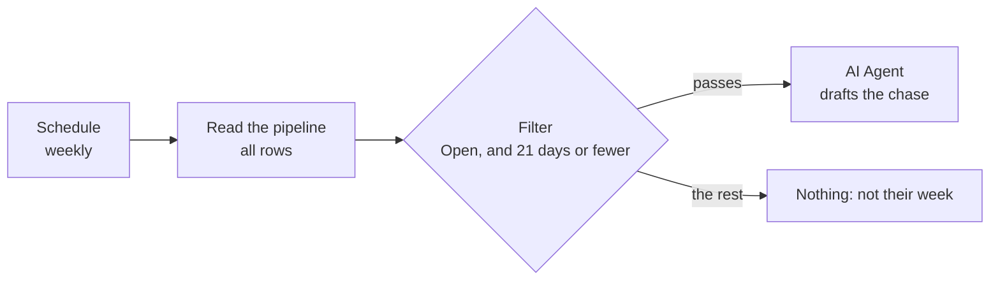

@slide two-col
kicker: Nothing new to learn here
## You have built both of these pieces already

::: cols
:: card good
### Schedule Trigger
Same node, same weekly interval, from Section 5.2. You are not learning
a new trigger, you are reusing the one you already trust.
:: card bad
### Google Sheets, Get Row(s)
Same operation, same pipeline, same read-only ceiling. Point it at the
same renewal sheet Agent 3 already reads.
:: card good
### One new thing: which rows matter here
:::

@narrate
Add a Schedule Trigger and a Google Sheets node exactly as you did in
Section 5. There is a real lesson hiding in how little there is to
explain here: once you have built one agent properly, the next one
starts from a head start, not from zero.

There is even a legitimate shortcut, and it is worth doing once to
learn that it exists: duplicate the Agent 3 workflow from the
workflow list, rename the copy, and strip out the report prompt,
keeping the trigger and the sheet read. Two working nodes, inherited
in ten seconds, credentials already attached. One discipline comes
with the move: read what you kept. An inherited node carries every
setting of its old job, and the read only dropdown check from Section
5.2 applies to a duplicated node exactly as it did to a fresh one.
Copying a workflow copies its virtues and its assumptions alike.

@slide sidenote
kicker: The one genuinely new decision
## Which rows count as "needs a chase"

::: split
:: main
Not every open renewal needs an email this week. This build reasons
about renewals within three weeks of their date, which means your
prompt needs the row's status and how many days remain, not just its
name.
:: aside Where "three weeks" comes from
It is not a magic number. It is Priya's own answer to "how much runway
do I actually need to chase a document and still make the deadline."
Yours might be different, and that is fine, the number belongs to you.
:::

note: TODO-IMG screenshots/section-5/n8n-sheets-node-pipeline-data.png (same Sheets node pattern as Agent 3, reused here)

@narrate
This is worth pausing on: the "three weeks" threshold is a judgement
call you are encoding, not a fact the data hands you. Write down your
own number before you build this, the same way you would decide it for
a person you were training to do this job.

Notice how this number sits against Agent 3's. The Monday report
worries at fourteen days; the chaser starts drafting at twenty one.
That ordering is the system working: the chase goes out while there
is still runway, so that by the time a renewal enters the report's
worry window, it should already have a reply thread behind it. Two
different numbers, two different jobs, chosen to mesh. When you set
your own thresholds, set them as a pair on purpose: the nudge should
always fire before the alarm.

@slide callout
kicker: Where "days remaining" actually comes from
::: callout It is calculated, not typed into a cell
Nobody updates a "days until renewal" column by hand every morning. Add
one small step that calculates it from today's date and the renewal
date already in your sheet, so the number is always current when your
agent reads it.
:::

@narrate
This is a small detail with a real cost if you skip it. A stale "days
remaining" number, typed once and never updated, will eventually tell
your agent a renewal is safely far away when it is not.

The mechanics stay code free: n8n's date handling can subtract the
renewal date from today inside a small transformation step, one
setting, no formula language to learn, and the course template does
it exactly that way, so import C04 later and read how if you prefer
learning backwards. The principle underneath is the one to keep:
anything that changes with the calendar must be computed at run time,
never stored. A stored "days left" is a snapshot pretending to be a
fact, which is becoming a familiar villain in this course.

@slide diagram
kicker: Who selects, who writes
## The filter sits between the sheet and the agent

figcap: Selection is wiring. Writing is judgement. Keeping them separate keeps both checkable.

@narrate
The selection itself is one more node, a Filter, sitting between the
sheet and the agent, with two plain conditions: Status is Open, and
days remaining is your number or fewer. What does this buy over just
asking the model to pick the rows itself? The filter is
arithmetic, so it is either right or wrong, checkable in one glance
at what passed through. Save the model for the part that needs a
model, the wording, and let a dumb comparison decide who gets
chased. One box selects, one box writes, and when a chase goes to
the wrong client, you will know within a minute which of the two to
open, because they cannot both be responsible.

@slide bullets
kicker: Before you move on
## What you should have now

1. A Schedule Trigger and Sheets node, reused from Section 5's pattern
2. A Filter node passing only open renewals inside your chase window
3. Pinned pipeline rows, including at least one renewal due soon and one that is not
4. A clear answer to "how many weeks out counts as urgent," written down

@narrate
Check the pinned rows against the filter by hand once: with the
course's five-client pipeline, one open renewal sits inside a
twenty one day window and should pass, the closed one must never
pass whatever its date says, and the far-off ones wait their turn.
If your filter passes a different set than your head does, one of
you is wrong, and it is cheaper to find out which one now. Next
lecture is where those close-to-deadline rows turn into an actual
drafted email, one per client.
