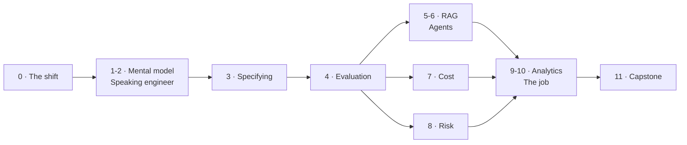

@slide sidenote
kicker: Section 0 · Orientation
## Three honest routes through this

::: split
:: main
1. **The full build.** Every section in order, exercises done. Roughly 12 hours
2. **The ship-it path.** Sections 0, 3, 4, 7, 8. You have a feature in flight now
3. **The credibility path.** Sections 1, 2, 5, 6. You need to hold your own with engineers
:: aside The one exception
Whichever route you take, do not skip Section 4. Every other section leans on it.
:::

@narrate
There are three sensible ways through this, and picking one deliberately beats
drifting through in order.

The full build is every section, in order, with the exercises actually done.
That's about twelve hours including the work, and it's what I'd recommend if the
AI part of your role is going to grow.

The ship-it path is for people with a feature in flight right now. Sections zero,
three, four, seven and eight. That's spec, evaluation, cost and risk: everything
you need to get something out safely, and nothing you don't.

The credibility path is sections one, two, five and six. Take that if your
immediate problem is holding your own in technical conversations rather than
shipping something this quarter.

Which of the three sounds like you right now: the full build, the ship-it path, or
the credibility path? Pick honestly, not aspirationally, because the route you'd
like to have time for isn't always the one you actually do.

You can always come back for the rest. Nothing later depends on you having watched
everything earlier, with one exception. Don't skip Section 4. Everything leans on
it.

@slide diagram
kicker: The shape of the course
## How the twelve sections fit together
figcap: Section 4 is the hub. Everything downstream consumes the measurement you build there.

@narrate
Before the artifacts, here's the shape of the whole course on one screen.

You start at Section zero, which you're in now. Sections one and two give you the
mental model and the vocabulary. Section three is where you write the spec.

Then look at Section four, sitting in the middle. That's evaluation, and it's the
hub. Everything to the right of it consumes the measurement you build there. RAG
and agents in five and six are judged by it. The cost work in seven prices it. The
risk work in eight stress-tests it. The analytics in nine and ten report it.

That's why I said don't skip Section four. It isn't the hardest section, but it's
the one the others plug into.

@slide table
kicker: What you build · 1 of 2
## The specification and measurement artifacts

| # | Artifact | You will use it to |
| --- | --- | --- |
| A01 | AI Feature PRD | Spec a feature so QA can actually test it |
| A02 | Golden dataset spec | Choose the 50 cases that decide your launch |
| A03 | Eval harness (sheet) | Measure quality with no engineering time |
| A04 | Eval harness (Python) | Put that measurement into CI |
| A05 | Rubric + calibration | Get two reviewers to agree |
| A06 | RAG design doc | Survive an architecture review |

@narrate
Here's the first half of what you'll walk out with.

The PRD template is the one most people tell me changed their week. It's a spec
format built for features that don't behave the same way twice.

The golden dataset spec and the rubric are how you pick the fifty cases that
decide your launch, and how you get two reviewers to score them the same way.

Then two versions of the eval harness. One is a spreadsheet, so you can build it
this afternoon without asking engineering for anything. The other is about thirty
lines of Python, so the same measurement runs automatically on every change. Take
whichever fits your situation. Most people start with the sheet.

@slide table
kicker: What you build · 2 of 2
## The artifacts that get people promoted

| # | Artifact | You will use it to |
| --- | --- | --- |
| A07 | Retrieval scorecard | Diagnose *why* answers are wrong |
| A08 | Agent scoping sheet | Size automation without wishful thinking |
| A09 | Unit economics model | Answer "what does this cost at scale?" |
| A10 | Model selection scorecard | Defend a model choice on evidence |
| A11 | Risk register + red-team | Clear legal before it clears you |
| A12 | Metric tree | Prove the feature still works, months after launch |

@narrate
The second half is the part that tends to get people promoted, because it's the
part almost nobody else on the team is doing.

The retrieval scorecard tells you why answers are wrong, not just that they are,
which turns a vague complaint into a fixable one.

The agent scoping sheet stops you committing to automation that the maths says
can't work. The unit economics model answers the question your finance team will
eventually ask, in the meeting where you don't want to be guessing.

The risk register is the one that saves whole quarters. Bring it to legal at
kickoff and you get conditions. Bring it in launch week and you get a hold.

And the metric tree is the one you'll actually keep using longest, because it
isn't a pre-launch document at all. One North Star and a couple of branches is
what tells you honestly whether the feature earned its keep six months in, not
just on the day it shipped.

@slide callout
kicker: Practicalities

::: callout Worth thirty seconds now
Turn captions on if you skim. And ==bring one real feature with you==. Every
exercise is written to be done against something from your own work.
:::

@narrate
Two practical things.

Captions are on every lecture, so if you're a skimmer, use them.

More importantly, bring one real feature with you. Every exercise in this course
is written so you can do it against something from your own job instead of a toy
example. Pick the AI feature you're most unsure about right now, keep it in mind,
and by Section 8 you'll have specced, measured, costed and risk-assessed it
without doing any extra work.

If you genuinely don't have one, use the support-summarisation case from the next
lecture. It runs all the way through the course.

@slide statement
kicker: Next
class: center
## Now the idea everything else hangs off.
lead: Six minutes, one idea, and the most important lecture in the course.

@narrate
Right. That's the housekeeping.

The next lecture is the one that matters most. It's six minutes, it's a single
idea, and everything else in this course is a consequence of it.

Let's go.
