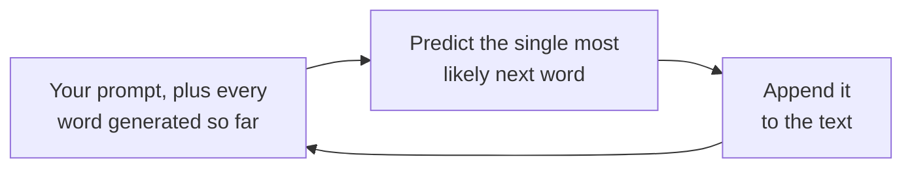

@slide statement
kicker: Section 1 · The mechanism
## Here's the whole model, in one sentence: predict the single most likely next word, then do it again.
lead: Everything else in this section, the useful parts and the dangerous ones, follows from that sentence.

@narrate
Picture the demo that got this feature greenlit. Someone picked the
prompt, tried it a few times first, and the room nodded along. Two weeks
into production, the same feature meets a message nobody rehearsed, and
it answers just as confidently as it did in the demo, except now it's
wrong.

That gap is not a bug that crept in afterwards. It's the mechanism, doing
exactly what it always does, just facing an input nobody chose for it
this time.

Strip away the marketing and the mystique, and here's what's actually
happening inside every one of these systems: given everything so far,
predict the single most likely next word. Add it. Do it again. That's the
whole mechanism. Not reasoning in the way you reason. Not looking things
up the way a search engine looks things up. Pattern completion, one word
at a time, extremely fast.

So what follows from that one sentence? I want to spend this lecture on
four things, because none of them are obvious from using the product,
and every one of them will eventually cost you if you don't already
know them.

None of this is a criticism. It's just what the mechanism is, and a PM
who knows the mechanism makes different, better decisions than one
working from the demo alone.

@slide diagram
kicker: The actual mechanism
## What's happening between your prompt and its answer
figcap: The model has no separate "thinking" step outside this loop. The words being generated are the only computation you get to see.

@narrate
Here's that sentence as a loop, because it really is just this, run
thousands of times per answer.

Start with your prompt. Predict one word: the single most statistically
likely next word, given everything so far. Append it. Now that word is
part of "everything so far," so go around again. Predict the next one.
Append it. Repeat until the answer is done.

There's no separate step where it "thinks it through" first and writes
the answer down after. The writing is the thinking, and once a word is
generated, the model is already partly committed to whatever comes next,
because that word is now sitting in the context feeding the next
prediction.

@slide quote
kicker: Ask it something it cannot know
attrib: A model with no access to your company's actual policy

> "We offer a full refund within 30 days of the annual charge."

@narrate
Watch the mechanism produce a genuinely dangerous sentence.

Ask a model, with nothing in the prompt about your actual policy, what
your refund policy is. It doesn't say "I don't have that information." It
predicts the most statistically likely continuation of a sentence that
starts with "our refund policy is," because somewhere in an ocean of
training text, refund policies overwhelmingly sound like that.

Thirty days, full refund, is a genuinely common policy shape. It might
even be close to yours, by coincidence. It is not looking up your policy.
It's completing a plausible sentence, with exactly the same confident tone
it would use if it happened to be correct.

Picture a support agent trusting that sentence for one real customer.
Nothing about the delivery would have warned them. That's the entire
danger in one exchange: not that it's wrong, but that wrong and right
sound identical.

@slide table
kicker: Four consequences that follow directly
## What that mechanism means for you

| Because it... | You should expect... |
| --- | --- |
| Completes patterns, not intentions | Confident answers to ambiguous questions, not clarifying ones |
| Has no separate confidence signal | Wrong answers delivered in the same tone as right ones |
| Only knows training data plus your prompt | Confident invention on anything recent or proprietary |
| Reflects the statistical centre of its training | Common answers over rare, correct, specialist ones |

@narrate
Four consequences, and you just watched two of them happen at once.

It completes patterns, not intentions, so an ambiguous question gets a
confident, plausible-sounding answer instead of the clarifying question a
person would ask.

It has no built-in confidence signal separate from fluency, so a wrong
answer and a right one arrive in exactly the same tone. You cannot hear
the difference.

It only knows what's in its training data plus whatever you put in the
prompt, which is precisely why it invented your refund policy instead of
admitting it didn't have one.

And it reflects the statistical centre of everything it was trained on.
Common patterns dominate. A rare, correct, specialist answer competes
against a much more common, plausible-sounding, wrong one, and the common
one often wins.

Hold onto that table. Nearly every failure mode in the rest of this
course is one of these four, wearing a different costume.

@slide definition
kicker: Naming it precisely

::: definition Next-token prediction
Choosing the single most statistically likely next word, given everything
written so far, then repeating. Not lookup. Not reasoning in the way you
mean it. Pattern completion, extremely fast, extremely fluent.
:::

::: example Try this yourself
Ask any model one question only your company could answer correctly, with
no context provided. Read the confidence in the answer. Now you've felt
the mechanism, not just heard about it.
:::

@narrate
That's the term for the whole mechanism. Not magic, not reasoning in the
way the word usually means: pattern completion, one token at a time, at a
speed and fluency that makes it feel like something else.

The exercise takes thirty seconds, and it's the one that actually sticks.
Ask any model something only your company could know, with zero context
given. Whatever it says back, confidently, is the mechanism working
exactly as designed, on a question it had no business answering.

@slide callout
kicker: The honest caveat

::: callout Be straight about this
This is the base mechanism, not the whole deployed product. ==Real
systems add guardrails, tool access, and retrieval on top of it==, and
Sections 5 and 6 are about exactly that. But everything they add sits on
top of this loop. None of it replaces it.
:::

@narrate
Say the honest caveat, because overclaiming in the other direction is
just as misleading.

What you just watched is the base mechanism, not the entire product you
actually use. Real systems wrap it in guardrails, give it tools to look
things up, and connect it to your actual documents, which is most of what
the RAG and agents sections later in this course are about.

But every one of those additions sits on top of this loop. They don't
replace next-token prediction, they constrain and inform it. Understanding
the loop is what lets you tell the difference between a guardrail that
actually works and one that's decoration.

@slide bullets
kicker: Before you move on
## One thing worth doing now

Ask a model one question only your company could answer, with no context, and notice whether it hedged or answered as confidently as a correct answer would

@narrate
One thing before you move on.

Ask a model one real question only your company could answer, with
nothing about your company in the prompt. Then notice, specifically,
whether it hedged, or answered with the same confidence a correct answer
would carry.

Next lecture takes the other half of that loop seriously: what's actually
inside "everything written so far," how big that space is, and exactly
where your feature quietly breaks once real conversations get long.
