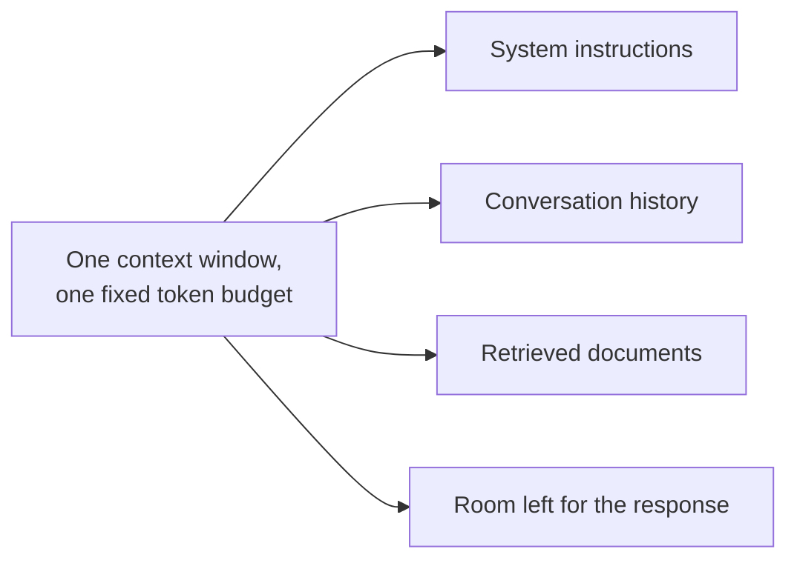

@slide statement
kicker: Section 1 · Tokens and context
## The demo used a three-message thread. Production has forty. Same prompt, same model, and it quietly stopped working.
lead: Not a bug. The context window filled up, and something had to give.

@narrate
Here's a failure pattern you will see, almost guaranteed, on any feature
that summarises or reasons over a conversation. It works perfectly in the
demo, on a short thread you picked yourself. Weeks later, on a real
forty-message support thread, it starts missing things it used to catch.

Nobody changed the prompt. Nobody changed the model. What changed is
length, and length runs straight into a hard limit called the context
window: the finite amount of text a model can hold in view at once,
measured not in words but in tokens.

Understanding that limit, and what happens right at it, is the difference
between debugging this in an afternoon and debugging it by guessing for a
week.

And it will look like a model problem first. Someone will suggest
switching providers, or rewriting the prompt for the fifth time. The
actual fix is usually neither.

@slide table
kicker: The actual unit
## Tokens, not words

| Text | Roughly this many tokens |
| --- | --- |
| A word, on average | 1.3 |
| A typical support ticket reply | 40-60 |

@narrate
First, the unit these models actually think in, because "word count" will
mislead you. A token is roughly three quarters of a word: short common
words are one token, longer or rarer ones split into two or three. If you
want the exact splitting rules, they don't change any decision you own,
so the number to remember is the rough ratio, not the mechanics behind it.

What matters is the practical size: a typical support ticket reply runs
forty to sixty tokens. That number matters in a minute, because your
context window has a fixed token budget, and every part of your prompt,
the system instructions, the conversation, the documents you retrieved,
is drawing from the same pool.

@slide metrics
kicker: Back to Ticket 4471's thread
## What happens once it grows to forty-five messages

::: metrics
- 1 :: The message with the original April 1st deadline :: bad
- 45 :: Messages in the thread by the time it's escalated ::
- 12 :: Oldest messages silently dropped to fit the window :: bad
:::

@narrate
Picture that ticket from Section 0, still open, still escalating. By
message forty-five, the thread is long enough that it no longer fits the
context window whole.

The common, simple fix engineering reaches for first is a sliding window:
keep the most recent messages, drop the oldest ones until it fits.
Straightforward, cheap, and it means the first message, the one with the
actual deadline, is exactly the one most likely to get silently dropped.

Nobody decided to lose the deadline. The window filled up, and the oldest
content, which happened to be the most important content, lost the
tie-break.

This is also why it's so hard to catch in testing. Fifty short, tidy test
cases will not surface it. A length-dependent failure only shows up in a
test case that's actually allowed to grow long, which is precisely the
kind of case most test sets never include.

@slide diagram
kicker: What's actually sharing that budget
## Four things drawing from one token pool
figcap: Grow any one of these and there's less room left for the others, including the answer itself.

@narrate
Here's why the window fills up faster than people expect. It isn't just
the conversation. Four things share the exact same budget.

Your system instructions take a slice, fixed, every single call. The
conversation history takes a slice, and it's the one that grows over
time. Any documents you retrieve for the answer take a slice. And
whatever's left over is the room the model actually has to write its
response in.

Grow the conversation history without bound, and you're not just risking
dropped messages. You're shrinking the room left for the model to answer
in, and a cramped response budget produces answers that get cut off
mid-thought.

@slide callout
kicker: The honest caveat

::: callout Be straight about this
Bigger context windows exist now, some models hold hundreds of thousands
of tokens. ==That doesn't mean every token in the window gets weighed
equally==, and it isn't free: cost scales with tokens sent, which Section
7 puts a real number on.
:::

@narrate
Say the honest caveat, because "just use a bigger context window" is the
answer people reach for, and it's incomplete.

Modern models do hold enormous windows now, sometimes hundreds of
thousands of tokens. But fitting is not the same claim as attending to
evenly. Research on these models consistently finds that content buried
deep in a very long context gets less reliable recall than content near
the start or the very end. Fitting solves the truncation problem. It
doesn't fully solve the getting-forgotten problem.

And every token you send costs money, on every single call. Section seven
puts an actual number on that. For now, just know that "send everything,
every time" is a cost decision as much as an engineering one.

@slide definition
kicker: The practical fix

::: definition Context management
Deciding what to keep, summarise, or drop before you hit the limit, on
purpose, rather than letting a sliding window decide for you by accident.
:::

::: example Try this yourself
For any feature that reasons over a growing thread, ask what happens at
message fifty. If nobody knows, that's not a hypothetical, it's an
untested part of your feature.
:::

@narrate
Name the fix precisely, because "add more context" is not it.

Context management means deciding, deliberately, what survives. Summarise
older messages into a few sentences instead of keeping them verbatim.
Re-inject the details that must never be lost, like a deadline, near the
end of the prompt where recall is strongest, not buried at message one.
Decide this on purpose, because the alternative is a sliding window making
the decision for you, silently, the same way every time.

The exercise is one honest question: for your own feature, what happens
at message fifty? If the answer is "we haven't tried it," that's not a
hypothetical risk. That's an untested path your real users are going to
find first.

@slide bullets
kicker: Before you move on
## One thing worth doing now

Take your feature's longest real input, stretch it to three times that length, and watch what happens to the details near the start

@narrate
One thing before you move on.

Find a real case for your feature: more messages, a longer document,
whatever your feature actually takes as input. Push it to three times the
length of the longest one you've genuinely handled, run it, and check
whether the one fact you'd hate to lose, the equivalent of Ticket 4471's
deadline, survived to the other end.

Next lecture stays inside this same mechanism, but from a different
angle: temperature, and why the same prompt, on the same day, gives you
two different answers.
