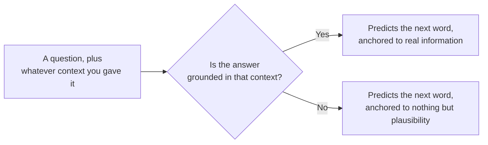

@slide statement
kicker: Section 1 · Hallucination
## That refund policy from lecture one has a name: hallucination. And it wasn't a malfunction.
lead: The model did exactly what it always does. There was just nothing true to anchor it to.

@narrate
Go back to that refund policy for a second: thirty days, full refund,
stated with total confidence, invented from nothing. Notice what it never
said, even once: did anything in that sentence sound like "I'm not
sure"? That has a name, and
understanding the name properly is the difference between explaining it
well to a skeptical engineer and just saying "AI does that sometimes."

Hallucination is not the model malfunctioning. It's the model doing the
exact same thing it does when it's right: predicting the most plausible
continuation of the text so far. The only difference is that this time,
nothing in its training or its prompt anchored "plausible" to "true." So
it filled the gap with whatever sounded right.

That distinction matters, because it tells you the fix isn't "make the
model try harder." It's giving it something true to anchor to in the
first place.

It also matters for a conversation you will actually have. Someone will
call a wrong answer "a glitch" or "a bug they'll patch." Neither word is
accurate, and using the accurate one is how you get taken seriously in
the room.

@slide diagram
kicker: Same mechanism, no anchor
## Why this isn't a separate, broken code path
figcap: There is no second system that switches on when the model doesn't know something. It's the same loop from lecture one, running with nothing to ground it.

@narrate
Here's why you can't patch this out with a stricter prompt alone.

There's no separate "I don't know" system sitting off to the side,
waiting to catch the gap. It's the same single loop from lecture one,
every time. If the context you gave it actually contains the answer, that
same mechanism predicts words anchored to real information, and it's
remarkably good at that.

If the context doesn't contain the answer, the exact same mechanism keeps
running, because that's the only mechanism there is. It predicts the next
plausible word anyway, anchored to nothing but "this is what sentences
like this usually say." From the outside, both outputs sound equally
fluent, equally confident. Only one of them is actually connected to
anything true.

This is also why hallucination gets worse exactly when you'd least
expect it: on the questions that sound the most ordinary. A visibly
strange question makes people double-check the answer. A completely
mundane one, like a refund policy, doesn't, and mundane is precisely
where an invented answer blends in best.

@slide two-col
kicker: Two shapes this takes
## Knowledge gaps versus unsupported details

::: cols
:: card
### Knowledge-gap hallucination
- "What's our refund policy?" with no policy provided
- Answered from general pattern, not your actual policy
:: card
### Unsupported-detail hallucination
- Summarising a real document, and inventing a page number
- One true source, one small invented specific slipped in
:::

@narrate
Two shapes you'll actually meet, and they need slightly different fixes,
so it's worth telling them apart.

Knowledge-gap hallucination is the refund policy: ask it something it
was never given the means to know, and it answers from general pattern
instead of your specifics.

Unsupported-detail hallucination is sneakier, because most of the answer
is genuinely grounded. Give it a real document to summarise, and it gets
the substance right, then invents one small specific, a page number, a
date, a quote, that sounds exactly as confident as everything around it.
That one's harder to catch, because ninety percent of the sentence earned
your trust honestly.

Ask which one you're more worried about, and most teams answer wrong.
They spend their review time hunting knowledge-gap hallucinations,
because that's the dramatic one, and let the quieter unsupported detail
through unchecked, on the document they were sure was safe.

@slide table
kicker: The two fixes that actually work
## Neither one is "write a better prompt"

| Fix | What it actually does |
| --- | --- |
| Grounding | Puts the true answer in the context, so there's something to anchor to |
| Verification | Checks the output against a source after the fact, catching what grounding missed |

@narrate
Here's the honest list, and notice what's missing from it: a cleverer
system prompt.

Grounding means putting the actual answer inside the context before you
ask, your real refund policy, your real document, so the mechanism has
something true to predict from instead of a gap to fill. That's most of
what Section five, RAG, is built to do properly.

Verification means checking the output against a real source after it's
generated, catching the unsupported detail that slipped through even when
most of the answer was grounded. That's what the rubric and golden set
you'll build in Section four are actually for.

@slide callout
kicker: The honest caveat

::: callout Be straight about this
Modern training does reduce this, models are measurably better at saying
"I don't know" than they were. ==Reduced is not eliminated==, and no
amount of asking it to "please only say true things" closes the gap
grounding and verification close.
:::

@narrate
Say the honest caveat, because "this is unfixable" would be its own kind
of overclaiming.

Training has genuinely improved here. Models today are measurably more
willing to say they don't know something than they were. That's real
progress, and it's worth acknowledging rather than pretending nothing's
changed.

But reduced is not eliminated, and it never will be from training alone,
because the mechanism is still next-token prediction. Asking it nicely to
only say true things changes the words in the prompt, not the mechanism
generating the answer. Grounding and verification change what the
mechanism has to work with. That's the actual difference.

@slide bullets
kicker: Before you move on
## Two things worth doing now

1. Find one place your feature answers without being given the real facts
2. Ask whether that gap closes with grounding, verification, or neither yet

@narrate
Two things before you move on.

Find one place in your own feature where it's answering a question
without actually being given the facts to answer it from. That gap is
where your next hallucination is waiting, not hypothetically,
specifically.

Then ask which fix closes it: grounding, if the fact exists somewhere you
could retrieve it, or verification, if you can at least check the answer
afterwards. If neither is possible yet, that's worth knowing before
launch, not after.

Next lecture turns this into a map: seven archetypes of AI feature, and
which ones actually make it to production.
