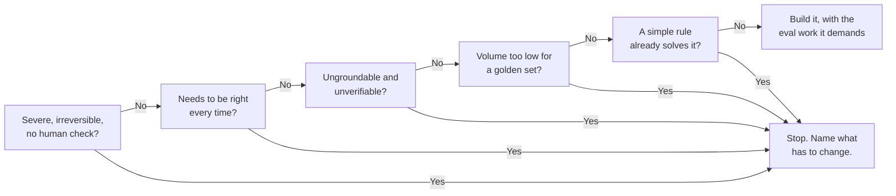

@slide statement
kicker: Section 1 · Hands-on
## This whole section has been how to use AI well. This lecture is the other half: when the honest answer is don't.
lead: Saying no, with a specific reason, is not a failure of imagination. It's the same discipline pointed at the decision before the feature.

@narrate
Everything in this section so far has assumed you're building the
feature and needed to build it well. This lecture assumes something
different: that the most valuable thing you can decide, sometimes, is
not to.

Nobody gets promoted for the AI feature they didn't ship. So who in the
room is actually going to argue for not building it? That's exactly why
this checklist matters: the pressure is always toward building something,
and the discipline you need is the same one from the rest of this course,
pointed at the decision itself instead of at the output.

Five questions. If you answer yes to any of them, that's not a maybe.
That's a specific, nameable reason to stop, or to fix, before you write a
line of spec.

This lecture is marked hands-on for a reason. Reading a checklist teaches
you nothing. Running it against something you actually care about
shipping is the only version that changes what you do next week.

@slide bullets
kicker: The disqualification checklist
## Say no if any one of these is true

1. Is a wrong answer severe and irreversible, with no human check first?
2. Does this need to be correct every time, not just usually right?
3. Can you neither ground it in facts nor verify it afterward?
4. Is the volume too low to justify a golden set at all?
5. Would a simple rule already solve this, reliably, today?

@narrate
Here's the checklist. Five questions, and one yes is enough to stop and
rethink.

Severe and irreversible, with nothing catching it first, that's the act
archetype at its most dangerous, last lecture's chart telling you the
truth. Needing correctness every time, not just usually, is asking the
mechanism from lecture one to do something it fundamentally isn't built
for.

Ungroundable and unverifiable together means neither of hallucination's
two real fixes is available to you, so you're flying on hope. Volume too
low means the golden set from Section four costs more than the problem is
worth. And if a simple rule already solves it, adding a probabilistic
system on top only adds risk to a feature that already worked.

Read them again and notice none of the five asks whether the model is
capable enough. Every one of them is a question about your situation:
what happens when it's wrong, whether you can check it, whether the
volume justifies the investment. That's deliberate. Capability keeps
moving. Your situation is what you actually control.

@slide diagram
kicker: The checklist as a decision path
## One yes on any gate is a stop, not a maybe
figcap: A no on all five is what clears a feature to move forward, and even then it carries the eval work last lecture's chart said its archetype demands.

@narrate
Here's the same five questions laid out as a path, because that's how it
actually plays out in a room. One yes, on any single gate, and you stop
right there and name what has to change before you go further.

Only a no on every one of them clears you through to the far side, and
even then, you land on the eval work last lecture's chart said this
archetype demands, not a free pass.

@slide two-col
kicker: Run it against something real
## Same toolkit, two different verdicts

::: cols
:: card good
### Summarise the support thread
- Wrong summary gets caught by the agent reading it
- Groundable in the actual ticket, verifiable against it
- High volume, easily justifies a golden set
:: card bad
### Auto-approve refunds over $500
- Wrong approval is money out the door, no human checked
- Needs to be correct every time, not usually
- Low historical volume, no golden set built yet
:::

@narrate
Same company, same underlying model, two completely different verdicts,
and this is the exercise, run for real.

The ticket summariser passes cleanly. A wrong summary gets caught by the
agent reading it before anything happens. It's groundable in the actual
ticket text and verifiable against it. And ticket volume is high enough
that building a golden set pays for itself immediately.

Auto-approving refunds over five hundred dollars fails on at least two
questions at once. Money leaves before any human checks it, that's severe
and irreversible. And it needs to be right every single time, not
usually, because "usually" means real dollars walking out the door on a
predictable schedule.

Notice these are the same seven archetypes from last lecture, just met at
the decision point instead of after the fact. Summarise sits at the safe
end of that chart. Act sits at the dangerous end. The checklist is what
that chart feels like before you've built anything.

@slide callout
kicker: The honest caveat

::: callout Be straight about this
A "no" from this checklist is rarely permanent. ==It's usually a specific
list of what has to become true first==: a retrieval system to ground it,
a golden set worth the investment, a human checkpoint added back in.
:::

@narrate
Say the honest caveat, because "no" can sound bigger than it actually is.

The refund example didn't fail because AI can never touch money. It
failed because right now, today, it isn't groundable enough, verifiable
enough, or reviewed enough. Add a human approval step back in for
anything over five hundred dollars, and question one stops applying.
Build enough volume and history, and question four stops applying.

A disqualification is a punch list, not a verdict. It tells you exactly
what would have to change, which is far more useful than either a blind
yes or a permanent no.

@slide definition
kicker: Naming it precisely

::: definition The disqualification checklist
Five questions, asked before the spec, not after the postmortem. One yes
means stop and name what has to change, not push forward and hope.
:::

::: example Try this yourself
Run all five questions against your actual current feature, today, out
loud, with someone else in the room. Silence on any question is itself an
answer.
:::

@narrate
That's the whole tool, and notice it's designed to run before the spec,
not after something's already gone wrong in production.

The exercise is blunt: run all five, right now, against the real feature
you're closest to, and do it with someone else in the room. If you hit
silence on any question, nobody actually knows the answer, and that
silence is exactly as informative as a yes. It means find out before you
build, not after.

@slide bullets
kicker: Before you move on
## Two things worth doing now

1. Run the five questions against your current feature idea
2. For any yes, write down what specifically has to change

@narrate
Two things before you move on.

Run the five questions against whatever you're closest to building right
now. Not hypothetically, the real one.

For every yes you get, write down, specifically, what would have to
become true before that answer flips. That list is worth more than the
checklist itself, because it turns a stop sign into a roadmap.

Next lecture closes out this section: what you've actually built here,
and how it plugs into everything from Section two onward.
