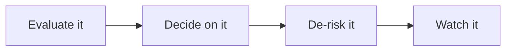

@slide statement
kicker: Section 10 · What the room actually asks
## Four questions keep recurring in AI product interviews. Most candidates answer all four in generalities.
lead: You've spent this course building the specific answer to each one. This lecture is where you practise saying it out loud.

@narrate
Ask around, and product leaders hiring for anything AI-adjacent will
describe a strikingly similar loop: how would you evaluate this, how
would you decide whether to ship it, what would worry you about it, how
would you know it's working once it's live. Different companies, same
four questions, because the underlying job is the same everywhere.

Most candidates answer all four the same way too: correctly in spirit,
vaguely in substance. "I'd set up a good evaluation process" is true of
almost every candidate in the room and distinguishes none of them. It
sounds like an answer without functioning like one.

You're not in that position any more, and this lecture's only job is
making sure you notice that before the interview does it for you. Every
one of these four questions already has a specific answer sitting in
this course, built during an exercise, not invented under pressure in
the room.

That matters more for this specific interview than it would for most
others, because the interviewer asking these questions is very likely
someone who has personally been burned by a vague answer before, either
their own or a hire's. They're not asking to make conversation. They're
screening for the exact gap this course exists to close.

@slide diagram
kicker: Four questions, four places your answer already lives
## The interview loop, mapped to this course

@narrate
Notice these four questions aren't a random assortment, they trace the
job itself, in the exact order the job actually happens: assess the
feature, choose whether it ships, name what could go wrong, then keep
watching once it's live. An interviewer asking all four isn't testing
four unrelated skills.
They're testing whether you can walk a feature through its actual
lifecycle, the same lifecycle this course has spent ten sections
building one artifact at a time.

Take the first question specifically, "how would you evaluate this
feature," since it's the one almost every candidate gets asked and
almost none answer well. "I'd look at accuracy" isn't wrong, it's just
not an answer yet. "A fifty-case golden set, weighted toward the
boundary cases, scored against a rubric two people agree on" is the
same idea, drawn from 4.2's golden set and 4.5's pass rate, except now
it's something you've actually built and can describe in the order you
built it.

The second question, deciding whether to ship, catches a confusion
worth clearing up before anyone asks it directly: passing an eval and
being ready to ship are two different questions, and answering as
though they're the same one is a fast way to sound junior in the room.
7.4's scorecard exists precisely because the ship decision weighs the
pass rate against cost, latency, and how bad the failure mode actually
is, not the pass rate by itself. Naming those variables unprompted is
what separates someone who ran an eval once from someone who's made a
real ship call.

The third question, what would worry you, is where most candidates go
softest, because naming a real worry out loud feels like admitting a
weakness rather than demonstrating one. It's the opposite. "I'd want to
know the blast radius before I got excited, here's what that means for
this specific feature," drawing on 6.6's blast radius and 8.1's
register, is a stronger answer than pretending no feature has ever
worried you, because the second version isn't true of anyone who's
actually shipped something.

The fourth question, how you'd know it's working after launch, is the
one candidates skip entirely most often, because most interview prep
stops at launch. Answering it well, adoption, acceptance, deflection,
9.1's three-metric floor, signals something specific: that you think
about a feature as a thing that keeps needing attention after the demo,
not a thing that's finished the day it ships.

@slide two-col
kicker: The same question, two answers
## "How would you evaluate this feature," asked two ways

::: cols
:: card bad
### The generic answer
- "I'd set up a solid evaluation process"
- "I'd track accuracy and iterate from there"
- Ends the moment the interviewer asks "like what, specifically"
:: card good
### The specific answer
- "A fifty-case golden set, weighted toward the boundary cases"
- "A rubric two raters actually agree on, then a real pass rate"
- Survives three follow-ups, because every part of it is true
:::

@narrate
Notice the good column isn't longer or more impressive-sounding, it's
just answerable. Every phrase in it is something you could open right
now and point to, because you built it during this course's exercises
or on a real feature at work.

This is 10.5's follow-up-question test again, aimed at a spoken answer
instead of a portfolio document. An interviewer who's good at this job
will ask "OK, what would three of those fifty cases actually look
like." The generic answer has nothing left to say at that point. The
specific answer has forty-seven more cases to describe, because they're
real.

This is also why memorising this course's vocabulary without the
underlying habit fails in the room. "Golden set" and "blast radius"
said as terms, without being able to build one live for a feature
you've never seen, sound identical to the generic answer within two
follow-up questions. The interviewer isn't grading your vocabulary.
They're grading whether the vocabulary is attached to something real.

Notice, too, that the good column answers in the order the work
actually happens: build the set, agree the rubric, then measure. That
sequencing is its own signal, separate from the content. A candidate
who lists the same three ingredients out of order, rubric before
cases, measuring before agreement, is usually reciting a checklist
rather than describing something they've actually done in that order
before.

@slide callout
kicker: The honest caveat
::: callout Be straight about this
Reciting a framework by name isn't the same as applying it.
==A good interviewer will hand you their feature and ask you to do it
live==, not describe it in the abstract.
:::

@narrate
Say the honest caveat, because this lecture would be genuinely
counterproductive if it taught you four phrases to memorise instead of
four habits to demonstrate.

The actual test rarely sounds like "define a golden set." It sounds
like "here's a feature we're building, walk me through how you'd
evaluate it," followed by silence while you think. That silence is the
entire interview. Anyone can define a golden set. Far fewer people can
sketch one, unprompted, for a feature they heard about ninety seconds
ago.

This is exactly why the try-this exercise on the next slide asks you to
practise against a feature you didn't design. Answering well on this
course's own examples proves you were paying attention. Answering well
on a feature you've never seen proves you actually internalised the
habit, which is the only version of this skill an interview can't tell
apart from the real job.

This risk is highest right after finishing a course like this one,
while the terms are freshest and the underlying habit hasn't had time
to become automatic. That gap closes with repetition against
unfamiliar features, not with rereading this lecture a second time.

@slide definition
kicker: Naming it precisely
::: definition An answer that survives follow-up
A specific number or mechanism, applied live to the interviewer's
actual feature, not a framework name recited back at them from memory.
:::

::: example Try this yourself
Have someone describe an AI feature you've never heard of. Answer one
of this lecture's four questions out loud, in under a minute.
:::

@narrate
That's the standard worth rehearsing against, and it only works if the
feature is genuinely unfamiliar. Rehearsing on a feature you already
know the answer to tells you nothing about whether the habit has
actually formed.

Notice which of the four questions you reach for fastest and which one
stalls you. That gap is useful information, not something to feel bad
about. It's pointing you back at a specific lecture in this course
worth a second look before the interview that actually matters.

Do this exercise with another person if you can arrange it, since the
unscripted follow-up question is the part that's hardest to practise
alone. A friend asking "what would three of those cases look like" cold
is a far closer rehearsal for the room than answering your own
imagined follow-up.

Run it more than once, against more than one borrowed feature, if you
have the time before an interview that matters. The first attempt tends
to expose the gap. It's usually the third or fourth that starts to feel
like an answer instead of a performance of one.

@slide bullets
kicker: Before you move on
## Two things worth doing now

1. Pick one question and rehearse it live against an unfamiliar feature
2. Notice your weakest question, and revisit that lecture before an interview

@narrate
Two things before you move on.

Pick one question, not all four at once, and actually say the answer
out loud to another person. Reading this lecture's table silently
doesn't build the same reflex as hearing yourself produce the answer
under a little real pressure.

Then be honest with yourself about which question stalled you, and go
back to that specific lecture rather than this one. The fix for a weak
answer on blast radius is 6.6 and 8.1 again, not another pass through
this summary.

Next lecture is your thirty-sixty-ninety day plan: turning everything
from this section into the first three months of the actual job.
