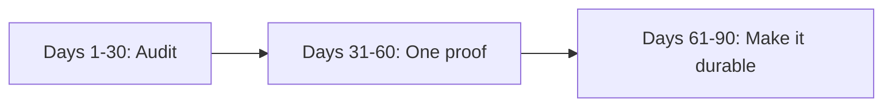

@slide callout
kicker: Section 10 · The first ninety days

::: callout Not a status update
A generic thirty-sixty-ninety plan could describe any PM's first
quarter, at any company, whether or not AI was involved. ==This one
can't==: three specific, dated artifacts instead of three status
updates.
:::

@narrate
"Learn the product, build relationships, ship a quick win" isn't wrong.
It's just not specific to anything, which means it says nothing an
interviewer or a new manager couldn't have guessed before you walked in
the door. You've spent this whole course building things more specific
than that.

This lecture swaps the three generic milestones for three artifacts
this course already taught you to build, timed to when they're actually
achievable in a role touching AI features. Nothing here is new material.
It's a calendar wrapped around tools you already have.

Notice, too, that the timing itself is deliberate, not arbitrary. Each
milestone needs the standing, or the information, that only the
previous one produces. Day one of a new role has neither, which is
exactly why the first thirty days are about finding out what's true,
not about shipping anything yet.

This is also the natural close of this whole section, not a new topic
bolted on at the end. Every lecture since 10.1 has been a specific skill
for doing the job. This one is where those skills get a calendar,
because a skill you can name but never schedule tends to stay
theoretical past the first busy week.

@slide diagram
kicker: Thirty, sixty, ninety, built from tools you already have
## Three milestones, three lectures behind each one

@narrate
Days one to thirty aren't about changing anything, they're about
finding out what's actually true, because a new hire has information
value long before they have standing to act. Classify every AI-touching
feature you can find, shipped or planned, using 1.6's archetypes, and
check honestly whether any of them has an eval or an 8.1-style risk
register row already. Most new AI PMs find at least one that has
neither. That's not a criticism of the team that came before you. It's
the single most useful thing you can hand your new manager in week two.

Days thirty-one to sixty are where the audit turns into something real.
Pick the single gap that matters most, small enough to actually finish
inside a month, and fix it visibly: a 4.2-style golden set for the most
fragile shipped feature, or the first honest row in an 8.1 register
that didn't exist before you arrived. The point isn't the artifact's
size. It's that it's finished and checkable, which a plan or a proposal
never is.

@slide example
kicker: Days 61-90
::: example Durability, not a second one-off win
A dashboard built on 9.5's three-metric floor, so the team can see the
number without asking you directly. Or a roadmap line fixed the way
10.3 describes, so next quarter's commitment isn't another guess.
:::

@narrate
Days sixty-one to ninety are about durability. Could a teammate pick
this up and continue it if you left tomorrow? That question is the
real test of day ninety, more than whether the dashboard or the
roadmap line looks finished.

@slide two-col
kicker: Day thirty, two ways
## The impressive update, and the useful one

::: cols
:: card bad
### The impressive version
- A deck covering everything learned about the product
- A long list of ideas for what AI could do here
- Nothing anyone can check again in a month
:: card good
### The useful version
- One written finding: which feature has no eval, named plainly
- One dated commitment: what ships by day sixty, and how you'll know
- Something your manager can actually hold you to
:::

@narrate
Notice the good column is smaller, not bigger, and looks less
impressive in the room on day thirty itself. That trade is worth making
anyway, because the bad column's comprehensiveness is exactly what
makes it unfalsifiable. Nobody can check "here's everything I've
learned" against anything, six weeks later or ever.

This is 10.2's calibration principle again, aimed at your own first
update instead of a stakeholder's. A single named finding plus a dated
commitment is a claim reality can prove wrong, which is exactly what
makes it trustworthy in a way a comprehensive-sounding survey never is.

There's a compounding effect worth naming here too. A manager who
watches one specific, dated commitment land on time starts trusting the
next one by default. A manager who's only ever seen broad, unfalsifiable
updates has no evidence either way, and has to keep re-evaluating you
from scratch every single time, which is a slower way to earn the trust
this whole plan is actually for.

@slide callout
kicker: The honest caveat
::: callout Be straight about this
A plan is a hypothesis, not a contract. ==If week two turns up a bigger
problem than this plan expected==, chase that instead, and say so.
:::

@narrate
Say the honest caveat, because finishing a plan exactly as written,
regardless of what the audit actually finds, is its own failure mode,
not a sign of discipline.

This is 10.1's sprint-theatre point again, aimed at a whole quarter
instead of a single feature idea. A ninety-day plan followed to the
letter no matter what days one to thirty reveal stops being judgement
and becomes a performance of having a plan. The entire reason to spend
the first thirty days auditing is that the audit might change what the
next sixty should be.

If that happens, say so plainly, the same way 10.2 asked you to replace
a hedge with a real number. "The plan changed because of what I found
in week two, here's the new day sixty" is a stronger sentence to bring
to your manager than quietly forcing the calendar to match an
assumption the audit already disproved.

@slide definition
kicker: Naming it precisely
::: definition A ninety-day plan worth having
Three dated, checkable artifacts, not three status updates: one honest
audit, one small finished proof, one habit the team keeps after you.
:::

::: example Try this yourself
Write your own version of this lecture's table for your actual role,
current or the one you're interviewing for next.
:::

@narrate
That's the standard worth writing toward now, before day one makes it
urgent, and the exercise is worth doing for the real role in front of
you, not a hypothetical one.

Most people writing this for the first time realise they can already
name the day-thirty finding, even before the job starts, just from
what they've noticed in the interview process itself. That's worth
writing down now. It's much easier to confirm a suspicion on day five
than to form one from nothing.

Treat day thirty itself as the plan's own checkpoint, not just a
milestone inside it. Reread what you wrote today against what the audit
actually found, and let the sixty and ninety day rows change if they
need to. A plan that can't survive contact with its own first month of
evidence was never really a plan, just a date with a guess attached.

@slide bullets
kicker: Before you move on
## One thing worth doing now

Write your own thirty-sixty-ninety using this lecture's structure, and name the specific artifact you'd ship by day sixty

@narrate
One thing before you move on.

Write the plan using this lecture's table, for the role you actually
have or actually want next. A generic template rewritten in your own
words is still a generic template. Then name the day-sixty artifact
specifically, not as a category but as a real thing with a real feature
attached, so day thirty-one already knows what it's building toward.

Next lecture is the capstone brief: ship an AI feature spec, the final
project of this course, where every artifact you've built gets used on
one feature, start to finish.
