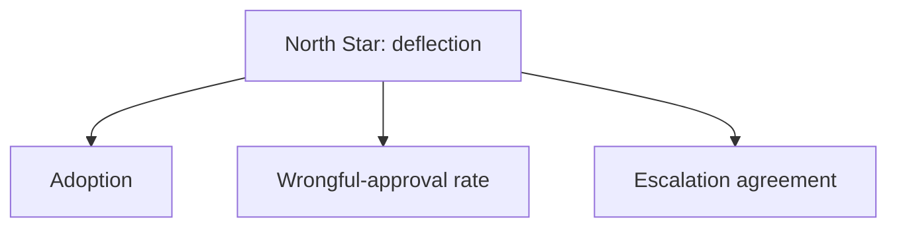

@slide callout
kicker: Section 11 · The worked example

::: callout Same feature, the other four questions
Where 11.2 asked whether the feature works, this lecture asks whether
==it's worth building, safe to ship, and honestly measured after
launch==: the same refund agent, the other four artifacts.
:::

@narrate
Four artifacts, one feature, continuing directly from 11.2's PRD,
golden set and rubric. Nothing about the scope changes here: still
refunds under fifty dollars, verified account, capped at three a day,
everything else escalated to a human.

Watch how directly each artifact here depends on something 11.2 already
built, because your own package should show the same dependencies. The
cost model needs the tool-call sequence from Section seven. The model
scorecard needs the golden set's zero-tolerance bar to even know what
it's scoring against. That dependency isn't a coincidence. It's exactly
the internal consistency 11.1 asked every capstone package to have.

If you skipped straight to this lecture without watching 11.2 first,
the numbers here won't fully make sense, and that's the point rather
than a gap to apologise for. A real feature's cost, risk and metrics
genuinely can't be judged in isolation from its spec and its evidence
that it works. Treat that dependency as a feature of the format, not
an inconvenience of how this course happened to split two lectures.

@slide table
kicker: Artifact four, the cost model
## Three tool calls, real volume, one honest number

| Line | Value |
| --- | --- |
| Tool calls per resolution | 3, the sequence 7.6 already walked through |
| Cost per resolution, mid-tier model | About one and a half cents |
| Monthly volume reaching the agent | 2,000 requests |
| Monthly model cost | About thirty dollars |

@narrate
Three tool calls, checking the account, checking the policy and cap
status, issuing the approval, are the same three 7.6 used to explain
this exact feature's latency. The cost model and the latency budget
are built from the identical sequence, because they're both just
different questions asked of the same three round trips.

Thirty dollars a month sounds almost too small to justify a whole
capstone artifact, and that's the actual point worth sitting with. A
support agent's loaded time runs to real money per hour, and if
deflection lands anywhere near forty five percent of two thousand
monthly requests, that's roughly nine hundred cases a month closing
without a human touching them at all. Thirty dollars against that
much recovered time is not a close call, and it's the kind of number
you want ready before anyone in the room asks whether this is worth
building.

Notice what this number can't tell you on its own. It's an estimate of
cost, not proof the deflection rate is real. That gap is exactly what
the metric tree later in this lecture exists to close.

@slide example
kicker: What this table leaves out entirely
::: example Not the whole cost
Engineering time to build and maintain the integration, the tool calls
into the order system, the escalation queue a human still has to work.
:::

@narrate
A cost model that only counts the model's own API bill is answering a
narrower question than "what does this feature cost," and saying so
plainly is better than letting a small, honest number imply a
completeness it doesn't have.

@slide table
kicker: Artifact five, the model scorecard
## The safety gate comes before the cost comparison

| Model | Wrongful approvals, of 50 | Overall pass rate | Cost per resolution |
| --- | --- | --- | --- |
| Flagship | 0 | 100% | About four cents |
| Mid-tier | 0 | 96% | About one and a half cents |
| Budget | 2 | 88% | About half a cent |

@narrate
Read the first data column before any other, because it's the only
one that gets to disqualify a row outright. Budget's two wrongful
approvals fail 11.2's zero-tolerance bar on the spot, regardless of
how cheap it is or how respectable eighty eight percent sounds next to
the other two.

Between the two models left standing, the decision is now genuinely
about cost, because both already cleared the bar that actually
mattered. Flagship's extra four percentage points of overall pass
rate, and its extra two and a half cents per resolution, are buying
correctness on cases this feature's bounded scope was already
designed to make easy. Mid-tier wins, not because it's cheaper in the
abstract, but because the task's own narrowness means the cheaper
model didn't have to give up anything on the row that actually counts.

This is the direct payoff of 11.2's scope discipline. A wide-open
version of this feature would need Flagship's full reasoning just to
approach zero wrongful approvals. The bounded version made a cheaper
model's ceiling high enough to clear the same bar.

@slide example
kicker: A column this table deliberately drops
::: example Where did 7.4's p95 latency column go
Not because latency stopped mattering: 7.6 already settled it for this
feature. The three tool calls, not the model's own thinking time,
dominate the wait either way.
:::

@narrate
Swapping Flagship for Mid-tier barely moves the number a customer
actually feels, which is one more reason the safety gate and the cost
column are doing all the real work in this particular decision.

@slide table
kicker: Artifact six, the risk register
## The same five categories, populated for this feature

| Category | This feature's risk |
| --- | --- |
| Prompt injection | A crafted email tries to trigger a refund directly |
| Data & privacy | Order history in the prompt carries more than the decision needs |
| Regulatory | Refund handling rules vary by the customer's region |
| Bias & fairness | Escalation rate could differ by customer segment |
| Operational | Approval quality drifts quietly after a model update |

@narrate
These are 8.1's exact five categories, not a reinvented list, because
the point of a shared register format is that any two features' risks
line up in the same rows and can actually be compared.

The first row is already handled, not just named. 11.2's read-then-act
separation is the mitigation, built into the design before this
register was even written, which is what a genuinely low residual risk
looks like on this row rather than an open item.

The second row, data and privacy, is 8.3's territory: send the model
only what the decision needs, verification status, today's approval
count, the amount, rather than the full order history with stored
payment details attached. A refund decision doesn't need to see a
card number to get made correctly, and anything the model never
receives can't leak in a response or sit exposed in a log later.

@slide table
kicker: The register, continued
## The last three rows

| Category | This feature's risk |
| --- | --- |
| Regulatory | Refund handling rules vary by the customer's region |
| Bias & fairness | Escalation rate could differ by customer segment |
| Operational | Approval quality drifts quietly after a model update |

@narrate
The third row is easy to skip entirely on a feature this small, which
is exactly why it belongs on the register anyway. Refund handling and
disclosure rules aren't identical everywhere, so the honest mitigation
is a named check before this feature ever expands past its home
market, not an assumption that what's legal here is legal everywhere.

The fourth row asks a question an aggregate pass rate can't answer on
its own. A ninety six percent overall pass rate could still be hiding
one customer segment escalated far more often than another, the same
blind spot 8.5 warned a single headline number always risks. The
mitigation is watching the escalation rate broken out by segment, not
just the one number this lecture has been quoting in aggregate. Check
your own register the same way: does its headline number hide a
segment you haven't looked at yet?

The last row deserves the most attention of the three, because it's the
one 8.6 warned looks completely fine right up until it isn't. Nothing
about this feature's infrastructure graphs would move if approval
quality quietly drifted after an upstream model update. The mitigation
has to be a metric that would actually catch it, which is exactly what
the next slide's tree is for.

@slide diagram
kicker: Artifact seven, the metric tree
## One North Star, branches adapted to an autonomous decision

@narrate
Deflection sits at the top for the same reason 9.1 gave: it's the
number that ties directly back to the cost model two slides ago. If
deflection lands near the forty five percent this lecture estimated,
the ninety hours of monthly human time this feature was built to save
is real. If it doesn't, the cost model's promise was a hypothesis that
didn't survive contact with production.

Notice the second branch isn't 9.1's original acceptance metric, it's
a direct replacement. What do you watch instead, when there's no human
in the loop to measure acceptance from? Acceptance assumes a human is
deciding, and this feature's auto-approve path has no such human, so
the honest adaptation is the production version of 11.2's own
zero-tolerance bar: wrongful-approval rate, watched continuously, the
same discipline 8.6 asked of exactly this kind of quiet drift.

The third branch keeps something acceptance-shaped for the half of
this feature that does involve a human: when a case escalates, does
the reviewer agree it needed to. A falling agreement rate here is an
early warning that the agent's escalation judgement is drifting, well
before it shows up as a wrongful approval anywhere else.

@slide callout
kicker: The honest caveat
::: callout Be straight about this
The cost model's ninety hours of saved time is a projection, not a
result. ==Only the metric tree's deflection number, measured in
production, can confirm it actually happened==.
:::

@narrate
Say the honest caveat, because it's the one place this whole worked
package could quietly overstate itself if nobody said it out loud.

Every number in the cost model two slides back was an estimate: a
volume guess, a deflection guess, a time-saved guess. None of them
were measured, because the feature hadn't shipped yet when they were
written. That's not a flaw in the artifact. It's exactly what a cost
model is for at this stage. But calling it a result instead of a
projection is precisely the gap 10.3 warned an entire roadmap against,
now showing up in a single feature's numbers instead.

The fix is the same one 10.3 gave a whole quarter: say plainly which
numbers are measured and which are still projected, and revisit the
projection against the metric tree's real deflection number once
there's enough production data to trust it.

@slide definition
kicker: Naming it precisely
::: definition A finished capstone, closed
Six artifacts, one real feature, a safety gate that decides the model
before cost does, and a metric tree that will eventually confirm or
correct every number the cost model projected.
:::

::: example Try this yourself
Go back to your own capstone's cost model. Circle every number that's
a measurement. Underline every number that's still a guess.
:::

@narrate
That's the honest state worth leaving your own capstone in, projected
numbers labelled as projections, not quietly dressed up as results.

Most first-pass cost models, checked this way, turn out to be almost
entirely underlined. That's fine at this stage of a feature's life.
What matters is knowing which parts of your own package are still
hypotheses, the same discipline this lecture just applied to its own
numbers rather than only asking it of you.

@slide bullets
kicker: Before you move on
## One thing worth doing now

Check your own model choice against a safety gate before cost, and label your own cost model's numbers measured or still projected

@narrate
One thing before you move on.

Look at your own model scorecard and check whether cost was compared
before or after any safety gate you should have applied. If a cheaper
model ever won by skipping that order, revisit the decision. Then label
your own cost model honestly, the same exercise this
lecture just ran on itself. It costs a few minutes and it's the
difference between a projection and a claim.

Next lecture is the self-assessment rubric: checking your own finished
capstone against the same bar this worked solution just tried to meet.
