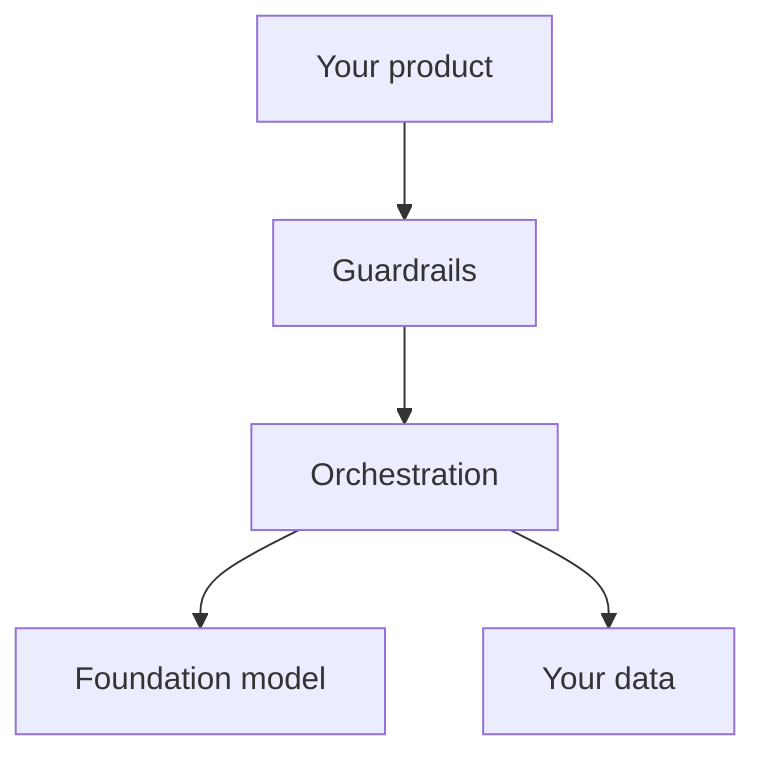

@slide statement
kicker: Section 2 · The stack
## When someone says "the AI is broken," they usually mean one specific layer of five. Guessing which one is how these conversations go sideways.
lead: One diagram, five layers, and you'll never again nod along to a sentence you didn't fully follow.

@narrate
Here's a sentence you'll hear in a real meeting: "the model's fine, it's
a retrieval problem." If you don't know there's a difference between
those two things, that sentence just ended the conversation without you.

There are really five layers in any AI feature, stacked on top of each
other, and almost every technical disagreement you'll sit through is
actually about which one of the five is broken, or which one should
change.

Learn this diagram well enough to redraw it, and you stop nodding along.
You start asking the one question that actually moves the conversation
forward: which layer are we talking about?

This is also the fastest credibility you'll earn in this whole course.
Engineers don't expect a PM to know the stack. Asking "is that a
retrieval issue or an orchestration issue" the first time changes how
the rest of the conversation goes.

@slide diagram
kicker: The whole stack
## Five layers, and almost everything you'll discuss lives in one of them
figcap: Orchestration is the layer PMs forget exists, and it's usually where the actual bug is.

@narrate
Here's the whole thing, top to bottom, the way a user's request actually
travels.

Your product is what the user sees, the chat window, the button, the
summary on screen. Guardrails sit just underneath, checking what goes in
and what comes back out. Orchestration is the layer most PMs have never
heard named, even though they've been debugging it for months: the code
that assembles the prompt, decides what context to include, and calls
everything else in the right order.

That orchestration layer talks to two things beneath it. The foundation
model, the mechanism from Section one. And your data, whatever documents
or records get retrieved to ground the answer. Almost every bug you've
ever blamed on "the model" actually lived in orchestration: the wrong
document got pulled, the prompt assembled the pieces in the wrong order,
the context window ran out before the important part.

Follow the arrows back up and you get the return trip: the model
answers, the guardrails check it again on the way out, and the product
displays it. Same five layers, same order, just running in reverse.

@slide table
kicker: What lives at each layer
## Five layers, five different kinds of problem

| Layer | What breaks here | Who usually fixes it |
| --- | --- | --- |
| Product | Confusing UI, wrong expectations set | Your team |
| Guardrails | Unsafe input slips through, or safe output blocked | Whoever owns risk |
| Orchestration | Wrong context assembled, prompt logic wrong | Engineering |
| Foundation model | Genuine capability limit | Nobody, until you change providers |
| Your data | Missing, stale, or badly chunked documents | Whoever owns the content |

@narrate
Here's why naming the layer matters practically: each one has a
different owner and a different fix.

A product problem is yours, confusing UI, the feature answering a
question nobody actually asked. A guardrail problem sits with whoever
owns risk, something unsafe got through or something safe got blocked by
an overcautious filter.

Orchestration problems are engineering's, and they're the most common
bug you'll actually hit: the wrong document got retrieved, the prompt
assembled the conversation history in the wrong order. A genuine
foundation model limit is the one thing you can't patch, only route
around or wait out. And a data problem sits with whoever owns the
content: stale documents, missing pages, badly chunked text. Five
different people, five different Monday morning conversations.

Most launch-week arguments are actually two people disagreeing about
which row of this table they're in, without either one saying so out
loud.

@slide callout
kicker: The honest caveat

::: callout Be straight about this
On a small team, or a simple feature, ==one person or one file often does
all five jobs at once==. The layers still exist even when nobody's drawn
a line between them, and that's exactly when bugs hide.
:::

@narrate
Say the honest caveat, because this diagram can look like five separate
teams and often isn't.

On a small team, or for a simple feature, one engineer might write the
orchestration code, choose the guardrails, and pick the data source, all
in the same afternoon, in the same file. The five layers still exist.
They're just not five separate people yet.

That's exactly when bugs hide, because nobody's drawing the line between
"this is a data problem" and "this is an orchestration problem" out
loud. Naming the layer is useful precisely because it forces that
distinction even when one person wears all five hats.

@slide definition
kicker: The practical use

::: definition Stack-aware debugging
Before agreeing something is "an AI problem," naming which of the five
layers it actually lives in. The fix, the owner, and the timeline are
different for each one.
:::

::: example Try this yourself
Next time someone says a feature "isn't working," ask which layer. Watch
how much faster the actual conversation gets once everyone's answering
the same question.
:::

@narrate
That's the entire practical payoff of this diagram: one question, asked
before the debugging starts, instead of after an hour of guessing.

The exercise is just that question, used for real. Next meeting where
something's "not working," ask which of the five layers. You'll be
surprised how often the room doesn't actually agree yet, and how much
faster things move once it does.

@slide bullets
kicker: Before you move on
## One thing worth doing now

Take one real bug or complaint about your own feature and name which of the five layers it actually lives in

@narrate
One thing before you move on. Pick whatever's currently broken or
annoying about your feature, and settle, specifically, which of the
five layers owns it. Not a guess. If nothing comes easily, reread that
one.

Next lecture uses this exact stack to answer the question everyone asks
too early: prompt, retrieval, fine-tune, or agent, and the decision tree
that actually settles it.
