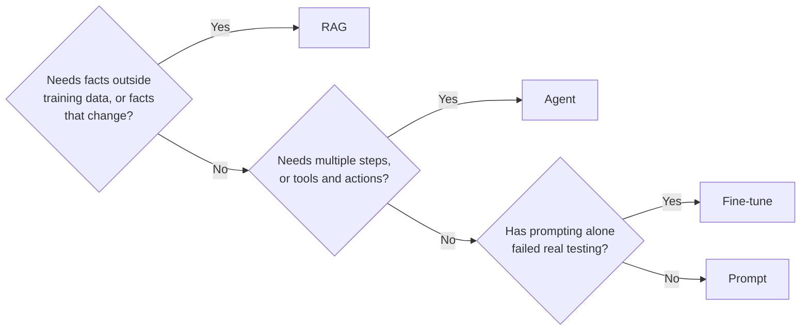

@slide callout
kicker: Section 2 · The decision tree

::: callout Watch for this in the room
Someone proposes a fine-tune before a better prompt gets tried. Someone
else calls for an agent when a single grounded answer would do.
==The expensive option gets proposed first, and it should almost always
be tried last==.
:::

@narrate
That's the pattern worth naming, and there are really only four moves
available: prompt it better, retrieve the right information, let it
take actions, or change the model itself. Three questions, asked in
order, tell you which one you actually need.

Get the order right and you'll notice something. The expensive option
almost never turns out to be the first one you needed to try. It usually
is the last box on this tree, reached only once the cheaper three have
genuinely been ruled out, not skipped past because it sounded more
serious.

That matters because these four options don't cost the same to be wrong
about. Ship the wrong prompt and you fix it before lunch. Commit to a
fine-tune on the wrong assumption and you've spent days of engineering
time and a training run finding out. The tree exists to make sure that
cost difference actually shapes the order you try things in, instead of
whichever option sounds most impressive in the planning meeting.

@slide diagram
kicker: The three questions, in order
## Ask these in order. Stop at the first yes.
figcap: Facts first, then actions, then the model itself, only after prompting has actually failed.

@narrate
Walk it in order, because the order is the whole point.

First question: does this need facts the model wasn't trained on, or
facts that change, like this week's prices or this customer's account
history? If yes, stop, you need retrieval. That's RAG, and it answers
more "the model doesn't know enough" complaints than any other box on
this tree.

If the facts are fine, ask the second question. Does this need multiple
steps, or calling some other system: booking something, updating a
record, checking a second source before answering? If yes, you need an
agent, orchestration that can decide what to do next, not just what to
say next.

Only if both are no do you reach the third question: has prompting
actually failed real testing, not "might it fail"? If a better prompt
genuinely can't hold the format or behaviour you need, a fine-tune
earns its cost. If prompting hasn't been seriously tried yet, the
answer is still prompt.

One more distinction: "multiple steps" means deciding what to do next
based on what just happened, not multiple steps inside one model call.
Look something up, decide whether to escalate, then act: that's the
branching an agent buys you, and why it's harder to evaluate than
anything else here. Section six covers that properly.

@slide table
kicker: What each one actually changes
## Same four options, mapped onto last lecture's five layers

| Approach | What it changes | Cost to try again | Lives in |
| --- | --- | --- | --- |
| Prompt | The instructions you send | Seconds, edit the text | Orchestration |
| RAG | What data gets retrieved | Minutes, swap the index | Your data |
| Agent | What actions it can take | Hours, new tool code | Orchestration |
| Fine-tune | The model's weights | Days, retrain and re-eval | Foundation model |

@narrate
Here's the same four options, mapped onto the stack from last lecture,
and the pattern is worth sitting with.

A prompt change and an agent both live in orchestration, the layer you
can iterate on fastest. RAG lives in your data layer, still cheap to
change: swap what gets retrieved and test again in minutes. A fine-tune
is the only one of the four that touches the foundation model layer
itself, and that's exactly why it's the slowest and most expensive to
get wrong.

Read the iteration cost column again. It climbs by roughly an order of
magnitude at each row. That column alone is the argument for asking the
questions in order. You want to exhaust the cheap, fast options before
committing to the one measured in days, not hours.

There's a second reason the layer matters, beyond speed. Whoever owns
that layer is who ends up doing the work. A prompt change is often
something you can propose in a document yourself. RAG usually needs
someone who owns the data pipeline. A fine-tune needs an engineer who
can run a training job, evaluate it properly, and decide whether it's
safe to ship. Naming the layer tells you not just how long the fix
takes, but whose calendar it actually needs to land on.

@slide two-col
kicker: Same complaint, two different fixes
## Watch which layer the fix actually belongs in

::: cols
:: card bad
### "Fine-tune it on this month's prices"
- Retrains every time a price changes
- Days of turnaround for a one-line fact
- Question one already answered this
:: card good
### "Retrieve the current price sheet"
- Updates the moment the source document changes
- No retraining, no waiting on a batch job
- Fixed in the data layer, not the model layer
:::

@narrate
Here's the tree, run for real, on a complaint you'll actually hear:
answers are citing last month's prices.

The instinct in the room is often "let's fine-tune it on the current
sheet." Walk that against question one and it falls apart immediately.
Prices change monthly. A fine-tune baked in today is wrong again in four
weeks, and each correction means retraining and re-evaluating before it
ships.

The actual fix was sitting at question one the whole time. Retrieve the
current price sheet at answer time, and the fix updates itself the
moment someone edits the source document. No retraining, no waiting on a
batch job, no drift between what the model "knows" and what's actually
true this week.

Same complaint, same team, same model underneath. The only thing that
changed was which layer they looked at first.

@slide callout
kicker: The honest caveat

::: callout Be straight about this
Real features usually need more than one box at once. ==A support agent
that retrieves account data and then updates a record is RAG and agent
together==, not a choice between them.
:::

@narrate
Say the honest caveat, because this tree can look like it's asking you
to pick exactly one box, and that's rarely how a real feature works.

A support agent that looks up your order and then cancels it is doing
RAG to find the order and acting to cancel it, both at once. The tree
isn't asking you to choose a single answer. It's asking you to name
every box that applies, in order, so you don't skip retrieval on your
way to building an agent that didn't actually need to be one.

@slide definition
kicker: Naming it precisely

::: definition The decision tree
Three questions, asked in that order: does it need facts, does it need
actions, has prompting actually failed. Fine-tuning is the answer only
when all three point there, never the first thing you reach for.
:::

::: example Try this yourself
Take a proposal on your team that jumped straight to "let's fine-tune."
Run it backward through the three questions and see how far it actually
gets before the honest answer is yes.
:::

@narrate
That's the entire tool, and notice where it puts the burden of proof: on
the expensive option, not the cheap one. Nobody has to justify trying a
better prompt first. The justification is owed by whoever wants to skip
straight to the box that takes days and needs its own training run.

The exercise is specific. Find a real proposal, yours or someone else's,
that reached for a fine-tune, and run it backward through the tree. More
often than you'd expect, it stops at question one or two, and the actual
fix was retrieval or a better prompt the whole time.

@slide bullets
kicker: Before you move on
## One thing worth doing now

Run the three questions against a feature you're currently discussing, and name every box that applies, not just the first one that fits

@narrate
One thing before you move on.

Run the three questions, in order, against whatever AI feature is
actually on your plate right now. Stop at the first yes, then check
whether it's really one box: most real features are two of the four
working together, and naming both is more useful than forcing a single
answer.

Next lecture takes the RAG box from this tree and opens it up: what
embeddings and vector search actually do, without the underlying maths.
