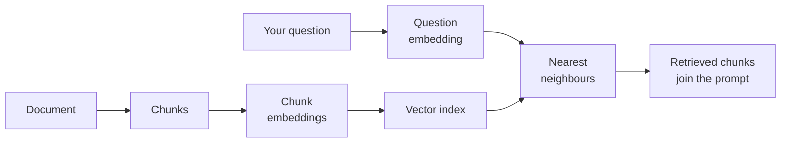

@slide quote
kicker: Section 2 · Inside the RAG box
attrib: What people say before they've had this explained

> "I don't really get vector search. Isn't that basically doing linear
> algebra?"

@narrate
It's not, and it's worth being precise about why, because "it searches
a vector database" isn't an explanation either. It's a phrase people
repeat to sound like they understand it.

An embedding is a list of numbers that represents what a piece of text
means. Not what words it contains, what it means. Two sentences that say
roughly the same thing in completely different words end up with
similar numbers. Two sentences using identical words in unrelated
contexts don't.

Vector search is just this: turn your question into that same kind of
number list, then find whichever stored piece of text has the closest
numbers. Closest numbers means closest meaning. That's the entire
mechanism, and you now understand it as well as you need to for every
conversation you'll have about it.

What actually changes how you use this is one consequence: the search
is entirely about meaning, never the specific words typed. Ask about
"cancelling a subscription" and it can surface "ending your membership"
without either sentence sharing a single word. That's the whole point
of replacing keyword search with this.

@slide diagram
kicker: What actually happens, end to end
## Two paths, running at completely different times
figcap: The top path runs once, when documents load. The bottom path runs live, on every single question.



@narrate
Walk the two paths, because they run at completely different times, and
that distinction explains a lot of confusion about what's slow and what
isn't.

The top path runs once, when you load your documents. Each document
gets split into chunks, sized to be small enough to be specific and
large enough to still make sense on their own. Each chunk becomes a
number list, and all of those number lists get stored in what people
call a vector index, which is really just a very fast lookup structure
for "which numbers are near which other numbers."

The bottom path runs every single time someone asks a question. The
question becomes its own number list, using the exact same process. The
system finds whichever stored chunks have the closest numbers, the
nearest neighbours, and those chunks, not the whole document, get
dropped into the prompt alongside the question.

That's the whole mechanism. Everything people call RAG is some version
of these six steps, with different choices about chunk size, how many
neighbours to retrieve, and what counts as close enough.

@slide figure
kicker: Why "top match" isn't usually one match
## Six candidates, one query, three actually get used
figcap: Retrieval doesn't return the single best chunk. It returns the top few, and the cutoff is a number someone chose.

```figure
kind: histogram
threshold: 4
threshold_label: "Retrieved for this query"
bins:
  - {label: "Chunk F", value: 41}
  - {label: "Chunk B", value: 52}
  - {label: "Chunk D", value: 58}
  - {label: "Chunk A", value: 79}
  - {label: "Chunk C", value: 85}
  - {label: "Chunk E", value: 91}
note: "Similarity score is illustrative: what matters is the ranking, not the exact number."
```

@narrate
Here's six chunks, ranked by how close their numbers are to the
question's numbers, for one real query.

Notice the system doesn't return one answer. It returns a shortlist,
usually somewhere between three and ten chunks, and someone chose that
number. Set it too low and you miss a chunk that actually had the
answer. Set it too high and you flood the prompt with marginally
related material that crowds out the good chunks, and costs you tokens
on every single call.

That cutoff line is doing more work than most teams give it credit for.
It's not a technical detail buried in a config file. It's a product
decision about how much you trust the ranking, and it's worth
revisiting deliberately instead of leaving at whatever default a
tutorial happened to use.

@slide two-col
kicker: Where retrieval actually breaks
## Same document, two different chunking choices

::: cols
:: card bad
### Chunked every 500 characters
- Splits a numbered list halfway through step 3
- Splits a table from its own header row
- Retrieves a fragment nobody could act on
:: card good
### Chunked by section and list boundary
- A numbered list stays one chunk, start to finish
- A table stays attached to its header
- Retrieves something a human could actually use
:::

@narrate
This is the failure mode worth knowing by name, because it looks like a
model problem and it's actually a chunking problem.

Split a document every fixed number of characters, and you'll
eventually cut a numbered list in half, or separate a table from the
header row that explains what its columns mean. The embedding for that
fragment is still technically accurate. It represents what little text
survived the cut. It's just useless to whoever reads it, because half a
procedure with no header is not a procedure.

Chunk by the document's actual structure, sections, list boundaries,
table boundaries, and the same retrieval step returns something a human
could act on. Nothing about the model changed. The only thing that
changed was where the document got cut before it was ever embedded.

@slide callout
kicker: The honest caveat

::: callout Be straight about this
Closeness in this space means "similar meaning," not "true" or
"current." ==A confidently wrong, out-of-date chunk can rank just as
close as a correct one==, because the numbers don't know which one is
right.
:::

@narrate
Say the honest caveat, because "we added RAG" gets treated as a
guarantee of accuracy, and it isn't one.

An embedding captures what a piece of text is about. It has no opinion
on whether that text is still true. A pricing page from eight months
ago and this week's pricing page can both describe pricing in nearly
identical language, and rank almost identically close to a question
about price. Retrieval will happily hand over the old one if it's still
sitting in the index.

That's not a bug in the search. It's exactly what similarity means, and
it's why keeping your source documents current is part of running a RAG
feature, not a one-time setup step you finish and forget.

On any RAG feature you touch: who owns re-indexing when a source
document changes? If the honest answer is nobody, you've found next
week's actual risk, sitting quietly underneath a feature everyone
already signed off on.

@slide definition
kicker: Naming it precisely

::: definition Vector search
Turning text into a number list that represents its meaning, then
finding stored text whose numbers are closest to your question's
numbers. Closeness is meaning, not correctness.
:::

::: example Try this yourself
Pull up your own product's retrieved chunks for one real query. Read
them as a human would. If they don't actually answer the question,
check the chunk boundaries before you blame the model.
:::

@narrate
That's the definition worth keeping, and notice what it deliberately
leaves out. No mention of correctness, because that was never what this
mechanism promises.

The exercise makes it concrete. Find one real query your feature has
handled, look at what actually got retrieved, and read it the way a
user would. If it's not useful, the fix is rarely a better model. It's
almost always upstream, in how the document got chunked or how many
neighbours got pulled.

@slide bullets
kicker: Before you move on
## Two things worth doing now

1. Look at what your own feature actually retrieves for one real query
2. Check whether chunk boundaries respect the document's structure

@narrate
Two things before you move on.

Pull one real retrieved result from your own feature and read it
properly, not just skim it. Then check how the source document got
chunked, and whether the boundaries respect lists, tables, and
sections, or just cut at a fixed character count.

Next lecture stays in the stack and tackles the phrase that swallowed
"prompt engineering" whole: what context engineering actually means,
and why the name change matters.
