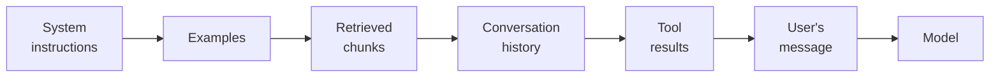

@slide statement
kicker: Section 2 · The stack, continued
## "Prompt engineering" was 2023's phrase. What actually mattered survived under a bigger name: context engineering.
lead: The lever was never the clever wording. It was always everything else riding along with it.

@narrate
Early on, people treated getting good output as a wording problem.
Phrase the instruction cleverly enough, add the right magic words, and
the answer improves. That's prompt engineering, and it's not wrong,
it's just a small piece of something bigger.

Every real feature sends the model far more than your instruction. It
sends retrieved documents, the last several messages of a conversation,
examples of the format you want, results from tools it already called,
and only then, your actual question. All of that together is the
context. Managing it well is context engineering, and it's the actual
skill behind almost every AI feature that works reliably.

The name change isn't marketing. It's an admission that the thing doing
the work was never just the sentence you typed.

It also isn't just a rename for its own sake. When most people typed a
prompt directly into a chat box, the prompt genuinely was almost the
whole story, there wasn't much else in the window. The moment a feature
started retrieving documents, remembering a conversation, and calling
tools, most of what the model actually saw was being assembled by code,
not typed by a person, and the old name stopped describing where the
real decisions were being made.

@slide diagram
kicker: What's actually in the window
## One context window, assembled from six pieces, in order
figcap: This is roughly the order they actually appear in. What goes in each slot, and how much of it, is the entire skill.

@narrate
Here's roughly what's actually inside a real context window, in the
order the pieces usually appear.

System instructions come first: who the model is being asked to be,
and the rules it should follow. Examples, if the feature uses them,
show the shape of a good answer. Retrieved chunks are whatever your
data layer pulled in for this specific question. Conversation history
is everything said so far in this session. Tool results are whatever
came back from anything the system already called. And the user's
actual message, the thing everyone assumes is "the prompt," is usually
the smallest piece of the six.

Context engineering is deciding what goes in each of those slots, how
much of it, and in what order, for every single request. Prompt
engineering was writing slot one well. It was never the whole job.

Notice, too, that most of these slots change on every single call.
Retrieved chunks depend on the question. History grows every turn. Tool
results depend on what actually happened a moment ago. Only the system
instructions and examples tend to stay fixed. That's the part a lot of
PMs picture when they hear "the prompt," a document someone wrote once,
when in practice it's a small, stable fraction of what the model
actually receives on any given call.

@slide two-col
kicker: Same wrong answer, two different diagnoses
## Ticket 4471 again: the summary was wrong, and the fix wasn't the prompt

::: cols
:: card bad
### Assumed it was a wording problem
- Rewrote the system instructions four times
- Added "be careful" and "double-check" to the prompt
- Same wrong summary came back each time
:: card good
### Checked what was actually in context
- Found a resolved duplicate ticket still in the retrieved chunks
- The model was accurately summarising the wrong ticket
- Fixed retrieval, not the wording, and it never recurred
:::

@narrate
Remember ticket 4471 from the tokens lecture. Here's the same instinct
that caused that bug showing up again, in a different shape.

The summary was wrong, and the first move was rewriting the system
prompt. Four attempts, increasingly emphatic: be careful, double-check
your work, make sure the summary matches the ticket. None of it changed
the output, because none of it addressed what was actually happening.

The real problem was sitting in the retrieved chunks. An old, resolved,
near-duplicate ticket had been pulled in alongside the real one, and
the model was accurately summarising a mixture of both. It wasn't
confused. It was doing exactly what a mixed context asked it to do. The
fix was in retrieval, not wording, and no version of a cleverer prompt
was ever going to find it.

@slide callout
kicker: The honest caveat

::: callout Be straight about this
More context is not automatically better. ==Models pay less attention
to the middle of a long context than the start or the end==, and every
irrelevant chunk you add is something real competing for that
attention.
:::

@narrate
Say the honest caveat, because "just add more context" is the opposite
mistake, and it's just as common as under-including.

Stuff the window with everything that might be relevant, and two
things get worse at once. The model's attention isn't distributed
evenly, it favours the start and the end of what it's given, so
genuinely important material buried in the middle of a long context
gets less weight than it deserves. And every token you add costs money
and time, a conversation Section seven finishes properly.

Context engineering means choosing what's in the window as carefully as
you'd choose what's in an executive summary. Complete isn't the goal.
Sufficient is.

@slide definition
kicker: Naming it precisely

::: definition Context engineering
Deciding what goes into every slot of the context window, in what order
and how much, for each request. Prompt engineering is one slot. This is
all of them.
:::

::: example Try this yourself
Next time an answer is wrong, resist rewriting the prompt first. Print
the actual context that was sent and read the whole thing, in order,
the way the model saw it.
:::

@narrate
That's the definition worth carrying forward, and it explains why this
lecture belongs in a course for PMs, not just engineers. You don't need
to write the retrieval code to ask the right question about it.

The exercise is the habit that matters most from this whole lecture.
Before you touch the prompt, look at the full context as it was
actually sent, every slot, in order. More often than seems reasonable,
the wording was never the problem.

@slide bullets
kicker: Before you move on
## One thing worth doing now

Find one real wrong answer from your feature, read its full sent context slot by slot, and name which slot the problem actually lived in

@narrate
One thing before you move on.

Find a real case where your feature gave a wrong answer, and get the
actual context that was sent for that request, not the template, the
real one. Read every slot, in order, and ask: which one did the problem
actually live in? Instructions, examples, retrieval, history, tools, or
truly the wording. Most of the time it won't be the last one.

Next lecture takes the piece everyone underestimates, latency and
throughput, and gives you the vocabulary to read a benchmark table the
way an engineer already does.
