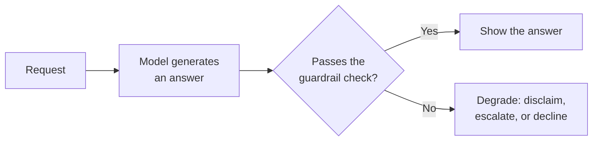

@slide statement
kicker: Section 3 · When it's wrong
## Every acceptance criterion so far answers "how often is it wrong." None of them answer "what happens the moment it is."
lead: A pass rate is a count. It says nothing about what the feature actually does the instant it fails.

@narrate
You now know how to specify the dataset, the rubric, and the
threshold. All three answer some version of the same question: how
often does this feature get it right.

None of them answer a completely different question, one just as
important: when it gets it wrong, what actually happens next. Does the
wrong answer sail straight through to the user, stated as confidently
as a right one would have been. Does anything catch it. Is there a
fallback, or is showing the raw output the only path the system knows.

That's what a failure taxonomy and a degradation path are for, and
almost no PRD specifies either one.

Think about the last production incident you actually sat through. The
retro almost never says "the pass rate was too low." It says something
like "it told a customer their refund was approved when it wasn't, and
nobody caught it for six hours." That's not a threshold problem. It's a
missing answer to the question this lecture asks: what was supposed to
happen the moment that specific kind of wrong answer occurred, and why
didn't it?

@slide table
kicker: Not all failures are the same failure
## Five ways a feature fails, and why lumping them together hides the risk

| Failure type | What it looks like | The right response |
| --- | --- | --- |
| Confidently wrong | A false fact, stated as true | Must never reach the user unchecked |
| Right, wrong format | Correct content, breaks the parser | A silent failure downstream, not a visible one |
| Times out or errors | No answer at all | A retry or a fallback, not a hang |
| Over-cautious refusal | Declines something safe | Annoying, rarely dangerous |
| Partially right | Some facts correct, one isn't | The hardest to catch, easiest to miss |

@narrate
Here's why a single pass rate flattens exactly the distinction that
matters most. All five of these count as one failure in a simple
percentage. They are not remotely the same event.

A confidently wrong answer is the dangerous one, the failure mode
lecture one-point-five spent a whole hour on: nothing about how it
looks tells you it's wrong. A timeout is annoying but honest, the
system visibly didn't answer. An over-cautious refusal costs you a bit
of usefulness and costs nobody anything real. Treating all five as
interchangeable "failures" means your ninety percent pass rate could
be hiding a small number of the first kind and a large number of the
harmless kind, and the number alone can't tell you which.

Building this table is a five-minute exercise with a habit behind it,
not a research project. For your own feature, picture the worst thing
it's actually done, or could plausibly do, and ask which row it
belongs in. Most features turn out to have three or four realistic
failure types, not the dozen you might expect. The value isn't the
length of the list. It's that each row now has an owner and a
response, instead of dissolving into one undifferentiated number.

@slide diagram
kicker: What happens the moment it's wrong
## A path for uncertainty, not just a hope
figcap: The guardrail layer from Section two is what makes this branch possible. This is what it's actually for.

@narrate
Here's the branch most PRDs never draw, because most PRDs only draw
the top path.

A request comes in, the model generates an answer, and then something
has to actually check it before it reaches anyone: a confidence score,
a guardrail, a rule that catches the shape of a known failure. Passes,
show it. Doesn't, and the feature needs a second, deliberate path, not
silence and not a guess dressed up as an answer.

Degrading gracefully means picking one of three honest moves: say
plainly that you're not sure, hand the case to a human, or decline the
request outright. All three beat showing a wrong answer with the same
confident tone as a right one. The guardrail layer from Section two
is what makes this branch technically possible. A PRD that never
specifies it is a feature with only the top path built.

Which of the three you pick should depend on the archetype and blast
radius from earlier in this section, not on whichever felt easiest to
build. A drafting tool can usually just disclaim and let the human
reviewing it decide. An agent about to take an action is a different
conversation: escalating or declining is often the only responsible
choice, because there's no draft step left to catch a bad guess.

@slide callout
kicker: The honest caveat

::: callout Be straight about this
Degrading gracefully isn't free. ==A feature that hedges or escalates
too often is its own failure==, just a quieter, more expensive one than
being wrong.
:::

@narrate
Say the honest caveat, because the fix here has its own failure mode,
and it's an easy one to walk straight into.

Set the guardrail too sensitive, and the feature spends half its time
saying "I'm not sure" about things it actually knew, or routing easy
cases to a human who now has more work than the feature was supposed to
save. That's not safe, it's just failing in a direction that's harder
to notice on a dashboard. The degradation rate belongs in the PRD too,
with its own threshold, the same way the pass rate does.

@slide definition
kicker: Naming it precisely

::: definition Graceful degradation
A specified, deliberate response for when the feature can't clear its
own bar: disclaim, escalate, or decline. The alternative isn't safety,
it's a confident guess with nothing behind it.
:::

::: example Try this yourself
Find where your PRD describes what happens when the model is uncertain
or wrong. If the honest answer is "it won't be," you've found the gap
this lecture is about.
:::

@narrate
That's the definition worth holding onto: degradation is a decision,
made in advance, not an emergency improvisation made the day something
breaks in production.

The exercise is direct. Look for the sentence in your PRD that
describes the unhappy path. Most PRDs don't have one, because most
teams write the feature they're hoping to ship, not the one they're
actually going to operate.

@slide bullets
kicker: Before you move on
## One thing worth doing now

List your feature's failure taxonomy, at least three distinct types, and write one sentence naming the degradation path for the most dangerous one

@narrate
One thing before you move on.

List at least three different ways your feature can fail, not just
"wrong," and notice how differently you'd want each one handled. Then
take the most dangerous one on that list and write down, in one
sentence, what the system actually does when it happens. If you can't
finish that sentence yet, that's this week's real work, not a detail to
leave for later.

Next lecture is where the degradation path from this one gets a name
and a design: human-in-the-loop, and exactly where in the flow a
person needs to stand.
