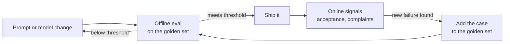

@slide statement
kicker: Section 4 · The eval mindset
## Your team already evaluates its AI. Accidentally, in production, on customers.
lead: This lecture gives the three modes names, so you can pick one on purpose.

@narrate
Think about how your team last found out an AI feature had a quality problem.

For most teams it happens one of three ways. Someone senior pastes a bad output
into the chat with the word "yikes". Support notices the same complaint arriving
three times in a week. Or, more rarely, a check that ran before the release
caught it, and no customer ever saw it.

Those are the three modes of evaluation. Vibes, online measurement, and offline
evals. Every team runs all three whether they mean to or not. What separates
teams that ship reliably from teams that firefight is which mode they trust,
and at which moment.

By the end of this lecture you will be able to name the mode any quality signal
is coming from, say what question it can genuinely answer, and predict where it
will mislead you. That last skill is the one that earns you the room's trust.

@slide table
kicker: The three modes
## Three ways of knowing, side by side

| | Vibes | Offline evals | Online measurement |
| --- | --- | --- | --- |
| What it is | Trying examples and reacting | Scored runs on a fixed golden set | Signals from real usage |
| Answers | "Does this feel right?" | "Did this change help or hurt?" | "Is it working for users?" |
| When it runs | Any time, in seconds | Before every release | Only after you ship |
| How it's sampled | A handful, hand-picked | Fifty cases, chosen once, on purpose | Everything, as it happens |

@narrate
Here they are side by side, and I want to be fair to each one.

Vibes is not a slur. It is expert judgement applied quickly: you paste in an
input, look at what comes back, and react. It costs nothing and returns a
verdict in seconds. Its weakness is the sampling. The inputs get chosen by
whoever is trying to impress the room, or condemn it, and the verdict moves
with the mood of whoever is looking.

An offline eval swaps mood for method. Same inputs every run, scored the same
way, before anything reaches a customer. It is the only mode that can tell you
whether yesterday's prompt change made things better or worse.

Online measurement is acceptance rates, thumbs-down clicks, complaint volume.
It is the only mode that measures reality rather than a rehearsal of it. The
catch is that reality reports late, and it bills the customer for the lesson.

@slide definition
kicker: The mode this section builds

::: definition Offline evaluation
Running the feature against a **fixed** set of inputs and scoring every output
against criteria agreed in advance, before the change ships. The fixed inputs
are what make two runs comparable.
:::

::: example Try this yourself
Recall your last three AI quality "findings" and label each one: vibes, offline,
or online. Most teams discover their entire process is modes one and three.
:::

@narrate
Let me define the middle mode precisely, because the rest of Section 4 builds
it, and one word in the box is doing most of the work.

The word is fixed.

Run prompt version one against fifty tickets today, version two against fifty
different tickets tomorrow, and the comparison means nothing. You changed the
exam between sittings. Hold the fifty constant and suddenly a pass rate of
seventy-two percent against eighty-four percent is a real, defensible
difference. Same exam, two candidates.

That is the entire mechanism. Not sophistication, just holding the inputs
still while the system under test changes.

Now try the exercise on the slide before moving on. Label your team's last
three quality findings by mode. It takes a minute, and the result is usually a
little embarrassing: nearly everything turns out to be a reaction or a
complaint, and almost nothing was caught in rehearsal.

@slide diagram
kicker: How the modes connect
## One loop, three instruments
figcap: Offline evals gate the release. Online signals catch what the golden set missed. Every miss becomes a new case, so the instrument sharpens with age.

@narrate
The three modes are not rivals, and this picture is how they cooperate.

Start on the left. Every change to the prompt or the model runs through the
offline eval before it ships. Meet the threshold and it goes out. Miss it and
the change goes back for another attempt, and no customer ever knew.

Once you ship, online measurement takes over, watching what real usage does.
Sooner or later it surfaces a failure your fifty cases never anticipated. That
is not the eval failing. That is the eval's food. The new failure gets written
in as case fifty-one, and the gate is now stronger than it was last month.

Where do vibes fit? On the arrows. A colleague's "this looks wrong" is a
hypothesis about a missing case. You do not argue with it, you capture it and
let the loop test it.

@slide sidenote
kicker: Where each one lies
## Every instrument misleads in its own way

::: split
:: main
1. **Vibes** lie through sampling: five hand-picked inputs, judged by mood, generalised to millions
2. **Offline evals** lie through staleness: the golden set slowly stops resembling real traffic
3. **Online metrics** lie through delay: by the time the line moves, customers have already paid
:: aside Why vibes keep winning meetings
They are free, instant, and delivered with confidence by senior people. An eval
only beats a vibe when it already exists **before** the argument starts.
:::

@narrate
Now the failure modes, because knowing these is what stops you over-trusting
your own instrument.

The first mode fails through its sample. Five inputs someone chose while
feeling optimistic tell you almost nothing about a distribution, which you know
from Section 0 better than most engineers do.

The second fails through drift. Your golden set is a photograph of your traffic
on the day you built it. Traffic moves, the photograph does not, and a stale
set will wave through changes that hurt the users you actually have now.
Lecture 4.2 deals with keeping it alive.

The third fails through timing. The dashboard is honest but slow, and it speaks
after the damage is done.

Notice the aside on the right, because it explains a meeting you have been in.
The fix is never to argue harder. It is to have the number ready first.

@slide callout
kicker: The honest trade

::: callout Be straight about this
An offline eval is not free. The first golden set costs you a day or two of
curation, every rubric argument costs a meeting, and the set needs feeding as
traffic drifts. What you are buying is ==an answer before shipping== instead of
an argument after. Keep all three modes. Move your *decisions* onto the middle
one.
:::

@narrate
Here is the cost, stated plainly, because someone on your team will raise it
and you should not be the last to hear it.

Building the first version of the instrument takes a day, maybe two. Agreeing
what good means takes a meeting that will occasionally get heated. And the
maintenance never fully stops, because traffic keeps moving.

The argument that wins is that none of this work is new. You were always going
to spend those hours arguing about quality. The only choice you have is
whether the argument happens before launch, against evidence, in private, or
after launch, against anecdotes, in front of your customers.

And you never abandon the other two modes. Demos still persuade. Dashboards
still catch what rehearsal cannot. What changes is that ship decisions stop
resting on either of them.

@slide bullets
kicker: Before you move on
## What to do now

1. Label your team's last three quality findings by mode, in writing
2. Note the one production failure a pre-ship check would have caught
3. Next lecture: choose the fifty examples the whole instrument stands on

@narrate
Three small things before you go on.

Do the labelling exercise properly, on paper, not in your head. Three findings,
three labels. It becomes your before picture, and in a few lectures you will
enjoy how dated it looks.

Then find one failure that reached production in the last quarter that a fixed
pre-ship check would have caught. That single example is worth more in your
next planning discussion than any argument this course can hand you, because
it is yours.

Next lecture we build the foundation everything else in this section rests on:
the golden set. Fifty examples sounds small. Chosen well, it is the most
valuable file your team owns. Choosing them well is a craft, and it is exactly
what we do next.
