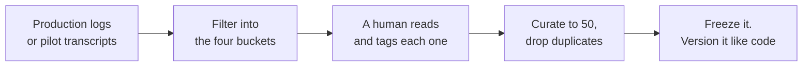

@slide statement
kicker: Section 4 · The golden set
## Fifty is not a sample size. It's a coverage decision.
lead: Grab fifty rows at random and you'll build an instrument that flatters you.

@narrate
Here's how most golden sets actually get built. Someone needs fifty examples
by Thursday, so they open the database, sort by most recent, and copy the
first fifty rows. Or worse, they remember the ten outputs that looked great
in the demo and use those. Or an engineer gets asked for "a representative
sample", which sounds rigorous and, underneath, just means random again.

All three feel reasonable. Fifty is fifty, and a deadline doesn't care where
they came from. But none of them does the actual job a golden set has to
do.

The right question was never how many examples you need. Fifty, five
hundred, it doesn't matter if you chose them badly. The right question is
which fifty, deliberately chosen, would actually catch this feature failing
before a user does.

That's a coverage decision, not a sample size. It's the difference between
an instrument that tells you the truth and one that's been quietly built to
agree with you.

@slide metrics
kicker: Why random alone fails
## The chance a random fifty misses a real problem entirely

::: metrics
- 1 in 25 :: How often this failure mode hits a real user :: warn
- 2 :: Expected appearances in a random sample of 50 ::
- 1 in 8 :: Chance that random fifty contains zero examples of it :: bad
:::

@narrate
Here's why picking at random, even fifty of them, isn't good enough on its
own.

Picture a failure mode that hits one real user in twenty-five. About four
percent. Not rare. The kind of thing that would show up in your support
queue most weeks.

Sample fifty cases completely at random, and on average you'd expect to see
it about twice. Average is the trap. Work out the actual odds and there's a
better than one in eight chance your random fifty contains zero examples of
it. Not underrepresented. Zero.

Ship on that golden set and you'd score ninety-something percent, feel
confident, and carry a blind spot the size of one user in twenty-five,
sitting completely outside your instrument. Random doesn't fail loudly. It
fails silently, which is worse.

And this is the mild version. Real golden sets aren't built from one clean
random draw, they're built from whatever transcripts happened to be handy,
which is biased before you even start counting.

@slide table
kicker: The four buckets
## What fifty cases actually need to cover

| Bucket | Count | Proves |
| --- | --- | --- |
| Common path | 20 | The everyday case doesn't quietly regress |
| Known failure modes | 15 | The bugs you already found stay fixed |
| Edge cases | 10 | Unusual but real inputs don't break it |
| Adversarial | 5 | Someone trying to break it, easily, can't |

@narrate
So here's the deliberate version: four buckets, and fifty split across them
on purpose, not fifty of whatever was easiest to pull.

Twenty are common path, the ordinary case your users hit constantly. Skimp
here and you can pass your golden set while quietly regressing the thing
that matters most, because nothing in your fifty was even measuring it.

Fifteen are known failure modes: the specific ways you've already watched
this feature break. The ticket-summary case from Section 0, the one that
dropped a deadline, belongs here. Every one of these is a bug you're
refusing to let back in unnoticed.

Ten are edge cases: real, unusual inputs, a ticket in a second language, a
summary of almost nothing, a field left blank. Rare, but they happen, and
it's exactly where AI features get strange.

And five are adversarial: someone deliberately trying to break the feature,
or bend it into doing something it shouldn't, a prompt engineered to leak
instructions, a request dressed up to extract data it has no business
giving out.

@slide diagram
kicker: How you actually build one
## From raw traffic to a frozen instrument
figcap: The step people try to skip, a human reading and tagging each candidate, is the one that makes the other three mean anything.

@narrate
Here's what actually doing this looks like on a Monday morning.

You start from real production logs or pilot transcripts, never invented
examples. An invented example only ever tests what you already imagined,
which is precisely not the point of any of this.

Filter that raw traffic into rough candidates for each of the four buckets.
Then a human, you, or whoever owns this feature, actually reads every
candidate and tags it: common path, known failure, edge case, or
adversarial, with one line on why. That tagging step is the one people try
to skip, and it's the one that makes the other three mean anything.

Curate down to fifty, dropping near-duplicates, and freeze it. Version it
the way you'd version code: a date, a change log, one owner who approves
edits. The moment it's editable on a whim, it stops being an instrument and
goes back to being an opinion, just a more expensive one.

@slide callout
kicker: The honest trade

::: callout Be straight about this
A script can pull five hundred raw candidates from your logs in about a
minute. Turning them into fifty that mean something takes real hours:
reading transcripts, arguing where common path ends and edge case begins.
==That step does not compress==, and you cannot delegate it to the model
you are trying to evaluate.
:::

@narrate
Say the cost plainly.

Budget a real afternoon for this, not the twenty minutes it looks like on a
roadmap. Reading two hundred transcripts and arguing about four borderline
ones is slow, unglamorous work, and it happens before you've built anything
anyone can see. Nobody puts "read transcripts for three hours" on a roadmap,
so it quietly doesn't happen, and the golden set ends up built the lazy way
after all.

Teams that skip straight to the eval harness later in this section end up
with a beautifully engineered instrument pointed at fifty cases that don't
prove anything. The harness was never the hard part. This was, and it still
is, every time you refresh the set.

@slide definition
kicker: Naming it precisely

::: definition Golden set
Fifty real cases, deliberately covering the common path, known failure
modes, edge cases, and adversarial inputs, frozen and reused as the fixed
instrument every release gets measured against.
:::

::: example Try this yourself
Pull your last 200 real transcripts. Sort each one into one of the four
buckets by hand. If a bucket comes back nearly empty, that isn't a filing
problem. It's the first real finding your golden set has produced.
:::

@narrate
Notice what the definition insists on: deliberately covering all four, not
fifty of whatever was easiest to pull. Miss a bucket entirely and you
haven't built a smaller golden set. You've built a blind spot with a pass
rate attached to it.

The exercise is how you find that blind spot before production does. Two
hundred transcripts, sorted by hand, takes about an afternoon.

Most people who do this for the first time get an uncomfortable result: one
bucket is nearly empty, usually adversarial, sometimes edge cases. That gap
is not a data problem. It's the actual shape of what your current testing
has never once looked at.

Fill it from real transcripts if you can find enough. Where you genuinely
can't, because nobody has tried to attack the feature yet, say so in the
spec instead of quietly padding the bucket with lookalikes. An honest gap
is information. A padded one is a false sense of coverage.

@slide bullets
kicker: Before you move on
## Two things worth doing now

1. Download **A02, the golden dataset spec**, attached to this lecture
2. Pull 200 real transcripts and sort them into the four buckets this week

@narrate
Two things before you move on.

The golden dataset spec is attached to this lecture. It has the four
buckets built in, with space for a count and a one-line reason for every
case you add. Download it now, while the four categories are fresh.

Then do the sort. Pull your two hundred, tag them, and see what's thin.
Most people find out something uncomfortable within the first thirty cases.

Next lecture, we put a rubric underneath all fifty, so "good" means the
same thing every time one gets scored, no matter who's holding the pen.
