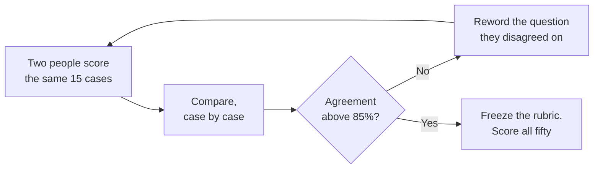

@slide callout
kicker: Section 4 · The rubric

::: callout Don't assume this repeats itself
Six questions don't make a rubric good. Agreement does. ==The collapse you
watched in Section 0, a three-point spread down to one, is not
automatic==. Write your own six this afternoon and nothing guarantees
they behave the same way.
:::

@narrate
Back in Section 0, you watched something satisfying happen. Five reviewers,
one rubric, and a three-point spread collapsed down to one.

I want to be honest with you about that demonstration. Those six questions
had already been road-tested before you ever saw them. Draft your own this
afternoon, first pass, and there's no such guarantee. Vague wording
produces exactly the disagreement you were trying to remove, just now
wearing a rubric's clothes. How would you even know, before shipping it,
which kind you'd written?

So this lecture isn't about writing questions. You already have a working
method for that. It's about the part almost nobody does afterwards: proving
your rubric actually produces agreement, and fixing it, specifically, when
it doesn't.

That proof has a name: inter-rater reliability. By the end of this you'll
know how to run it in under an hour, and why the version of this most teams
skip is exactly the hour that would have saved them.

@slide two-col
kicker: What makes a question rubric-grade
## Same intent, very different agreement

::: cols
:: card bad
### Sounds like a rubric question
- "Is the tone appropriate?"
- "Is the summary good?"
- "Did it handle the request well?"
:: card good
### Actually is one
- "Are all dates and deadlines from the original preserved?"
- "Is every claim traceable to a specific line in the ticket?"
- "Could an agent act on this without reopening the original?"
:::

@narrate
Look at the left column, because it's the trap. Every one of those reads
like a rubric question. Each has a subject, each sounds specific, and each
will still get a different answer depending entirely on who's reading it.
Appropriate to whom. Good by what standard.

The right column is the actual six from Section 0's ticket rubric, close to
word for word. Notice what they have in common. Each one points at
something you could screenshot and circle. A date is either in the summary
or it isn't. A claim either traces back to the ticket or it doesn't.

That's the whole test for a rubric-grade question: could two people who
disagree about everything else still land on the same answer, because the
answer is sitting right there in the text. If answering it takes taste, the
question isn't ready yet.

@slide diagram
kicker: The calibration protocol
## How you actually test a rubric before you trust it
figcap: Most rubrics need one or two loops through this before agreement holds. Budget for the loop, not just the first draft.

@narrate
Here's the actual protocol, and it's shorter than people expect.

Two people, you and one colleague, score the same fifteen cases
independently. Don't discuss them first. That's the part people skip, and
skipping it is what makes the whole exercise worthless.

Then compare, case by case, not just the final percentage. A spreadsheet
with two columns is the entire tool: your verdicts next to theirs, row by
row. Wherever you agreed, move on. Wherever you didn't, stop and read that
question again, together. Nine times out of ten, the wording let two
reasonable people read it two different ways.

Reword that one question. Just that one. Run the same fifteen cases again.
Clear about eighty-five percent agreement and you're done, freeze it. Fall
short and you loop again. Most rubrics need one or two passes through this
loop. Almost none need ten.

@slide metrics
kicker: The payoff
## What rewording one question did to agreement

::: metrics
- 9 of 15 :: Cases two reviewers agreed on, first pass :: bad
- 1 :: Question that caused most of the disagreement ::
- 14 of 15 :: Cases they agreed on, after rewording it :: good
:::

@narrate
Here's what that loop looks like with real numbers, from exactly this kind
of rubric.

First pass, two reviewers, fifteen cases: nine agreements. Sixty percent.
Not good enough to hang a launch decision on.

They read through the six disagreements together, and five of the six
traced back to one question: nothing invented. One reviewer was flagging
any paraphrase as invention. The other only flagged claims with no basis in
the ticket at all. Same three words, two different tests hiding behind
them.

They reworded it to something narrower: every claim in the summary is
traceable to a specific line in the ticket. Ran the same fifteen cases
again. Fourteen of fifteen agreed. One bad question was responsible for
almost the entire gap, and it took one sentence to fix.

@slide definition
kicker: Naming it precisely

::: definition Inter-rater reliability
How often two independent reviewers, using the same rubric on the same
cases, reach the same verdict. Low agreement is not a careless-reviewer
problem. It's an ambiguous-question problem.
:::

::: example Try this yourself
Hand your draft rubric and fifteen real cases to a colleague, without
briefing them first. Score independently. Compare. Wherever you disagree,
reword that question, not your colleague's judgement.
:::

@narrate
Notice where the definition points the blame. Not at the reviewer. At the
question.

That's a genuine change of instinct for most people. Your first reaction to
a disagreement is to think the other person read it wrong. Nearly always,
both of you read it correctly, and the question simply allowed two correct
readings.

The exercise is that same protocol, in one paragraph you can act on this
week. No special software, no data science background. A colleague, fifteen
cases, and forty-five honest minutes.

One caution before you go and do it: don't brief your colleague on what you
meant beforehand. That defeats the entire test. The rubric has to survive
being read cold, because cold is how it will actually get used once it's
real.

@slide callout
kicker: The honest trade

::: callout Be straight about this
Percent agreement can flatter you. If ninety percent of outputs are
obviously fine, two reviewers scoring almost at random would still agree
most of the time, by chance alone. If your pass rate sits above ninety
percent or below ten, ==ask a data analyst for Cohen's kappa== instead. It
corrects for exactly that.
:::

@narrate
Say the cost plainly, because raw agreement has a real blind spot.

Picture a feature that's genuinely excellent: ninety-five percent of
outputs pass on any reasonable reading. Two reviewers could score almost at
random and still agree with each other most of the time, purely because
almost everything is a pass. High agreement, in that case, tells you
nothing about whether your rubric is any good.

You don't need to run that correction by hand. A number called Cohen's
kappa exists specifically to strip out the agreement you'd expect from
chance and show you what's left. If your pass rate is very high or very
low, ask whoever owns your analytics for it. Anywhere in the middle, roughly
thirty to seventy percent, plain agreement is honest enough on its own.

And budget the discussion itself. Fifteen cases take twenty minutes to
score. Talking through six disagreements properly, out loud, takes longer
than the scoring did. That's not overhead, that conversation is where the
rubric actually gets better.

@slide bullets
kicker: Before you move on
## Two things worth doing now

1. Download **A05, the rubric and calibration protocol**, attached to this lecture
2. Run the fifteen-case loop against your own golden set's rubric this week

@narrate
Two things before you move on.

The rubric template and the calibration protocol are both in A05, attached
to this lecture. Same format behind the ticket rubric from Section 0, with
the fifteen-case loop written out as a checklist.

Then actually run it. Not on someone else's feature, on the rubric you're
building for your own fifty cases. Find your one bad question this week,
while it only costs you an afternoon, not a launch-week argument nobody can
settle.

Next lecture, we hand your rubric to an AI model and ask it to do the
scoring for you. It works better than you'd expect, and it fails in one
specific way that's worth knowing before you trust it.
