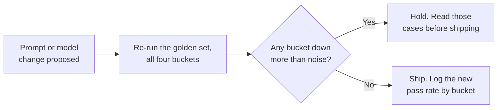

@slide statement
kicker: Section 4 · The dashboard
## Ninety-two percent to eighty-eight percent looks like noise. It wasn't.
lead: The aggregate barely moved. One bucket collapsed underneath it.

@narrate
You've built a golden set, a calibrated rubric, and a validated judge.
Here's the question this lecture is actually about: what do you do with the
number once you have it, release after release.

Most teams do the obvious thing. They watch one aggregate pass rate, and if
it doesn't move much, they ship. Sound familiar? That habit is about to
cost you, and I want to show you exactly how, before it happens to your
feature instead of a hypothetical one.

A ninety-two percent pass rate is not one measurement. It's fifty
measurements averaged into a single number, and averaging is exactly the
operation that hides a problem living in a small part of your set.

This is the same instinct from earlier in this section, applied one step
later. You built four buckets so a random fifty couldn't hide a rare
failure mode. Track only the blended number afterwards, and you've thrown
that structure away right when it started paying for itself.

@slide figure
kicker: The same fifty, one prompt change later
## What the aggregate hid
figcap: Pass rate by bucket, v12 against v13. Four buckets barely moved. One collapsed.

```figure
kind: grid
row_label: Bucket
cols: ["v12", "v13", "Change"]
rows:
  - {label: "Common path (20)", values: ["18/20", "19/20", "+1"]}
  - {label: "Known failure modes (15)", values: ["14/15", "14/15", "flat"]}
  - {label: "Edge cases (10)", values: ["9/10", "9/10", "flat"]}
  - {label: "Adversarial (5)", values: ["5/5", "2/5", "-3"], highlight: true}
  - {label: "Aggregate", values: ["92%", "88%", "-4 pts"]}
```

@narrate
Here's a real shape of change. A prompt update went out, meant to make
responses more thorough. Watch what it did, bucket by bucket, not just at
the bottom line.

Common path improved, nineteen of twenty instead of eighteen. Known failure
modes held. Edge cases held. Nothing alarming yet.

Then adversarial: five out of five, before, down to two out of five, after.
The instruction to be "more thorough and complete" made the model
measurably more willing to comply with a cleverly worded request it should
have refused.

Now look at the aggregate row. Ninety-two percent down to eighty-eight.
Four points, on a fifty-case set. Most teams would call that noise and
ship. The bucket breakdown says otherwise: one specific capability didn't
dip, it collapsed, and the aggregate buried it under thirty-nine cases that
got slightly better.

@slide definition
kicker: Naming it precisely

::: definition Regression, for a probabilistic feature
A pass-rate drop, in a specific bucket, bigger than the swing you'd expect
from re-running the same fifty cases twice. Not "one case flipped." Not
"the aggregate wobbled." A change you can point at and defend.
:::

::: example A rule of thumb, not the real thing yet
A small bucket dropping by more than a case or two deserves a look before
you ship. Lecture 4.8 gives you the actual statistical test.
:::

@narrate
Notice what the definition rules out. Not "one case flipped": a single
golden-set case is one data point, and data points wobble. Not "the
aggregate moved a bit": you just watched four points of aggregate movement
mean almost nothing on its own.

What counts is a specific bucket moving more than ordinary re-run noise
would explain. Five out of five to two out of five, in a bucket that exists
specifically to catch this kind of failure, is not noise. It's the bucket
doing its job.

The honest version of this rule is exactly that, a rule of thumb. The
properly worked-out version, with an actual threshold instead of a gut
feeling, is coming later in this section. For now, treat any small bucket's
sharp drop as a stop sign, not a shrug.

@slide diagram
kicker: Where this fits in your release process
## The gate a pass rate alone can't give you
figcap: The breakdown, not the aggregate, is what decides whether this ships.



@narrate
Here's where all of this actually sits in your week.

Someone proposes a change: a new prompt, a different model, a tweaked
retrieval step, anything. Before it ships, the golden set runs again, all
four buckets, not just a spot check.

Then the only question that matters: did any bucket move more than you'd
expect from noise. If yes, hold, and go read the specific cases in that
bucket before anyone argues about it in the abstract. If no, ship it, and
log the new pass rate, by bucket, next to the old one.

That log is the part most teams skip, and it's the part that turns "feels
about the same" into a chart you can point at.

None of this requires new tooling yet. A shared spreadsheet, one row per
release, four bucket columns and a date, does the job until you have a
reason to build something fancier.

@slide sidenote
kicker: What a dashboard actually needs
## Three things, or it's just a number

::: split
:: main
1. Pass rate by bucket, not one blended figure
2. Every prompt or model version, plotted, not just today's
3. Online signal from earlier in this section, layered on the same chart
:: aside The line you're actually watching for
Not the level. The kink. A sudden bend in one bucket's line is worth more
than the current value of any of them.
:::

@narrate
Remember the promise from earlier in this section: online signal gets a
proper home, a dashboard, instead of a Slack message when a customer
complains. Here's what that home actually needs, and it's less than people
build.

Pass rate broken out by bucket, always, never one blended figure standing
in for four different questions. Every version plotted against the last, so
a trend is visible, not just today's snapshot. And your online samples,
pulled from live traffic every release, sitting on the same chart as the
offline number they're meant to check.

Watch for the kink, not the level. A bucket sitting at ninety percent
forever is fine. A bucket that bends sharply in one release is the thing
that was actually worth building this for. Here's what that bend actually
looks like once you plot it instead of describing it.

@slide figure
kicker: The chart, not the description of one
## The same five rows, plotted release to release
figcap: Two releases is barely a slope, but it is already the shape a dashboard is built to catch. Adversarial bends. Everything else holds its line.

```figure
kind: trend
x_labels: ["v12", "v13"]
y_label: "Pass rate by bucket"
unit: "%"
series:
  - {label: "Common path", values: [90, 95], tone: muted}
  - {label: "Known failure modes", values: [93.3, 93.3], tone: muted}
  - {label: "Edge cases", values: [90, 90], tone: muted}
  - {label: "Adversarial", values: [100, 40], tone: warn}
  - {label: "Aggregate", values: [92, 88], tone: primary}
```

@narrate
Two points isn't a trend yet. It's barely a slope. That's the honest state
of this particular chart today, and it's also exactly why you keep it
running instead of screenshotting one before-and-after: it gets more
useful every release, not less.

Look at where four of the five lines sit at the second point: bunched near
the top, barely moved. One line does something the other four don't. It
doesn't dip. It falls through the floor of the chart, on its own, apart
from everything around it.

That's what a real regression looks like on a line instead of in a row of
a table: not a number that changed, a line that bent while its neighbours
didn't. By the time this chart has ten releases on it, you won't need
anyone to explain which bucket needs attention. You'll be able to see it
from across the room.

@slide callout
kicker: The honest trade

::: callout Be straight about this
A dashboard nobody looks at is worse than no dashboard: it creates the
feeling of safety without the substance. ==Someone has to own checking it
every release==, and re-running fifty cases against every proposed change
has a real, ongoing engineering cost.
:::

@narrate
Say the cost plainly.

Building the dashboard is the easy part. The ongoing cost is smaller than
the calibration work from earlier lectures, but it never ends: every
proposed change means a re-run, and every re-run means someone actually
opens the breakdown and looks, not just glances at whether the top-line
number is green.

Skip that ownership and you get the worst outcome in this course: a
dashboard that exists, looks rigorous in a slide deck, and hasn't been
checked in three releases. That's not a smaller risk than having no eval at
all. In some ways it's a bigger one, because everyone in the room now
assumes somebody's watching, and the launch conversation moves faster
precisely because nobody feels the need to double-check.

@slide bullets
kicker: Before you move on
## One thing worth doing now

Break your current pass rate out by bucket, even by hand, once, and name the one person who owns checking it every release

@narrate
One thing before you move on.

Take whatever pass rate you're currently tracking and split it by bucket,
even if that means an afternoon with a spreadsheet and no automation yet,
and see whether a blended number has been hiding something. Then name a
name, not a team, a person, who actually opens this after every release. A
dashboard with no owner quietly reverts to a Slack message within a month.

Next two lectures, we build the thing itself: the eval harness that
produces this breakdown automatically, first in a spreadsheet you can build
this afternoon, then in thirty lines of code that runs it for you.
