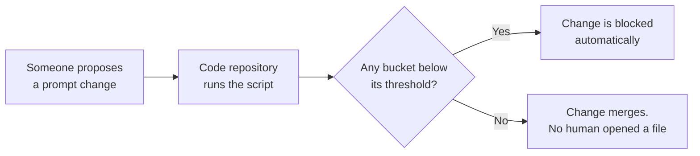

@slide statement
kicker: Section 4 · Hands-on, in code
## Eighteen lines. Read every one before you decide this isn't for you.
lead: This is the one lecture in the course that uses code. It's also the shortest one to explain.

@narrate
This is the lecture the course description warned you about, and promised
you wouldn't need to be a programmer for. Here's that promise kept.

The spreadsheet from last lecture works. It will keep working. This
version exists for one reason: it can run itself, automatically, every
time someone proposes a change, without anybody remembering to open a
file.

Eighteen lines, and we're going to read every single one before this
lecture is over. If you've never written a line of code, that's fine.
Ever followed a recipe you didn't write yourself? This isn't more
complicated than that.

Nothing to install, nothing to configure. Python already understands
spreadsheets and counting, out of the box. You're not learning a
programming language in the next nine minutes. You're reading eighteen
lines somebody else already wrote, closely enough to explain them back.

And if you never run it yourself, that's a completely reasonable outcome
of this lecture. The goal is that you can look at what an engineer built
for you and know whether it's doing what you asked, not that you become
the one maintaining it.

@slide code
kicker: Part one
## Read the file, score each case

```python
import csv
from collections import defaultdict

totals = defaultdict(int)
passes = defaultdict(int)
rubric = ["q1", "q2", "q3", "q4", "q5", "q6"]

with open("golden_set_scores.csv") as f:
    for row in csv.DictReader(f):
        bucket = row["bucket"]
        scores = [int(row[q]) for q in rubric]
        totals[bucket] += 1
        if sum(scores) == len(rubric):
            passes[bucket] += 1
```

@narrate
There's the first half, and notice something before we go further: nothing
on this slide is longer than a sentence.

Lines one and two borrow two tools instead of building them yourself. One
reads a file shaped like a spreadsheet, comma by comma. The other lets you
count things by bucket without listing the buckets in advance.

Lines four to six set up two empty counters, one for totals and one for
passes, and name your six rubric columns once so the rest of the script
can just say "rubric" instead of repeating them six times.

Then the loop. Open the file, and read it one row, one case, at a time.
For each row: read its bucket, read its six scores, add one to that
bucket's total, and if all six scores say pass, add one to that bucket's
pass count too. That's the only real judgement in the whole script,
repeated fifty times.

@slide code
kicker: Part two
## Turn the counters into the report you already trust

```python
for bucket in sorted(totals):
    rate = passes[bucket] / totals[bucket]
    print(f"{bucket:20s} {passes[bucket]}/{totals[bucket]}  {rate:.0%}")
```

```text
Adversarial           2/5   40%
Common path          19/20   95%
Edge cases             9/10  90%
Known failure modes  14/15   93%
```

@narrate
Walk case C027 from last lecture through the last block on the
previous slide. Bucket reads adversarial. Scores read one, one, zero, one,
one, one. Sum that list and you get five, not six, so the if is false, and
passes for adversarial does not go up. Totals for adversarial still does.

Now the three lines above: for every bucket seen, divide passes by total,
and print it, lined up in neat columns.

Here's what actually prints, using the same numbers from the dashboard
lecture. Adversarial at forty percent, the collapse you already know
about, sitting right there in plain text. No spreadsheet required to see
it, and no formula to click on to double-check it either. It's just
printed.

@slide diagram
kicker: Why this version, not just the spreadsheet
## What eighteen lines buys you that a spreadsheet can't
figcap: The spreadsheet needs someone to open it. This runs by itself, every time.



@narrate
Here's the actual reason this version exists, and it isn't "code is
better."

Wire this script into wherever your engineers already store the prompt or
the code, and it runs itself, automatically, every time someone proposes a
change. Nobody has to remember. Nobody has to open a spreadsheet at nine on
a Friday.

If a bucket falls below whatever threshold you've set, the change gets
blocked before it ships, not caught after. If every bucket holds, it
merges, and nobody had to be in the room for that to happen correctly.

That's the entire pitch for these eighteen lines over the version you
already built. Not smarter. Just present when you aren't.

This is also exactly what "regression testing" meant, back when the term
was just a diagram. The diagram was the idea. This script, wired into that
diagram, is the idea actually running, on every single proposed change,
including the ones proposed at ten at night by someone who has never met
you.

@slide callout
kicker: The honest trade

::: callout Be straight about this
This script still needs a CSV that already has every score filled in.
==The scoring itself is still your rubric and your judge, unchanged==. And
"eighteen lines you can read" is not the same claim as "eighteen lines you
should wire into your build pipeline alone." Ask an engineer for that
part.
:::

@narrate
Say the cost plainly.

This script has never scored a single case. It only reads scores that
already exist, from your rubric and your validated judge, exactly like the
spreadsheet did. Nothing about switching to code makes the judgement part
faster or cheaper.

And reading eighteen lines is genuinely different from wiring them into
wherever your company runs its code. That step, connecting this script to
actually block a bad change automatically, is worth five minutes of an
engineer's time, not an argument about whether you're allowed to ask for
it. You've read the logic. Let someone who does this daily handle the
plumbing.

One more honest limit: this script trusts its input completely. Feed it a
CSV where a score column holds "yes" instead of one or zero, and it won't
warn you, it will simply crash, or worse, silently miscount. A spreadsheet
at least shows you the wrong-looking cell. Code shows you a stack trace, or
nothing at all.

@slide definition
kicker: Naming it precisely

::: definition Automated eval harness
The same arithmetic as your spreadsheet, in a form a computer can run
without you, on a schedule or on every proposed change, so the bucket
breakdown exists before anyone has to ask for it.
:::

::: example Try this yourself
Export your spreadsheet's Scores tab as a CSV. Run this script against it.
The bucket breakdown should match your spreadsheet exactly. If it doesn't,
the bug is almost always a column name that doesn't match.
:::

@narrate
Notice this definition still isn't about programming. It's about who has
to be in the room for the check to happen: a human with a spreadsheet
open, or nothing at all.

The exercise is deliberately the smallest possible test: export what you
already built, run this against it, and confirm the two versions agree. If
they don't, before you suspect anything clever, check that your CSV's
column headers say exactly q1 through q6 and bucket. That single mismatch
causes nearly every disagreement you'll see.

Two independent implementations of the same arithmetic agreeing is not a
formality. It's the same principle as the calibration lecture, applied to
code instead of people: two workings, checked against each other, before
either one gets trusted alone.

@slide bullets
kicker: Before you move on
## Two things worth doing now

1. Download **A04, the Python harness**, attached to this lecture
2. Run it against your spreadsheet's CSV export and confirm the numbers match

@narrate
Two things before you move on.

The script, exactly as shown, is A04, attached to this lecture. Copy it,
don't retype it, so a typo doesn't become your first debugging session.

Run it against your own exported scores, and confirm it agrees with the
spreadsheet before you trust either one for a real launch decision.

Next lecture, we answer the question this section has been quietly
avoiding: when a pass rate moves, how do you actually know whether that's
real, or the ordinary noise of re-running fifty dice.
