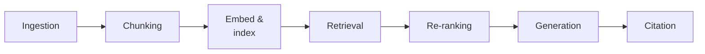

@slide statement
kicker: Section 5 · The full pipeline
## Section two's diagram had six boxes and two paths. Production has at least two more stages, and they're the ones you'll actually get asked about.
lead: Not a correction to that diagram. An extension of it, with the parts a working system needs that a teaching example could skip.

@narrate
Back in Section two, you learned the core mechanism: chunk, embed,
index, retrieve. That diagram was deliberately minimal, enough to
understand what vector search actually does.

A real production pipeline has two stages that diagram left out
entirely, one at the very front and one near the very end, and both of
them are exactly the kind of decision a PM needs to have an opinion
on. This lecture is the full map, so the next three lectures each have
somewhere specific to plug in.

Think of this the way an architect thinks of a floor plan versus a
structural drawing. Section two gave you the floor plan, enough to
understand how someone moves through the space. This lecture is closer
to the structural drawing: every load-bearing stage, in order, so you
know exactly where a crack would actually show up.

@slide table
kicker: Seven stages, start to finish
## What happens at each one, and whose call it actually is

| Stage | What happens | Whose decision |
| --- | --- | --- |
| Ingestion | Which documents are even in scope | Product or content owner |
| Chunking | How documents get split into pieces | Next lecture, in full |
| Embed & index | Chunks become searchable numbers | Mostly engineering |
| Retrieval | Finding the top candidates, filtered by permission | PM sets top-k and access rules |
| Re-ranking | An optional second pass that reorders results | PM decides if it's worth the latency |
| Generation | The model answers using what was retrieved | Mostly engineering |
| Citation | Whether and how sources are shown to the user | Entirely a product decision |

@narrate
Read down that right column and notice the pattern: the stages
bracketing the pipeline, the first and the last three, are yours. The
middle is mostly engineering's to build once you've made those calls.

Ingestion is the one people skip discussing entirely, and it's the
highest-leverage decision in the whole table. Every document you
include is something that can be retrieved and shown to a user, and
every document you exclude is a question the system will now
confidently answer wrong instead of well, because it was never told
that source exists. That's not an engineering call. It's a scope
decision, and it belongs in your PRD's dataset section from Section
three.

Citation deserves the same attention at the other end. Showing a
source next to an answer changes the entire trust relationship a user
has with the feature. A cited answer invites verification, an
uncited one asks for blind faith. That's a real product decision with
real trade-offs, not a formatting detail an engineer bolts on at the
end because someone remembered to ask for it.

@slide diagram
kicker: The whole thing, in order
## Seven stages, one line, start to finish
figcap: Two boxes here didn't exist in Section two's diagram: ingestion, at the very front, and re-ranking and citation, near the end.

@narrate
Here's the full sequence, laid out as one line instead of the two
parallel paths from Section two. Both views are true. That one showed
what runs once versus what runs live. This one shows the complete
journey, start to end, for a single question.

Re-ranking is the stage most PMs have never heard named, and it's
worth understanding why it exists. Initial retrieval is built for
speed, scanning thousands of chunks fast, which means it optimises for
finding roughly the right neighbourhood, not necessarily the single
best answer. Re-ranking takes that shortlist, maybe twenty candidates,
and runs a slower, more careful pass to reorder them before only the
top few actually reach the model. It's a precision step bolted onto a
speed step.

Picture it as the difference between a librarian pulling every book
that mentions your topic, and then actually reading the first
paragraph of each one before handing you the three that matter most.
The first pass is fast and broad on purpose. The second pass is slow
and narrow on purpose. Neither one alone does the whole job as well as
both stages together.

@slide callout
kicker: The honest caveat

::: callout Be straight about this
Every optional stage you add costs latency and money for a marginal
quality gain. ==Re-ranking and query rewriting aren't free upgrades==,
they're trade-offs against the throughput lecture already taught you
to ask about.
:::

@narrate
Say the honest caveat, because it's tempting to treat every stage on
that table as something a good pipeline simply has.

Re-ranking adds a real, measurable delay, an entire second pass over a
shortlist, before generation even starts. For some features that delay
is completely worth it, a legal or medical retrieval system where
precision matters enormously. For a low-stakes internal tool, it can
be latency spent on a quality improvement nobody will notice. Ask the
same question latency and throughput taught you to ask about anything:
does this stage earn its cost for this specific feature, or did it
just sound like best practice.

The same test applies to every stage on the table, not just
re-ranking. A pipeline with all seven stages fully built isn't
automatically better than one with five. It's appropriate when the
feature's archetype and blast radius from Section one actually justify
the extra latency and engineering effort. Building every optional
stage by default is the RAG equivalent of the hundred-percent
threshold from Section three: it sounds thorough and mostly just adds
cost nobody asked for.

@slide definition
kicker: Naming it precisely

::: definition Re-ranking
An optional second retrieval pass that reorders an initial shortlist
for precision, at the cost of extra latency. Worth it when being wrong
in the top result is expensive. Skippable when it isn't.
:::

::: example Try this yourself
Pull up your own feature's pipeline, or sketch what you think it looks
like. Name which of the seven stages actually exist in it, and which
were silently assumed rather than decided.
:::

@narrate
That's the term worth having by name, because "should we add
re-ranking" is now a specific, answerable question instead of a vague
gesture at making retrieval better.

The exercise is the same habit this whole course keeps returning to:
name the actual stages, out loud, rather than trusting a mental picture
of "it searches some documents." Most people find at least one stage
in that table nobody on the team has actually discussed.

Do this before your next conversation with engineering about the
feature, not during it. Walking in already able to name all seven
stages, and which ones your system actually has, changes that
conversation from you asking to be educated into you confirming what
you already suspect.

@slide bullets
kicker: Before you move on
## Two things worth doing now

1. Map your own feature's pipeline against these seven stages
2. Find the stage nobody has actually made a decision about yet

@narrate
Two things before you move on.

Map your feature against this table, stage by stage. Most real
pipelines turn out to be missing at least one row, usually ingestion
scope or citation, not because anyone decided against them, but
because nobody decided at all.

Find that undecided stage and name it specifically. An undecided stage
is exactly the kind of gap that looks fine in a demo and breaks the
moment a real, awkward question arrives, usually in front of the one
user you most wanted to impress.

Next lecture goes deep on the stage most PMs assume is purely
technical and isn't: chunking, and the decisions inside it that are
genuinely yours to make.
