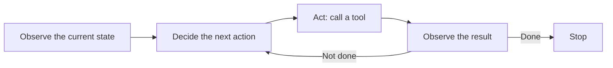

@slide statement
kicker: Section 6 · The mechanism
## Everything got called an agent this year. Most of it is a workflow with a chat window bolted on.
lead: The test is simpler than the marketing suggests, and it takes one question to apply.

@narrate
Every product you've evaluated this year claims to have an agent in it
now. Some of them do. Most of them are a fixed sequence of steps someone
designed in advance, with a model filling in text at one or two points
along the way. Both get called the same word, and the difference between
them is exactly what you need to be able to see.

Here's the test. Who decides what happens next: the person who built the
system, in advance, or the model, in the moment, based on what it just
observed. A workflow is the first. An agent is the second.

The distinction is worth this much attention because you'll be asked to
approve budget for one, scope one, or explain to legal what one is
allowed to touch. Answering any of those well depends on knowing which
system you're actually looking at, not which word is on the pitch deck.

@slide diagram
kicker: The actual mechanism
## Observe, decide, act, and look again before deciding what's next

@narrate
That loop is the entire mechanism. Look at the current state, decide what
to do about it, take that action through a tool, look at what happened,
and decide again, until the model itself judges the task finished.

@slide example
kicker: One request, two laps through the loop
## Worked: the summariser, extended into an agent

::: example Refund request lands in the queue
Observes the email, pulls order history, decides: refund or escalate.
Confirms the refund, then decides again: does this account's pattern
need a fraud flag before the case closes.
:::

@narrate
Take the support-ticket summariser from Section two, and push it one
step further than it's gone so far. Right now it only drafts a summary,
the kind that dropped Ticket 4471's deadline and left a human to catch
the double charge by hand. Suppose it could act instead. An agent
observes a refund request landing in that same queue, decides it needs
the order history, calls a tool to pull it, observes what came back, and
only then decides whether this qualifies for an automatic refund or
needs a human. That decision genuinely depends on what the order history
showed. Nobody wrote "always approve" or "always escalate" into the
system in advance. The model decided, in the moment, from what it
observed.

Say it decides the refund qualifies. That's not the end of the loop, it's
the next lap. It calls a tool to issue the refund, observes that the
payment system confirmed it, and decides again: does this specific
customer's pattern, three refunds in a month, say, need a fraud flag
before it closes the case, or is a confirmation email genuinely enough.
Each lap through that loop is a fresh decision made from what the last
one turned up, not a step ticked off a predetermined list.

@slide two-col
kicker: The distinction that actually matters
## Same output, completely different system

::: cols
:: card bad
### A workflow with a model in it
- A human designed the exact sequence in advance
- The model's job is filling in text at fixed points
- The same trigger always follows the same path
:: card good
### An agent
- The model decides the next action from what it just observed
- Different inputs can produce entirely different paths
- Stops when the model judges the task done, not at a fixed final step
:::

@narrate
Notice both columns can produce an identical-looking refund email. The
difference is invisible in the output and everything in how the system
got there.

Run the same test on anything you're evaluating. Ask what happens if the
order history comes back unusual: a duplicate order, a customer with
three prior refunds this month, an item that was never actually shipped.
A workflow either has no branch for that, or someone had to anticipate it
and hard-code a rule. An agent decides, because deciding what to do next
from what it just saw is the entire mechanism, not a special case bolted
onto it.

Vendors have every incentive to blur this, because agent is the word that
raises money and workflow is the word that sounds like the thing you
already had. Reading a product's own documentation for the phrase
"supported actions" or "configured steps" is usually the fastest tell:
that's workflow language, whatever the marketing page calls it.

@slide callout
kicker: The honest caveat
::: callout Be straight about this
Autonomy is not free. ==Every decision point is a chance to be wrong==,
and a five-step agent makes five separate chances, not one.
:::

@narrate
Say the honest caveat now, because the next few lectures spend real time
on exactly this cost.

Why is a workflow so predictable? Because nobody left room for it to
decide anything. An agent's whole value is that room, and that same room
is where it goes wrong: approves a refund it shouldn't have, calls the
wrong tool, decides it's done when it isn't. This section's next lecture
puts an actual number on how fast that risk compounds. For now, just hold
the trade plainly: more autonomy, more reach, and more ways to fail
quietly.

This is also why the refund example keeps returning to money moving.
Blast radius scales with what the agent's tools can actually touch, not
with how clever its reasoning looks in a demo. A five-step agent that
only drafts text is a different risk profile entirely from one that
issues refunds, and this section keeps that distinction live throughout.

@slide definition
kicker: Naming it precisely
::: definition Agent
A system where the model decides its own next action from what it just
observed, repeatedly, using tools, until it judges the task complete.
Not: a fixed sequence with a model generating text at one step.
:::

::: example Try this yourself
Pick one product you use that calls itself an agent. Ask what happens on
an input its designer didn't anticipate. If there's no good answer, it's
a workflow wearing the word.
:::

@narrate
That's the definition worth carrying past this lecture, and the second
half is doing as much work as the first. Not a fixed sequence with a
model generating text at one step, because that's the version most
"agent" marketing is quietly describing.

The exercise is genuinely worth five minutes. Most products fail it
honestly, and that's not a criticism of them. A well-built workflow is
often the right answer. It just isn't an agent, and knowing which one
you're actually looking at is the whole point of this lecture.

Keep the test handy past today, because you'll need it in rooms where
nobody else in the conversation is drawing the distinction. A vendor
demo, a roadmap review, an engineer proposing "an agent" for something a
workflow would do just as well and far more cheaply. Being the person who
asks the one question that actually settles it is worth more than
knowing the term.

@slide bullets
kicker: Before you move on
## Two things worth doing now

1. Run the test on one "AI agent" product you use or have evaluated
2. Write down one decision point where it could plausibly go wrong

@narrate
Two things before you move on.

Run the test for real, on a specific product, not a hypothetical one.
Who decided what happens next: its builder, in advance, or the model, in
the moment.

Then name one point where that decision could go wrong, concretely, not
in the abstract. "It might misunderstand the customer" is too vague to
act on. "It might approve a refund for an item that was already returned
once" is the kind of finding that actually changes what you build.

Next lecture gives you the tools and connections that let an agent reach
beyond its own output into your real systems, and the lecture after that
gives you the maths for exactly the risk you just named.
