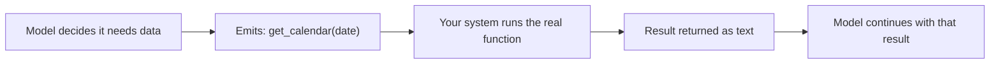

@slide statement
kicker: Section 6 · Reach
## An agent that can only talk is a chatbot. Tools are what turn it into something that can actually check your calendar.
lead: The mechanism is smaller than it sounds, and MCP is the part that actually changed in the last two years.

@narrate
Last lecture's loop had one box doing all the interesting work: act, call
a tool. Here's exactly what that box contains, because "the AI checked my
calendar" is doing a lot of hidden mechanical work you should be able to
name.

Two things make this possible. Function calling is how a model asks for
something specific instead of just talking. MCP is how it reaches your
actual tools, Workspace, Notion, Lark, whatever your team runs on,
without someone hand-wiring every single connection.

Neither one is exotic once you see it plainly, and that's the actual
goal of this lecture. Not to make you able to build either, but to make
sure nobody can wave "it's connected via MCP" at you as though that
settles a question it hasn't actually answered yet.

@slide diagram
kicker: What "the model called a tool" actually means
## A structured request, not code the model wrote

[SCREENSHOT-NEEDED: the author's own assistant-connector settings surface
showing a real Workspace or Notion connection (names redacted as needed),
annotated to the permission scope line the lecture's caveat is about]

@narrate
That's the whole mechanism, and the detail worth sitting with is the
middle box. The model doesn't write and execute code. It emits a
structured request, a function name and some arguments, formatted so
software can read it. Your system is the one that actually calls the
calendar, checks the result makes sense, and hands the answer back as
text the model reads like anything else in its context.

So where do you actually get to enforce the rules that matter: which
functions exist at all, what arguments are allowed, whether this
particular action needs a human to approve it first? Right there, in
that middle step. The model requests. Your system decides whether to
comply. Losing sight of that boundary is
how a demo video convinces a room that the model has more direct access
to your systems than it actually does.

Extend the loop one step further and the picture gets more concrete.
Say the model checked the calendar, found a free slot, and now wants to
schedule a meeting. That's a second function call, "create_event", with
its own arguments: time, attendees, a title it wrote itself. Reading a
calendar and creating an event look identical from the chat window. They
are not identical requests, and treating them as though they were is
exactly the gap this lecture exists to close.

@slide table
kicker: What actually changed
## Before MCP, every connection was bespoke. Now it's one protocol.

| | Before MCP | With MCP |
| --- | --- | --- |
| Connecting to Notion | Custom code, per project | One standard connector |
| Connecting to Gmail or Calendar | Custom code, per project | One standard connector |
| Connecting to Lark | Custom code, per project | One standard connector |
| Adding a new tool | Someone writes new integration code | Point the agent at a new MCP server |

@narrate
Before this protocol existed, every one of those rows meant an engineer
writing bespoke code to talk to that specific product's API, then
maintaining it when that API changed underneath them.

MCP standardises the middle of that picture: one protocol an agent speaks
to discover what a tool offers and call it, the same way regardless of
whether the tool is Workspace, Notion, or Lark. It doesn't remove the
work of connecting to a real system. It means that work gets done once,
by whoever maintains that connector, instead of once per project that
happens to need it. That's the actual shift worth understanding, not the
name of any particular connector, which will keep changing.

What it doesn't standardise is worth naming too. A protocol says nothing
about whether a specific connector was built carefully, what it logs,
or whether the person who installed it read the permission scopes before
approving them. Two calendar connectors can speak identical MCP and
still differ completely on whether a mistaken write is even recoverable.
Standard plumbing is not the same claim as trustworthy plumbing.

@slide callout
kicker: The honest caveat
::: callout Be straight about this
A tool connection is a permission grant, not a feature toggle. ==Ask what
it can write, not just what it can read==, before anyone wires it in.
:::

@narrate
Say the honest caveat, because "connect it to Workspace" sounds like one
decision and is actually several.

Read access to a calendar is low stakes. Write access, the ability to
create events, send email, or edit a live document on its own, is a
completely different risk, and it's easy to grant more than you meant to
because the connector ships with both switched on by default. Before any
tool connection goes live, ask specifically what it can write, not just
what it can read, and whether every write needs a human to approve it
first. That question is this section's guardrails lecture arriving four
lectures early, because it genuinely starts here, not there.

Picture the ordinary way this actually goes wrong. Someone approves
Workspace access for an agent so it can "check a few calendars," a
perfectly reasonable-sounding request. The connector they installed
defaults to read and write on every calendar it can see, because that's
the simpler product to ship. Nobody meant to grant write access to the
CEO's calendar. Nobody looked closely enough at the scope to notice they
had.

@slide definition
kicker: Naming it precisely
::: definition MCP, the Model Context Protocol
A standard way for a model to discover what tools are available and call
them, so a connector to one product works the same way for any
MCP-compatible agent, instead of being rebuilt per project.
:::

::: example Try this yourself
Ask whoever's proposing an agent for your team which specific functions
it can call, and which of those write instead of read. If the answer is
vague, that's the actual scoping conversation, not a formality.
:::

@narrate
That's the definition worth keeping, and notice what it doesn't promise:
nothing about which specific tools exist, because that list changes
constantly. What doesn't change is the shape of the question you ask
about any of them.

Try the exercise on a real proposal, not a hypothetical one. A vague
answer to "which functions can it call" is the same gap as a vague answer
to acceptance criteria back in Section three. Someone hasn't actually
decided yet, and shipping before they do is how the write-access mistake
happens.

Notice this exercise doesn't require you to read a line of code. The
function list is a product decision before it's an engineering one:
someone chose to expose "create_event" instead of just "check_calendar",
and that choice deserves the same scrutiny you'd give any other feature
decision, not a pass because the word agent is attached to it.

@slide bullets
kicker: Before you move on
## One thing worth doing now

List every tool an agent you're evaluating can call, split into read and write, and ask who approved the write access

@narrate
One thing before you move on.

Make the list itself, split cleanly into read and write. Most people
asked this question for the first time find the write column longer than
they expected. Then ask the harder one: who actually approved that
access, and what the system does the moment a call goes wrong, wrong
data, wrong recipient, wrong day.

Next lecture gives you the maths for how often "wrong" shows up once an
agent is chaining several of these calls together in a row, and it's a
less comfortable number than most demos suggest.
