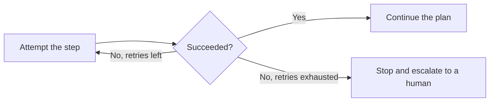

@slide statement
kicker: Section 6 · What actually breaks
## Most agent demos don't fail because the model is bad. They fail because nobody designed for the third retry.
lead: Three patterns separate an agent that survives production from one that only survived the demo.

@narrate
The refund agent from earlier in this section worked perfectly in every
demo anyone showed you. It also had never hit a network timeout calling
the payment system, never seen an order history come back empty, and
never been asked to do the same task twice by two different
support agents at once. Production hits all three in the first week.

None of those three are exotic edge cases. They're Tuesday. A network
blips, a record is mid-update when something reads it, two people on
your team work the same queue. Any system that touches real
infrastructure meets all three eventually, and the only real choice you
have is whether it meets them with a plan already in place or finds out
live.

None of that is a model problem. It's an architecture problem, and
there are three patterns that consistently separate the agents that
survive contact with production from the ones that don't.

Notice none of the three require a better model, and that's deliberate.
Every one of them is a design decision you can ask about and evaluate
without reading a line of code, the same way you'd ask about error
handling in any other feature before it ships.

@slide two-col
kicker: Pattern one
## Decide one step at a time, or plan the whole thing first

::: cols
:: card bad
### Step by step, no visibility
- The model decides only its very next action
- Nobody sees the plan until it's already executing
- A wrong assumption on step one is invisible until step four
:: card good
### Plan, then execute
- The model states its full plan before acting
- A human or a rule can review it before anything happens
- Step four's assumption is visible while it still costs nothing to fix
:::

@narrate
The difference sounds small and changes everything about how debuggable
the system is.

An agent that decides one step at a time is genuinely reactive: observe,
decide, act, exactly like 6.1's loop, with no plan you could inspect
before it commits to it. An agent that plans first states, in plain
language, what it intends to do and in what order, before calling a
single tool. That plan is cheap to review and cheap to reject. The
refund agent that plans "check order history, confirm no prior refund
this month, then issue the refund" lets you catch a missing check before
it runs, not after it's already moved money.

Does that mean every agent should plan-then-execute, regardless of the
task? No. A single lookup barely benefits from a written plan; there's
nothing to review. The pattern earns its cost specifically once a task
spans several steps with real consequences, which describes most of the
agents actually worth scoping carefully in the first place.

@slide diagram
kicker: Pattern two
## Bounded retries, then escalate. Never retry forever.

@narrate
Retrying a failed step sounds like the safe, resilient choice, and
unbounded retrying is one of the most common ways an agent quietly turns
a small failure into an expensive one.

A payment system timing out once is normal. An agent that retries a
timed-out refund call five times without checking whether the first
attempt actually went through can issue the same refund five times.
Bound the retries, and more importantly, decide in advance what happens
when they run out. The honest answer is almost never "keep trying
forever." It's "stop, and put this in front of a person," the same
escalation instinct as Section three's degradation paths, now applied to
a system that acts instead of one that only answers.

Notice the diagram has exactly one exit that isn't success: escalate.
Not "try a different approach automatically," which just substitutes one
untested path for another, and not "silently give up," which is 5.5's
silent-failure mode wearing a different section's clothes. A human
seeing the failure and the full context around it is the only exit that
reliably turns a stuck agent into a solved problem instead of a
mysterious one.

@slide callout
kicker: The honest caveat
::: callout Be straight about this
Every one of these patterns costs engineering time to build properly.
==Spend that budget where the blast radius is largest==, not evenly
across every agent you scope.
:::

@narrate
Say the honest caveat, because plan-then-execute and bounded retries
aren't free, and treating them as a checklist every agent must satisfy
regardless of stakes is its own kind of waste.

An internal agent that drafts a weekly summary nobody reads unattended
can probably skip most of this. An agent that touches customer refunds,
sends external email, or edits a live document cannot, and the
difference between those two is exactly the blast radius question the
guardrails lecture two lectures from now makes the actual scoping tool.
For today, just hold the principle: match the engineering investment to
what happens when this specific agent gets it wrong.

Watch for the opposite mistake too, the one that's easier to make in a
budget conversation than it sounds. A team under time pressure skips the
plan-review step or the idempotency check specifically on the agent that
touches money, because that's the one everyone's most eager to ship.
That's precisely backwards, and it's worth saying out loud in the room
where the schedule gets decided, not after the duplicate refund shows up.

@slide definition
kicker: Naming it precisely
::: definition Idempotent action
A tool call safe to run more than once without a different or worse
result: checking whether a refund already posted before issuing another
one, not just retrying the issue-refund call itself.
:::

::: example Try this yourself
Pick one tool call in an agent you're scoping. Ask what happens if it
runs twice by accident. If the honest answer is "something bad," that
call needs an idempotency check before it needs anything else.
:::

@narrate
That's the third pattern, and it's the one people skip because it sounds
like a backend detail rather than a product decision. It isn't. Whether
an action is safe to repeat is exactly as much your call as whether the
agent needs a plan reviewed first.

Run the exercise on something concrete. "Send a confirmation email"
running twice is annoying. "Issue a refund" running twice is a real
financial loss, and both can be caused by the exact same retry that
looked like the safe, cautious choice from pattern two.

The fix is usually cheaper than the finding sounds. Often it's a single
check added before the risky call: has this order already been refunded
today, has this email already gone out. That one addition is what makes
pattern two's retries genuinely safe instead of merely convenient, and
it's worth costing out at the same time you cost out the retry logic
itself, not as an afterthought once someone notices the gap.

@slide bullets
kicker: Before you move on
## One thing worth doing now

Ask to see an agent's plan, not just its output, and ask specifically what happens after its third failed retry

@narrate
One thing before you move on.

Ask to see the plan, not just the output. If there isn't one, because the
system decides one step at a time with nothing written down first,
that's worth knowing before you're debugging it in production instead of
reviewing it in a design doc. Then ask the retry question directly, and
expect a specific answer, not a shrug. "It handles errors gracefully" is
not a specific answer. "Three retries, then it stops and pings the
on-call channel" is.

Next lecture takes this same production-survival lens and points it at
a different question: when do you actually need more than one agent
working together, and why local-first is usually the safer way to find
out.
