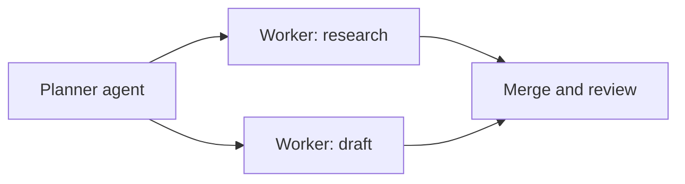

@slide statement
kicker: Section 6 · Before you add a second agent
## One agent's reliability maths was already sobering. A second agent doesn't fix that, it adds a handoff.
lead: The honest question isn't whether multiple agents are more capable. It's whether the task actually needed splitting up.

@narrate
Multi-agent sounds like the natural next step once one agent feels
limited: add a second one, specialised, and let them work together. Sometimes
that's exactly right. Often it's reaching for more machinery before
confirming the first machine was actually the bottleneck.

It's also, this year specifically, the architecture every vendor demo
reaches for, because a planner coordinating three specialised workers is
a genuinely impressive thing to watch. Impressive to watch and
proportionate to the task are two different claims, and only one of
them belongs in a scoping decision.

Here's the honest starting point. Every handoff between two agents,
one's output becoming another's input, is one more step in exactly the
chain 6.3 taught you to multiply out. Splitting a task across agents
doesn't remove steps from that chain. It usually adds one: the step
where agent A's output has to be correctly understood by agent B.

That's worth sitting with before anything else in this lecture, because
it cuts against the intuition most pitches lean on. "Two specialised
agents" sounds like it should be more reliable than one generalist
doing everything. Specialisation can genuinely help each agent's own
per-step accuracy. It doesn't touch the new step created at the seam
between them, and that seam is exactly where 6.3's maths starts counting
again.

@slide diagram
kicker: What actually got added
## A planner, two workers, and a merge step nobody had to build before

@narrate
Picture that shape built for something concrete: a planner agent breaks
a request into research and drafting, hands each to a specialised
worker, and a merge step reconciles both before anything ships.

Every arrow in that diagram is a handoff, and every handoff is a new
place for the reliability maths to bite. The research worker has to
produce something the drafting worker, or the merge step, can actually
use correctly. If the researcher's output is ambiguous and the merge
step misreads it with even a small probability, you've added a whole
new multiplication to a chain that was already compounding before you
added a second agent to it.

So how long is the actual chain? Longer than the diagram first
suggests, once you count it honestly. The planner's own decisions, each
worker's internal
steps from 6.1's loop, and now the merge step reconciling two outputs
instead of reading one. A task that looked like four steps as a single
agent can easily be eight or nine once it's been split across a planner
and two workers, and the whole-chain number from 6.3's table drops
accordingly.

@slide two-col
kicker: Where to actually build the first version
## Same architecture, very different place to find its problems

::: cols
:: card bad
### Straight to hosted, production
- Every mistake costs real API spend across every agent involved
- Debugging means reconstructing a trace across separate services
- Guardrails need enforcing across each agent's tool access separately
:: card good
### Local first
- Cost is bounded by your own compute, not metered per agent per call
- The full multi-agent trace is inspectable on one machine
- Easy to sandbox, kill, and restart while you're still learning the shape
:::

@narrate
Notice the left column isn't wrong about what multi-agent can do. It's
wrong about when to find out, and finding out is expensive in exactly
the ways that column lists.

Local doesn't mean a permanent architectural choice. It means proving
the handoffs actually work, on your own machine, where a bad merge step
costs you a rerun instead of an API bill and a confused support ticket.
Once the trace looks clean locally, moving it to production infrastructure
is a deployment decision. Skipping straight to production is a debugging
decision you didn't mean to make.

"Local" here means local infrastructure and a trace you can actually
read end to end, not a specific claim that a self-hosted model beats a
hosted one on quality. Some teams prototype with the same hosted model
they'd use in production, just run against local logs and a local test
harness instead of live traffic. The point isn't which model. It's
whether you can see every handoff clearly before real users depend on
getting through all of them correctly.

@slide callout
kicker: The honest caveat
::: callout Be straight about this
Most tasks that feel like they need multiple agents actually need one
agent with a clearer prompt. ==Try that first==, because it has none of
this lecture's new handoff risk.
:::

@narrate
Say the honest caveat, because multi-agent has genuine uses and this
section would be dishonest pretending otherwise, and it's also
genuinely oversold.

Before building the planner-and-workers version of anything, try
rewriting the single agent's instructions more precisely, or breaking
the task into a plan-then-execute sequence inside one agent, the pattern
from last lecture. If that solves it, you've kept the reliability
maths from last lecture and skipped every handoff this one just added.
Reach for a second agent when the subtasks genuinely need different
tools, different context, or real parallelism, not because the first
attempt's prompt was vague.

Genuine parallelism is the strongest of those three reasons, worth
naming specifically. If two subtasks truly don't depend on each other's
output, research and a completely separate compliance check, say,
running them as parallel agents can save real time without adding a
handoff on the critical path. That's a materially different case from
splitting one sequential task into stages just because it felt like the
architecturally sophisticated thing to do.

@slide definition
kicker: Naming it precisely
::: definition Multi-agent orchestration
More than one agent loop running on a task, coordinated through defined
handoffs. Each handoff is a new step the reliability maths applies to,
not a step that was already inside a single agent's chain.
:::

::: example Try this yourself
Take a multi-agent proposal you've seen and ask what a single,
better-scoped agent would fail to do. If the honest answer is "nothing
specific," that's the finding.
:::

@narrate
That's the definition worth keeping, and the second sentence is the
part most pitches skip: a handoff is a new step, not a free
specialisation.

Run the exercise on a real proposal, the same discipline as every other
lecture in this section. If nobody can name the specific thing a single
agent genuinely can't do, that's not a reason to say no outright. It's
a reason to ask for the local prototype before the production budget.

Notice this is the identical instinct from 6.1's opening test, one level
up. There, the question was whether the model decides the next step or
a human predetermined it. Here, it's whether splitting the work across
agents was actually necessary or just felt like the more impressive
answer. Both questions exist to stop architecture from expanding past
what the task genuinely required.

@slide bullets
kicker: Before you move on
## Two things worth doing now

1. Count the handoffs in a multi-agent proposal, and ask what happens at each one if it's misread
2. Ask whether it's been tried locally yet, or is heading straight to production

@narrate
Two things before you move on.

Count the handoffs specifically, the same way you counted steps for
6.3's table, and ask what a misread at each one actually costs.

Then ask the deployment question directly. "We're prototyping it
locally first" and "we're building it straight into the production
pipeline" are two different risk profiles wearing the same architecture
diagram, and it's a completely reasonable question to ask in a planning
meeting, not a technical detail beneath a PM's attention.

Next lecture gives you the guardrails that apply whichever answer you
get, and it's worth having both of today's questions answered before
you walk into that conversation.
