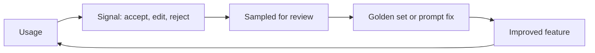

@slide statement
kicker: Section 9 · The phrase that overpromises
## "Data flywheel" is a real thing, and also the most over-promised phrase in this course. Here's the honest version.
lead: More usage generates more data. That data only improves the feature if a specific person closes the loop, on purpose.

@narrate
The pitch version of a data flywheel sounds automatic: ship it, users
generate data, the data makes it better, better draws more users, the
wheel spins itself faster every quarter. Said like that, it sounds like
something that happens to a product rather than something a team has
to do.

It isn't automatic anywhere in the loop. Every step, from a rejected
suggestion to an actual fix shipped, is a deliberate action someone has
to take. Skip the deliberate part and you don't have a flywheel. You
have 9.2's instrumentation, correctly capturing a rejection event that
nobody ever looks at again.

Every section in this course has quietly built toward this moment
without naming it. Section four gave you a golden set. Section eight's
incident rule turned one specific failure into a permanent case. This
lecture generalises both: the same discipline, running continuously on
ordinary usage, not just triggered by a crisis.

@slide diagram
kicker: The loop, honestly drawn
## Five steps, and only one of them happens automatically

@narrate
Exactly one arrow on this diagram draws itself: usage produces a
signal, because 9.2's instrumentation fires whether or not anyone's
watching. Every arrow after that needs a person to push it.

Sampling for review needs someone to decide how much gets looked at and
how often. Turning a reviewed case into a golden set entry or a prompt
fix needs someone with the authority and the time to make that change.
Shipping the improvement needs the normal release process this course
has assumed all along. Call any one of those steps optional, and the
loop stops exactly there, quietly, while the usage number keeps
climbing. Who would even notice?

Notice, too, what this diagram deliberately leaves out: a direct arrow
from Signal straight to Improved feature. That shortcut is exactly the
automated version this lecture is warning you away from, missing from
the drawing on purpose. Every real version of this loop routes through
a person at the review step, every time, no exceptions.

Compare this loop against 4.2's golden set build process: the same
shape stretched out over time instead of done once. A golden set was
fifty cases, chosen deliberately, scored against a rubric, at a single
moment before launch. This loop is the same deliberate selection and
review, running in small batches, forever, after launch.

@slide two-col
kicker: What actually closes the loop
## Data accumulating, and data actually used

::: cols
:: card bad
### Assumed to close itself
- Rejection events logged faithfully since launch
- Nobody owns reviewing them on any schedule
- Three months of signal, sitting in a table nobody queries
:: card good
### Closed on purpose
- A named person samples rejected cases weekly
- Real patterns become new golden-set rows or a prompt fix
- The same discipline 8.6 asked for after an incident, run routinely
:::

@narrate
Notice the good column isn't describing a bigger engineering effort.
It's describing the exact same habit 8.6 already asked for after an
incident, just running on a calendar instead of waiting for something
to break first.

That's the actual insight worth taking from this lecture: a rejected
or heavily edited output is a small incident, informative in exactly
the same way, even when nothing broke badly enough to page anyone.
Review it with the same seriousness, on a schedule, and the loop closes
weekly instead of only after a crisis forces it open.

Notice, too, how cheap the good column actually is compared to almost
anything else this course has asked you to build. No new
infrastructure, no new model, no new eval framework. Thirty minutes,
one person, one calendar entry, and a habit of actually acting on what
gets found in that half hour instead of filing it away.

Ask which of the five diagram steps your own feature is actually
missing, rather than assuming the whole loop is either working or not.
Most teams already have usage and signal working, since 9.2 covers
both. The break is almost always at sampling or review, the two steps
that need a person's calendar time rather than a line of code.

@slide callout
kicker: The honest caveat
::: callout Be straight about this
Don't let the feature retrain itself automatically from unfiltered
user input. ==That's 8.2's injection risk wearing a different
name==, aimed at your training data instead of your prompt.
:::

@narrate
Say the honest caveat, because "let the system learn from real usage
automatically" sounds like the flywheel finishing itself, and it's
actually a new, specific risk.

Unfiltered public input feeding directly back into what the feature
does next is exactly the shape 8.2 warned about: content from outside
your control silently steering behaviour, just arriving through a
training pipeline instead of a prompt. A reviewer between the signal
and the fix isn't friction slowing the flywheel down. It's the
component that stops the loop from learning the wrong lesson from a
small number of bad-faith or simply unusual requests.

This is also why the review step needs to be a person with judgement,
not a second model quietly triaging the first model's mistakes with no
human in the loop at all. A judge model reviewing rejected outputs can
genuinely help at scale, the same way 4.4 taught you to use one, but it
still needs 4.4's calibration discipline behind it, not blind trust
that a second model catches what the first one missed.

@slide definition
kicker: Naming it precisely
::: definition A closed loop
A rejected or edited output, sampled, reviewed by a person, and turned
into either a new golden-set case or a specific fix, on a real
schedule, not just after an incident forces the review to happen.
:::

::: example Try this yourself
Pull five rejected outputs from the last week. Check honestly whether
any of them ever became a golden-set case or a fix. If none did,
that's this lecture's finding.
:::

@narrate
That's the standard worth holding your own loop to, and the exercise is
worth running exactly as written, on real rejected cases, not a
hypothetical average of how review usually goes.

Most teams running this for the first time find the honest answer is
zero. The data was captured faithfully. Nobody ever closed the loop on
a single case. That gap is usually not a tooling problem. It's a
missing name next to a recurring calendar entry.

Widen the check if the first five surprise you. Pull twenty, then
fifty. The pattern that shows up repeatedly across a real sample is
usually the single highest-value fix available to the feature this
month, discovered for the cost of an hour's honest review instead of a
quarter's guessing.

@slide bullets
kicker: Before you move on
## Two things worth doing now

1. Check whether any recent rejected output ever became a fix
2. Put a name and a weekly cadence on reviewing them

@narrate
Two things before you move on.

Run the check from the example slide for real, on your own feature.
It's a five-minute look that usually tells you exactly where your loop
is actually open.

Then assign it. A weekly thirty-minute review, owned by one person, is
enough to keep a real loop turning. Nobody owning it at all is enough
to keep the data piling up forever, unused.

Both of these are true regardless of how sophisticated your
instrumentation already is. The most advanced event schema in the world
produces nothing on its own. It only ever produces what someone
deliberately does with it.

Next lecture is dashboards leadership actually reads, and the honest
difference between a dashboard built to inform a decision and one built
to look thorough in a review.
