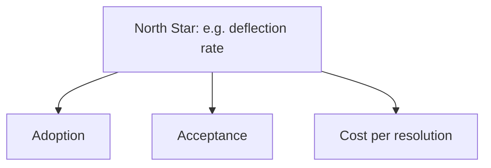

@slide statement
kicker: Section 9 · The workshop
## Twenty minutes, one real feature, a metric tree with a real number in every branch.
lead: Not a slide for a review deck. Every idea this section built, assembled into the one document your feature's whole story lives in.

@narrate
Pick the feature you're closest to, the one whose numbers you'd
actually recognise on sight. Open A12, and give this the same twenty
minutes every workshop in this course has asked for.

The bar is the same too. Not perfect. Complete, with a real number in
every branch, even where that number is an honest "not yet measured"
rather than a guess dressed up as data. A tree with one honest gap is
worth more than one with five numbers nobody checked.

This workshop doesn't introduce anything new. Every block on the next
slide is a direct check against something this section already taught
you, which means the twenty minutes should feel like assembly, not
discovery. If it feels like discovery somewhere, that block is this
workshop's actual finding.

Treat the twenty minutes as a floor, not a ceiling. A tree assembled
quickly from already-solid numbers is a genuine success, not a shortcut
to feel guilty about. The workshop rewards a team that did the earlier
work honestly by making this part fast.

@slide table
kicker: How to spend the twenty minutes
## Five lectures, five pacing blocks

| Minutes | Covers | Watch for |
| --- | --- | --- |
| 0-4 | Your three-metric floor: adoption, acceptance, deflection, 9.1 | Real numbers, not assumed ones |
| 4-8 | Your instrumentation against 9.2's schema | A request_id thread that actually connects |
| 8-12 | Your last A/B test against 9.3's checklist | Randomized by user, version pinned |
| 12-16 | One real feedback loop closed, 9.4 | An actual case turned into a fix or a golden-set row |
| 16-20 | The leadership dashboard itself, 9.5 | Three to five numbers, allowed to look bad |

@narrate
Notice the first two blocks are a direct check, not new work. If 9.1's
three metrics and 9.2's request_id thread are already solid, this is a
fast eight minutes confirming it, not a rebuild. Most of this workshop's
real time goes to whichever block turns out to be the honest gap.

Minutes eight through twelve ask you to actually open your last A/B
test's setup, not recall it from memory. Randomized by user, version
pinned for the duration, sized larger than the calculator suggested. If
you've never run one, that's a legitimate answer for this block too,
noted honestly rather than invented.

The feedback loop block, minutes twelve through sixteen, is the one
most workshops before this one have found the hardest, because it
demands a real example: one rejected case, actually traced to a fix or
a golden-set row, not a description of the process in the abstract.

The last block, the leadership dashboard, only works once the first
four are honest, which is why it sits at the end rather than the start.
A dashboard assembled from four unchecked numbers is exactly the
"looks good, isn't" trap 9.5 warned you about, wearing a workshop's
shape instead of a quarterly review's.

@slide diagram
kicker: The shape you're building
## One North Star, three branches, every one a real number

@narrate
This is the shape A12 asks you to fill in, and it's deliberately
simple. One North Star metric at the top, the single number that best
represents whether the feature is succeeding, and the branches
underneath it that explain why that number is moving.

Choose the North Star carefully, because it's doing more work than it
looks like. For a support assistant, deflection is often the honest
choice: it's the number that ties usage directly to the cost Section
seven taught you to compute. For a drafting tool, acceptance might sit
at the top instead, with adoption and a cost number as its branches.
There's no universal right answer, only the one that's honestly the
feature's actual purpose.

Notice this tree is deliberately shallow, one level, not a sprawling
org chart of every metric your team tracks. Depth is what the team's
own dashboard from 9.5 is for. This tree exists to be read in the time
it takes to say four sentences out loud, which is roughly how long
you'll actually have in the room where it matters.

The cost branch deserves a specific mention, because it's easy to leave
off a metric tree that otherwise feels complete. Pull it directly from
Section seven's unit economics model rather than estimating it fresh.
If 7.2's cost model and 7.5's margin work are already built, this
branch is a five-minute copy, the same shortcut this workshop's first
block already gave you for adoption and acceptance.

@slide callout
kicker: The honest caveat
::: callout Be straight about this
A tree with every branch green looks finished and usually isn't.
==Check whether you'd trust the North Star number enough to defend it
live==, not just whether the page looks complete.
:::

@narrate
Say the honest caveat, because a metric tree is exactly the kind of
document that can look done from a distance while being hollow up
close, the same trap 9.5 named for a dashboard that only ever shows
green.

Before you call a branch finished, ask the question a real review would
ask: where does this number come from, and would it survive someone
checking. If the honest answer is "I'm not fully sure," write that down
next to the branch rather than letting a plausible-looking number stand
in for a checked one.

This is the same discipline as every honest caveat this course has
asked for, aimed one last time at the artifact you're building right
now, not a hypothetical one. A metric tree presented once and never
revisited goes stale exactly the way 8.1's register does, and the fix
is identical: a real owner, and a real date for the next honest look.

@slide definition
kicker: Naming it precisely
::: definition A complete metric tree
One North Star metric, chosen deliberately for what this feature
actually does, with adoption, acceptance, deflection, and a cost number
underneath it, each one real or honestly marked unmeasured.
:::

::: example What to do when you finish early
Reread only the North Star choice. If you can defend why it's this
number and not a different one, the tree is ready to bring to a
leadership conversation.
:::

@narrate
That's today's bar, held to the same standard as every workshop before
this one: attempted honestly, with the one choice that matters most,
the North Star itself, made on purpose rather than by default.

If you finish with time left, don't polish every branch evenly. Return
to whichever number you're least confident defending live, because
that's the one a real review will find first.

Most people building their first tree default to whichever metric was
easiest to pull, not the one that best represents success. Catch that
instinct specifically at the North Star box, because every other branch
inherits its meaning from whether that top choice was actually the
right one.

@slide bullets
kicker: Before you move on
## Two things worth doing now

1. Finish the tree, with a deliberately chosen North Star
2. Send it to whoever owns your next leadership update

@narrate
Two things before you move on.

Complete every branch for a feature you actually own, and make sure the
top of the tree was a deliberate choice, not whichever number happened
to be easiest to find.

Then hand it to whoever actually presents this feature next, and ask
which branch they'd push back on first. Expect it to be the one you
were least sure about while building it. That's usually not a
coincidence.

Neither step requires new data collection. Everything the tree needs
should already exist somewhere in what 9.1 through 9.5 asked you to
check. This workshop is assembly, and assembly is the part most teams
skip, not because it's hard, but because nobody ever put twenty minutes
on a calendar for it.

Next lecture closes this section: what these seven lectures actually
built, and how it plugs directly into Section ten, where the job itself
starts.
