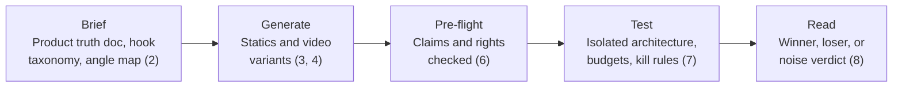

@slide callout
kicker: Section 11 · The capstone

::: callout One product. One full sprint. Every skill this course taught, in the order it actually happens.
Not a quiz, and not another five-minute exercise. This is the real thing, run once, start to finish.
:::

@narrate
Everything up to this point has been one piece at a time: a brief here,
a batch there, a testing architecture in Section 7. The capstone asks
you to run all of it, in sequence, on one real product, the same
sequence Section 10.4's ninety-day plan laid out.

Pick a product you can actually get creative rights to and real, even
if small, ad spend against. Your own business if you have one. An
employer's, with permission. A friend's small brand, if they'll let you
run a genuine test. This only teaches you something if the product and
the test are both real. A hypothetical product produces a hypothetical
result, teaching nothing about the honest reads Section 8 built.

Work through the sequence exactly as taught: product truth doc, hook
taxonomy, angle map, batch generation, pre-flight checklist, testing
architecture, and a first honest read. Sections 11.2 and 11.3 walk the
same sequence on Harlan's account immediately after this, as a worked
example to check your own decisions against, not a template to copy
without thinking.

This is deliberately the hardest lecture in the course to simply
listen to. Everything before it could be understood by watching. This
one can't. The capstone only teaches you anything once you've actually
opened Section 2.1's product truth doc template and started filling it
in with your own numbers.

@slide diagram
kicker: The sequence, one more time
## Every stage, and which section it comes from
figcap: Five stages, one direction. Each stage's output is the only valid input to the next one.

@narrate
Notice this table is identical in shape to Section 10.4's checklist.
That's deliberate. The capstone isn't new content, it's the proof that
the sequence you've been taught actually holds together end to end, on
a product this course has never seen before.

Expect this to take real time, genuinely days rather than the length
of this video. Generating and pre-flighting a proper batch alone is
several hours of honest work. Running a test long enough to get past
Section 7.4's small-sample honesty takes actual days of live spend,
not an afternoon. Budget for that before you start, not partway through
when the deadline pressure shows up.

Notice, too, that this table has no line for "pitching" or "reporting."
Those come later, in Section 10.4's phase three, once a real cycle has
actually been run. The capstone stops at an honest first read, which is
exactly as far as a genuine first sprint should go before anything gets
scaled, refreshed, or shown to anyone outside the work itself.

@slide bullets
kicker: What "done" looks like
## Five checkpoints, not a single deadline

- A product truth doc you could hand to someone else and have them understand the claims boundary
- A batch that cleared Section 6's pre-flight checklist, not just one that got generated
- A testing architecture with a real CAC ceiling and kill rule, worked from your own margin
- At least one verdict from Section 8.2's tree, written down honestly, noise included
- A completed scorecard, per Section 8.5, for every ad set you tested

@narrate
Five checkpoints, and notice none of them require a winner. A capstone
that ends honestly in noise, correctly identified as noise, has still
succeeded. Section 8.2 already told you most real batches land there.
Demanding a winner from your own capstone would be asking the exercise
to lie to you.

What actually fails the capstone is skipping a checkpoint, not landing
on an unglamorous result. A batch that skipped pre-flight, or a test
read before enough spend accumulated, teaches you nothing true about
your own product, whatever verdict it produces.

Would you trust a verdict from a process that skipped one of these five
checkpoints? If the honest answer is no, hold your own capstone to the
same standard you'd hold anyone else's. The rubric in Section 11.4
checks exactly this, but the more useful check happens here, honestly,
before you get there.

@slide bullets
kicker: Where this goes
## What this capstone sets up

- **Next lecture.** Worked solution, part one: the same sequence, walked through on Harlan's account
- **Section 11.4.** The self-assessment rubric, to score your own capstone honestly
- **Section 11.5.** Where to go next, once this is actually finished

@narrate
The next two lectures walk this exact sequence on Harlan's account, in
detail, as the worked example. Watch them before you start if you want
a model to follow, or after your own first pass if you'd rather work
it out independently first and compare notes afterward.

Either order works. What matters is that your own capstone gets run for
real, on a real product, not just watched as someone else's example.
That's the entire difference this course has been built to teach.

Give yourself permission for this to take longer than the two worked
lectures do to watch. Harlan's story compresses months of real account
history into a few minutes of narration for teaching purposes. Your own
capstone doesn't get that compression, and expecting it to move at the
same pace as the video is the fastest way to feel behind on a schedule
nobody actually set for you.
