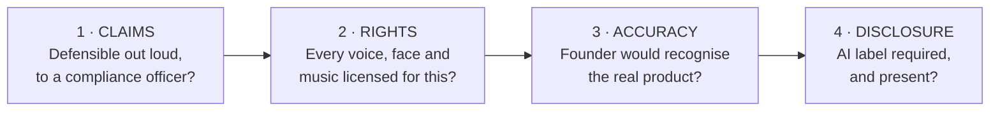

@slide statement
kicker: Section 6 · The near miss
## One draft nearly went out under Harlan's name. It only failed one of four possible ways.
lead: Name the four, and a pre-flight check stops being a vague worry and becomes a specific thing to look for.

@narrate
Picture the moment right before this section existed. A script lands on
Dana's desk claiming the socks are clinically proven to reduce swelling
by forty percent. Nobody had ever run that study. If nobody had asked
the right question, it ships under Harlan's name.

That near miss was one specific kind of failure: a claim nobody could
defend. It's one of exactly four ways an AI ad actually gets pulled,
refunded, or flagged, a claim that overstates what the product does, a
rights or licence gap behind the person or the music, a brand or product
that drifted from what it actually is, and a disclosure that's missing
where a platform requires one. Nearly every real failure sorts cleanly
into one of these four.

Naming all four now, not just the one that caught Harlan, is what lets
you check for a failure you haven't personally seen yet. You already
know what a mangled spec overlay looks like, because Section 3.4 showed
you one. You may never have seen a music-licensing gap specifically. But
if you know "rights gap" is a category worth checking, you catch it the
first time it shows up in your own batch, not after it's already cost
you something.

@slide table
kicker: The four categories
## Where you already learned the fix for each one

| Category | What it looks like | Where you already learned this |
| --- | --- | --- |
| Claims overreach | A number, an outcome, or a medical claim nobody can defend | Section 6.2, next |
| Rights gap | An unlicensed voice, face, or piece of music behind the ad | Sections 4.1, 6.4 |
| Brand or product drift | The product on screen isn't quite the real one | Sections 3.3, 4.4 |
| Missing disclosure | AI-generated or AI-edited content shipped without the label a platform requires | Section 6.3, next |

@narrate
Notice this table isn't introducing four new rules. It's naming the
pattern connecting rules you already have. Product drift is Section 3.3's
brand-control problem. A rights gap is Section 4.1's licence-tier catch.
You've been fixing individual instances of these all along. This section
just gives you the category, so you can check for the pattern instead of
waiting to recognise each specific instance again.

That's the actual value of a taxonomy over a list of examples. A list
tells you what already went wrong once. A category tells you what to
look for in a draft that's never failed this way before.

Notice, too, that all four categories share one property: none of them
are about whether the ad is good. A perfectly persuasive ad can still
fail every one of these checks, and a mediocre one can pass all four
cleanly. Section 8 handles whether an ad works. This section only asks
whether it's allowed to run at all, a genuinely separate question that's
easy to blur under deadline pressure.

@slide diagram
kicker: How to actually use this
## Run every draft through four questions, not four searches
figcap: The order is deliberate. Cheapest fix first, hardest to reverse last.

@narrate
Four questions, asked of every single draft, not four separate audits run
once a quarter. That's the actual shape of the checklist Section 6.6
builds properly, and it's worth previewing here so you recognise it
immediately when it arrives.

Run them in this order, deliberately. Claims first, cheapest to fix, a
line rewritten. Rights second, can force a whole recast but still fixable
before spend. Accuracy third, usually just needs regenerating. Disclosure
last, almost never a reason to kill a draft, only a reason to add a
label. Front-load the checks that catch the biggest problems earliest.

Notice the questions are all answerable, not vague. "Could I defend this"
has a yes or no. "Is every voice licensed" has a yes or no. A pre-flight
check that asks vague questions gets skipped under deadline pressure. One
that asks answerable questions gets actually run.

Which of these four would you be most tempted to skip on a Friday
afternoon, batch due, budget already approved? Be honest with yourself
about the answer, because that's exactly the question worth building a
habit around rather than trusting willpower to catch every time.

@slide callout
kicker: The honest pattern

::: callout Be straight about this
Harlan's own worst near-miss, a fabricated swelling-reduction claim, was
purely a claims-overreach failure. ==Section 6.2 exists specifically
because that one category catches more real ads than the other three
combined==.
:::

@narrate
One honest note about where the real risk actually concentrates.

Of the four categories, claims overreach is the one that catches the most
drafts in practice, and it's the one Harlan's account actually ran into.
An early cut of an ad claimed a specific swelling-reduction number nobody
had ever tested. It never shipped. But it's exactly the kind of claim
that's easy to write without noticing, because a specific number sounds
more credible than a vague one, and credibility is exactly what a script
is trying to earn.

That's the trap worth naming plainly. Everything Section 2.3's hook
taxonomy taught you about specificity, that a concrete detail beats a
vague one, is also exactly what makes an overreached claim so tempting to
write. The same instinct that makes a good ad good is the instinct that
needs the tightest check. That's not a coincidence, and it's why claims
get their own full lecture next, rather than a single bullet point here.

@slide bullets
kicker: Where this goes
## What this taxonomy sets up

- **Next lecture.** Claims: the category that catches the most drafts, examined properly
- **Section 6.3.** Disclosure, the category most sensitive to platform policy change
- **Section 6.4.** Rights, gathered into one checklist instead of scattered across Sections 4 and 5

@narrate
Next lecture takes the category that actually caught Harlan's worst
draft, and builds the specific test you can run on any claim before it
ships, not just a general instinct that something sounds off.

Keep the four-question framework close at hand while you go. Each of the
next three lectures takes one question and turns it into a real, specific
check. By Section 6.6, all four come back together as B05, one checklist
you run on a whole batch instead of once per question.

Before that, do one honest pass right now. Pull up whatever you
generated in Section 4.6's workshop and run the four questions against
it, out loud if that helps. You won't have the deep answer to each one
yet, this section builds those over the next three lectures, but you'll
already know, roughly, where your own set is strong and where it's worth
paying closer attention as those lectures arrive.
