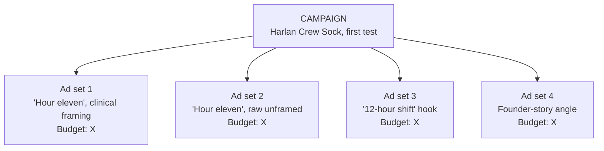

@slide statement
kicker: Section 7 · The instrument
## An ad account isn't where you spend money. It's the instrument that tells you which angle actually wins.
lead: Structured wrong, it just burns budget while telling you nothing. Structured right, every dollar is a measurement.

@narrate
Go back to the very first thing this course showed you: Dana and Sam,
independently, each picking their favourite from four variants, and both
of them wrong. That was never really an argument about taste. It was an
argument about instruments. Taste has no way to measure a winner.
An ad account, structured properly, does.

Sit with that reframing, because it changes what you're building here.
You're not setting up a place to spend money. You're building the one
instrument in this course that can answer the question every other
lecture assumed you'd eventually need: which of these angles is
actually true.

Most accounts aren't structured properly, and it's rarely because someone
made a careless mistake. It's because the default way to build a
campaign, one budget, one audience, a pile of creative thrown in
together, optimises for spending efficiently, not for learning anything.
Those are different goals, and this section is about building for the
second one.

Ask yourself honestly which goal your own account has actually been
built for so far. If every campaign you've run has been optimised purely
to spend efficiently, that's not a failure of effort. It's the default
every platform nudges you toward, because efficient spend is what the
platform gets rewarded for too. Nobody's default setting is on your
side of this particular question.

@slide table
kicker: The one rule underneath everything
## Isolate the variable, or you're not testing anything

| Setup | What's actually being compared | What you learn |
| --- | --- | --- |
| One ad set, five creatives mixed in | Whichever the algorithm happens to favour early | Almost nothing about the angles themselves |
| One ad set per angle, same budget, same audience | Angle against angle, cleanly | Which angle actually performs, isolated from everything else |

@narrate
Here's the entire structural idea, in one comparison. Throw five different
angles into one ad set and the delivery system optimises within that set
for whatever gets early traction, which tells you almost nothing about
which angle was actually stronger. It's rewarding speed of early signal,
not the thing you're trying to measure.

Give each angle its own ad set instead, same budget, same audience,
same placement, and the only thing left different between them is the
creative itself. That's not a minor configuration choice. It's the
difference between an account that produces an answer and one that just
produces a spend report.

This is the same logic a real scientific experiment runs on, just
applied to a Meta or TikTok ads manager instead of a lab. Change one
variable, hold everything else constant, and whatever difference shows
up in the result can only be explained by the thing you changed. Change
five variables at once, mixed into one set, and you've got a result with
no way to trace it back to a cause.

@slide diagram
kicker: How this actually looks, structurally
## One campaign, isolated ad sets
figcap: Same audience, same placement, same budget, across every ad set. Only the creative angle changes.

@narrate
Here's what that looks like on Harlan's own account, structurally, before
any specific budget numbers, those come next lecture. One campaign,
one ad set per angle, everything held constant except the creative
itself.

Notice what this buys you that a single mixed ad set never could: when
one ad set clearly outperforms the others, you know, with real
confidence, that the difference is the angle. Not the audience, not the
placement, not which ad happened to get shown first. The angle, isolated,
the same way a fair experiment isolates one variable at a time.

This is also why the angle map from Section 2.4 mattered as much as it
did. A structure this clean is only as good as what goes into it. Feed
it twenty genuinely distinct angles and you learn twenty real things.
Feed it twenty near-identical variations on one idea and you've built a
perfect instrument pointed at a question too narrow to be worth asking.

That's a genuinely easy mistake to make under pressure to hit a
creative volume target. Twenty ad sets sounds thorough regardless of
what's actually in them. Only the person who built the angle map
honestly knows whether those twenty are twenty real bets or one bet
wearing nineteen slightly different outfits.

@slide two-col
kicker: The two failure modes
## Both look like testing. Neither one is.

::: cols
:: card bad
### Too loose
- Everything mixed into one ad set
- "The algorithm will figure it out"
- Answers nothing about which angle won
:: card good
### Actually isolated
- One angle per ad set, rest held constant
- The algorithm optimises delivery, not your learning
- Answers exactly the question you're asking
:::

@narrate
Notice the trap in the loose version: it doesn't look like a mistake.
"Let the algorithm figure it out" sounds sophisticated, like trusting the
system instead of micromanaging it. But the algorithm is optimising for
its own objective, spend efficiency inside the set you gave it, not for
answering your question about which angle actually works.

That's not the algorithm failing you. It's doing exactly what it's built
to do. The mistake is asking it a question it was never structured to
answer, then reading its output as if it had.

Why does this trap catch experienced marketers as often as beginners?
Because "trust the algorithm" is genuinely good advice in other
contexts, like letting Advantage+ find the best audience inside a
targeting range you've already set. The mistake isn't trusting
automation. It's trusting it to answer a question, which angle actually
works, that only a properly isolated structure can answer in the first
place.

Worth naming: this is the same discipline Section 4.6's workshop asked
of you by insisting on three finished ads instead of one. A single ad,
however good, tells you nothing about which angle wins. Both mistakes
come from the same instinct, wanting an answer faster than a clean test
can actually deliver one.

@slide callout
kicker: The honest limit

::: callout Be straight about this
Isolating angles this cleanly costs you delivery efficiency in the short
term. ==You're deliberately trading a small amount of that efficiency for
an answer you can actually trust. That trade is the entire point==.
:::

@narrate
One honest trade-off worth naming, because a tidy structure isn't free.

Splitting budget across several isolated ad sets means each one gets
less spend, less delivery efficiency, than one larger combined set would.
That's a real cost. It's also the price of an actual answer instead of a
guess dressed up as data. Section 1.3 already made this argument in the
abstract, that your taste can't reliably pick a winner. This structure is
where that argument becomes something you can actually act on.

Weigh that cost honestly rather than dismissing it. A slightly less
efficient test that tells you the truth beats a slightly more efficient
one that tells you nothing you can trust. You're not choosing between
cheap and expensive here. You're choosing between an answer and a
guess wearing a spend report as a disguise.

There's also an angle-map cost worth naming honestly, the one this
lecture's table slide already hinted at. A structure this clean is only
as good as what goes into it. Twenty isolated ad sets running twenty
near-identical variations on one idea will still produce a clean result,
just a clean answer to a question too narrow to be worth the structure
built to ask it.

@slide bullets
kicker: Where this goes
## What this structure sets up

- **Next lecture.** Budgets and kill criteria: the actual numbers, decided before the data arrives
- **Section 7.5.** The workshop where you build this exact structure for your own product
- **Section 8.** Reading results assumes an account that was actually structured to produce one

@narrate
Next lecture puts real numbers on this structure: how much to spend per
ad set, and the exact rule that tells you when to kill one, decided now,
before a single result comes in to tempt you into moving the goalposts.

Before that, look at whatever campaign you're currently running, if you
have one, and ask the one question this lecture actually turns on: if I
saw one ad set outperform the others tomorrow, could I say with
confidence exactly why? If the honest answer is no, that's not a small
gap. It's the entire gap this section exists to close.
